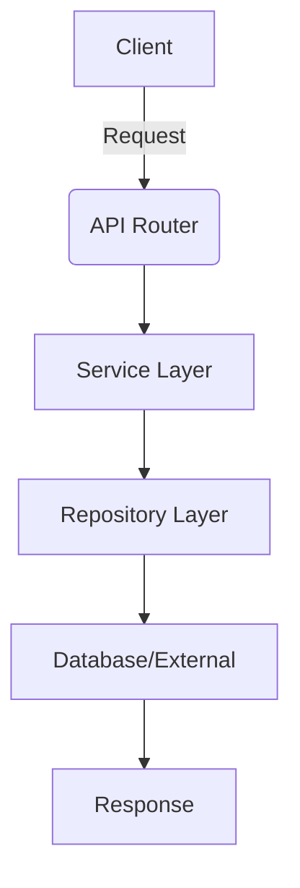

# Repository Guidelines

## Project Structure & Modules
- Core code lives in `app/` with clear layers: `api`/`routers` (FastAPI entrypoints), `services` (business logic, FastAPI-agnostic), `repositories` (RDB/vector access), `models` (SQLAlchemy), `schemas` (Pydantic DTOs), `vectorstore` and `llm` (protocols + impls), `queue` (retry/DLQ), `mcp` (Claude tools). Tests sit in `tests/`; docs in `docs/`; entrypoints are `main.py` (API) and `mcp_server.py` (MCP).

## Build, Test, and Development Commands
- Install: `uv sync --all-groups` (installs runtime + dev deps). Set up env from `.env.example`.
- Run API: `uv run python main.py` or `uv run uvicorn app.api.main:app --reload`.
- Run MCP server: `uv run python mcp_server.py` (stdio transport).
- Lint/format/type-check: `uv run black app/ tests/ --check`; `uv run ruff check app/ tests/`; `uv run mypy app/`.
- Tests: `uv run pytest`; with coverage `uv run pytest --cov=app tests/`.
- Migrations: `uv run alembic revision --autogenerate -m "msg"`; apply with `uv run alembic upgrade head`.

## Coding Style & Naming Conventions
- Python 3.10+, async-first. Follow Black line length 100 and Ruff defaults; prefer type hints everywhere (`mypy` strict). Keep services free of FastAPI types; inject dependencies at routers. Use `snake_case` for modules/functions, `PascalCase` for models/schemas/services, UPPER_SNAKE for constants. Keep prompts/config in `app/llm/` and vector logic in `app/vectorstore/`; avoid cross-layer imports that break the API/service/repo boundaries.

## Testing Guidelines
- Pytest with `pytest-asyncio`; tests live in `tests/` following `test_*.py` and `Test*` classes. Use `--cov=app` for coverage; prefer unit tests on services and repositories with mocks for LLM/vectorstore. Name tests after behavior (`test_register_consultation_returns_id`). When adding async code, mark with `@pytest.mark.asyncio`.

## Commit & Pull Request Guidelines
- Match existing history: Conventional Commits style (`feat: ...`, `fix: ...`, etc.; can be Korean or English). Keep commits focused; include migrations and updated tests in the same commit when applicable.
- PRs should include: summary of change, linked issue/task, how to run/verify (commands above), and notes on schema or config changes. Add screenshots or sample payloads for API-affecting changes; mention MCP tool additions explicitly. Avoid mixing refactors with feature work unless tightly coupled.

## Security & Configuration Tips
- Never commit secrets; keep real keys in `.env`. Default dev mode uses mock vectorstore/LLM; note when switching to cloud providers. If enabling PostgreSQL, confirm `DATABASE_URL` and run migrations. Review prompts to ensure hallucination-prevention context is included; services should not invent data beyond provided consultation content.

---

# Unit Spec Template

**중요:** 모든 신규/변경/삭제 기능 개발 의뢰 시, AI Assistant는 먼저 아래 Unit Spec을 작성하여 제시합니다. 사용자 검토 및 승인 후 작업을 진행합니다.

## 1. 요구사항 요약

- **목적:** <무엇을 하기 위한 기능인지 한 줄 요약>
- **유형:** ☐ 신규 ☐ 변경 ☐ 삭제
- **핵심 요구사항:**
  - 입력: <예: topic, userId 등>
  - 출력: <예: markdown, json, status code 등>
  - 예외/제약: <예: 토픽 누락 시 400 반환, 타임아웃 15s>
  - 처리흐름 요약: <한 줄로 동작 요약>

---

## 2. 구현 대상 파일

| 구분 | 경로                                    | 설명                  |
| ---- | --------------------------------------- | --------------------- |
| 신규 | app/api/routers/example.py              | 신규 API 엔드포인트   |
| 변경 | app/services/example_service.py         | 비즈니스 로직 수정    |
| 참조 | app/repositories/example_repo.py        | 데이터 접근 층 참고   |

---

## 3. 동작 플로우 (Mermaid)



---

## 4. 테스트 계획

### 4.1 원칙

- **테스트 우선(TDD)**: 본 섹션의 항목을 우선 구현하고 코드 작성.
- **계층별 커버리지**: Unit → Integration → API(E2E-lite) 순서로 최소 P0 커버.
- **독립성/재현성**: 외부 연동(LLM/DB/File I/O)은 모킹 또는 임베디드 스토리지 사용.
- **판정 기준**: 기대 상태코드/스키마/부작용(저장/로그)을 명시적으로 검증.

### 4.2 구현 예상 테스트 항목(각 항목의 목적 포함)

| TC ID      | 계층 | 시나리오              | 목적(무엇을 검증?)                 | 입력/사전조건                        | 기대결과                                           |
| ---------- | ---- | --------------------- | ---------------------------------- | ------------------------------------ | -------------------------------------------------- |
| TC-API-001 | API  | 정상 케이스           | API 계약/상태코드/응답 스키마 검증 | `POST /api/v1/example` `{...}`      | `201`, 필드 존재, 스키마 일치                      |
| TC-API-002 | API  | 입력 누락(Validation) | 입력 검증 및 오류 매핑             | `{}`                                 | `400`, 에러코드 `VALIDATION_ERROR`, 메시지 존재   |
| TC-SVC-003 | Unit | 비즈니스 로직         | 서비스 로직 정합성 검증            | 정상 입력 모의                       | 기대 결과값 반환, 의존성 호출 확인                 |
| TC-REPO-004 | Unit | 데이터 접근           | 저장소 계층 검증                   | 모킹된 DB                           | 예상 쿼리 호출, 데이터 반환                        |

---

## 5. 사용자 요청 기록

### 원본 요청 (1차)
```
<사용자 초기 요청>
```

### Claude 분석 (필요시)
```
<분석 내용, 추가 고려사항 제안>
```

### 사용자 명확화 (2차+)
```
<사용자 추가 요청/수정 사항>
```

### 최종 확정 (체크리스트)
- ✅ <확정된 사항 1>
- ✅ <확정된 사항 2>
- ✅ <확정된 사항 3>

---

## 프로세스 안내

1. **사용자 의뢰 → AI Assistant UnitSpec 작성**
   - 사용자가 기능 의뢰 시 AI Assistant는 위의 UnitSpec 템플릿을 채워 제시

2. **사용자 검토 & 승인**
   - 사용자는 제시된 UnitSpec을 검토하고 수정/명확화 요청
   - 최종 승인 시 확정 의사 표현

3. **AI Assistant 구현 시작**
   - UnitSpec 승인 후 구현 작업 시작
   - 작성된 UnitSpec을 `docs/yyyymmdd_한글작업명.md` 형식으로 저장

4. **진행 추적**
   - 구현 과정에서 UnitSpec의 테스트/파일 항목을 참고하여 진행
   - 변경사항 발생 시 UnitSpec 업데이트
