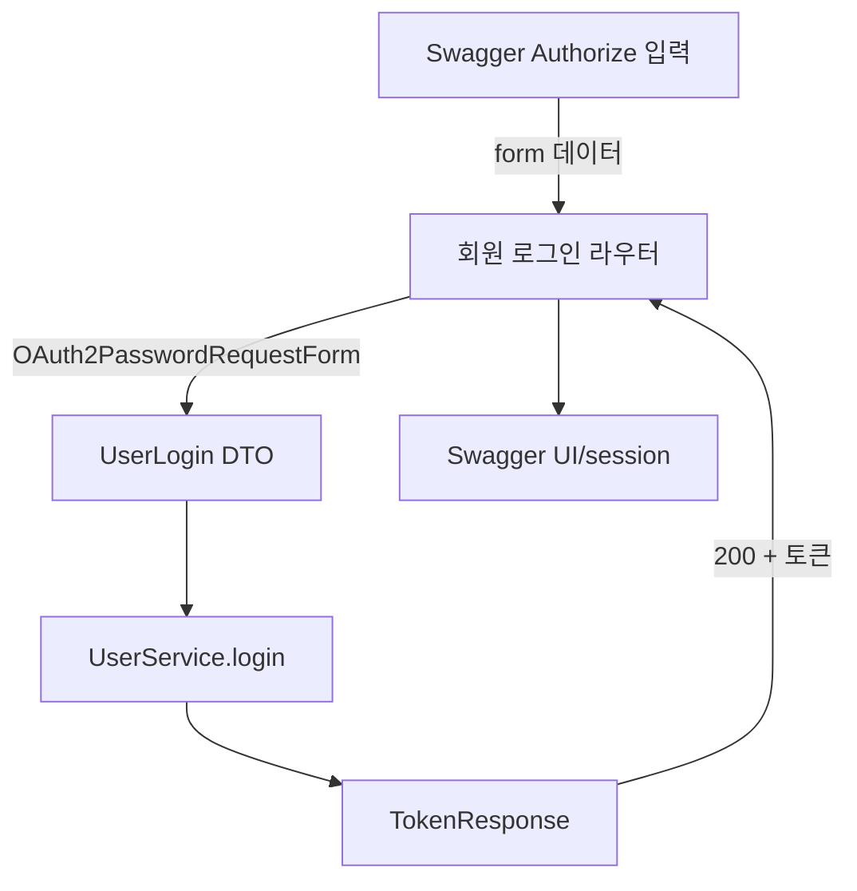

# Swagger Authorize 로그인 폼 지원

## 1. 요구사항 요약

- **목적:** Swagger “Authorize”에서 사용하는 OAuth2 Password Grant 폼 데이터로 `/auth/login`이 정상 동작하도록 한다.
- **유형:** 변경
- **핵심 요구사항:**
  - **입력:** OAuth2 password grant 폼(`grant_type`, `employee_id`, `password`) 또는 JSON `UserLogin`
  - **출력:** `TokenResponse`
  - **예외/제약:** 인증 실패 시 기존 `401 Unauthorized` 및 `WWW-Authenticate` 헤더 유지
  - **처리흐름 요약:** `OAuth2PasswordRequestForm`으로 오는 값으로 `UserLogin`을 만들고 서비스 호출 후 토큰 반환

## 2. 구현 대상 파일

| 구분 | 경로 | 설명 |
| --- | --- | --- |
| 변경 | `app/routers/auth.py` | 로그인 핸들러가 OAuth2 폼을 받아 `UserService` 호출 |
| 신규 | `tests/unit/api/test_auth_login.py` | OAuth2 폼 입력 시 `/auth/login` 응답 검증 |
| 참조 | `app/services/user_service.py` | 기존 로그인 로직 유지 |

## 3. 동작 플로우 (Mermaid)



## 4. 테스트 계획

### 4.1 원칙
- FastAPI 엔드포인트가 OAuth2 폼뿐 아니라 기존 JSON 입력에도 불변성을 유지하는지 검증
- 외부 의존(토큰 발급, DB)은 mock/fixture로 대체하여 독립적인 단위 테스트 확보
- 기대 결과: `200` + `TokenResponse`와 기존 처리 흐름 유지

### 4.2 구현 예상 테스트 항목

| TC ID | 계층 | 시나리오 | 목적 | 입력/사전조건 | 기대결과 |
| --- | --- | --- | --- | --- | --- |
| TC-API-001 | API | Swagger OAuth2 폼 입력 | OAuth2PasswordRequestForm을 처리하는 핸들러 검증 | `grant_type=password&employee_id=foo&password=bar` | `200`, 토큰 포함 JSON |
| TC-SVC-002 | Unit | UserService.login 호출 | JWT 생성 로직 유지 | 정상 유저/비밀번호 (mock DB) | `TokenResponse` 반환 |

## 5. 사용자 요청 기록

### 원본 요청
```
Swagger Authorize에서 ID/PW 입력 시 "body: Input should be a valid dictionary or object..." 오류
```

### Claude 분석
```
Swagger OAuth2 password flow는 form 데이터를 보내므로 현재 JSON 바디만 파싱하는 `UserLogin`을 거치지 못하고 있음. Login 라우터를 `OAuth2PasswordRequestForm`으로 읽고 `UserLogin`으로 매핑하면 해결 가능.
```

### 최종 확정
- ✅ Swagger Authorize는 `application/x-www-form-urlencoded`로 요청
- ✅ `/auth/login`은 여전히 `TokenResponse`를 반환
- ✅ 문서/테스트로 행동 검증
