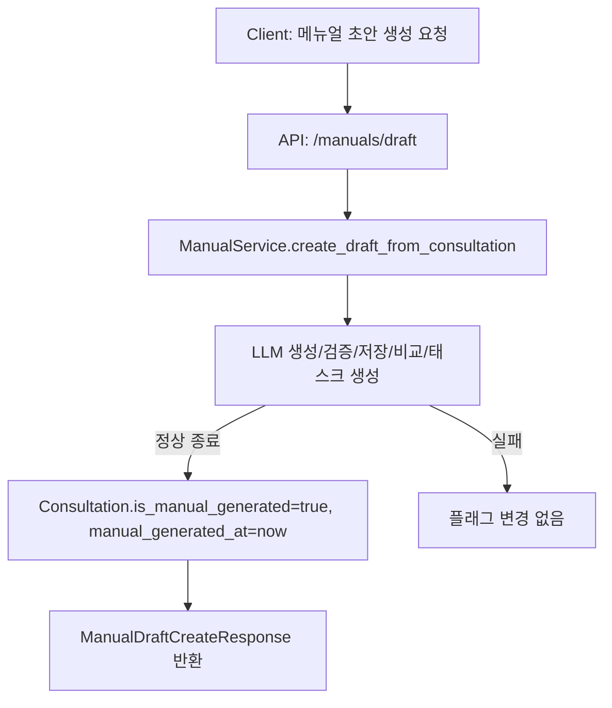

# Unit Spec: FR-17 상담 메뉴얼 작성 여부 관리 기능

## 1. 요구사항 요약

- **목적:** 상담이 메뉴얼 초안 생성 프로세스를 정상 완료했는지 RDB에 기록하고, 상담 상세 화면에 “메뉴얼 생성됨” 상태를 노출한다.
- **유형:** 변경
- **핵심 요구사항:**
  - 입력: CONSULTATION_ID (`FR-2` 실행 흐름 내)
  - 출력: `ConsultationResponse`에 `is_manual_generated`과 `manual_generated_at`을 포함
  - 예외/제약: FR-2 초안 생성이 실패하면 플래그값은 변경하지 않는다.
  - 처리흐름 요약: FR-2 초안 생성이 정상 종료된 시점에 상담 레코드에 플래그와 타임스탬프를 업데이트

---

## 2. 구현 대상 파일

| 구분 | 경로 | 설명 |
| ---- | ---- | ---- |
| 변경 | `app/models/consultation.py` | `is_manual_generated`, `manual_generated_at` 컬럼 추가 |
| 변경 | `app/schemas/consultation.py` | 응답 DTO에 신규 필드 반영 |
| 변경 | `app/services/manual_service.py` | 정상 종료 시 컨설테이션 업데이트 로직 |
| 변경 | `app/repositories/consultation_repository.py` | 플래그를 갱신하는 메서드/트랜잭션 지원 |
| 신규 | `alembic/versions/20250214_fr17_manual_flag.py` | 마이그레이션 생성 |

---

## 3. 동작 플로우 (Mermaid)



---

## 4. 테스트 계획

### 4.1 원칙

- **테스트 선행 (TDD)**: 명세된 테스트 항목 먼저 작성
- **계층별 커버리지**: Unit → Integration → API
- **독립성/재현성**: LLM/VectorStore/DB는 모킹 또는 테스트 DB 사용
- **기준**: 성공 시 플래그/타임스탬프 갱신, 실패 시 값 유지

### 4.2 예상 테스트 항목

| TC ID | 계층 | 시나리오 | 목적 | 입력/사전조건 | 기대결과 |
| ---- | ---- | ---- | ---- | ---- | ---- |
| TC-SVC-001 | Unit | FR-2 정상 흐름 | 상담 플래그/시간 갱신 확인 | 상담 존재, 생성 성공 | `is_manual_generated=true`, `manual_generated_at` 존재 |
| TC-SVC-002 | Unit | FR-2 실패 시 | 실패 시 플래그 유지 | LLM 검증 실패 또는 저장 실패 유도 | 플래그/시간 미변경 |
| TC-API-003 | API | 상담 상세 조회 | 신규 필드 노출 | 상담 조회 요청 | 응답에 두 필드 포함 |

---

## 5. 사용자 요청 기록

### 원본 요청 (1차)
```
[RFP_KHW_v6.md](docs/RFP_KHW_v6.md) , [onboarding.md](onboarding.md)  
너는 Python 전문 개발자야. 
내가 보낸 문서를 분석하고 아래의 요구사항 개발에 대한 Unit_spec을 작성해줘.

[요구사항]
- RFP 파일에 명시된 FR-17
```

### Claude 분석
```
FR-17은 FR-2 상담 기반 메뉴얼 초안 생성 플로우가 정상 종료된 시점에 플래그/타임스탬프를 Consultation에 기록함.
```

### 사용자 명확화
```
[체크리스트 회신]
- FR-2 는 이미 완료됨.
- 상담 상세 응답에 플래그 추가 필요.
- 실패 시 플래그 변경 없음. 
```

### 최종 확정 (체크리스트)
- ✅ FR-2 흐름 활용
- ✅ 상담 상세 응답에 `is_manual_generated`, `manual_generated_at` 노출
- ✅ 실패 시 플래그 유지

---

## 프로세스 안내

1. Unit Spec을 검토하고 승인하면 구현을 시작합니다.
2. 차후 변경사항 발생 시 본 문서를 갱신합니다.
