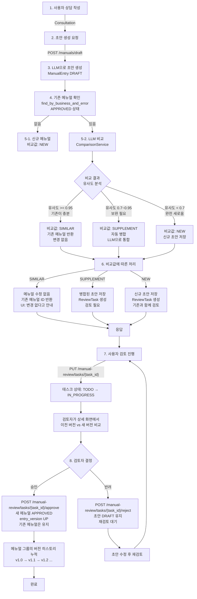

# Unit Spec: 메뉴얼 독립 버전 관리 및 지능형 비교 시스템

## 1. 요구사항 요약

- **목적:** 같은 업무구분/에러코드의 메뉴얼들이 각자 버전을 관리하면서, 신규 초안과 기존 메뉴얼을 자동 비교하여 비슷/보완/신규로 분류하고 이에 따라 자동 처리하는 시스템 구축
- **유형:** ☑ 신규 ☐ 변경 ☐ 삭제
- **핵심 요구사항:**
  - 입력: Consultation(inquiry_text, action_taken, business_type, error_code)
  - 출력: 비교 결과(comparison_type: similar/supplement/new), 처리된 ManualEntry 또는 기존 메뉴얼, ManualReviewTask (필요시)
  - 예외/제약:
    - VectorStore 미구성 시 유사도 기반 비교 스킵
    - 비교 실패 시 기본값 "new" 처리
    - 자동 병합은 LLM 기반 (환각 방지 규칙 적용)
  - 처리흐름 요약: 상담 → 초안 생성 → 기존 메뉴얼 확인 → 비교(비슷/보완/신규) → 비교값에 따른 자동 처리 또는 검토 태스크 생성

---

## 2. 구현 대상 파일

| 구분 | 경로                                    | 설명                                    |
| ---- | --------------------------------------- | --------------------------------------- |
| 신규 | app/services/comparison_service.py      | 메뉴얼 비교 로직 (비슷/보완/신규 판단) |
| 변경 | app/models/manual.py                    | entry_version, parent_entry_id 필드 추가 |
| 변경 | app/models/task.py                      | ManualReviewTask.comparison_type 필드 추가 |
| 변경 | app/services/manual_service.py          | create_draft_from_consultation() 리팩토링 |
| 변경 | app/services/manual_service.py          | approve_manual() 수정 (_deprecate 로직 제거) |
| 변경 | app/repositories/manual_rdb.py          | 리포지토리 메서드 확장 (버전 조회) |
| 변경 | app/schemas/manual.py                   | ManualReviewTaskResponse.comparison_type 추가 |
| 변경 | app/routers/manuals.py                  | POST /manuals/draft 응답 확장 |
| 신규 | migrations/XXX_manual_versioning.py     | DB 마이그레이션 (entry_version, parent_entry_id) |

---

## 3. 동작 플로우 (Mermaid)



---

## 4. 테스트 계획

### 4.1 원칙

- **계층별 테스트**: Unit (서비스 로직) → Integration (DB) → API (라우터)
- **독립성**: VectorStore는 mock, LLM은 mock 사용
- **커버리지**: 비교 로직(비슷/보완/신규) 각 경로 최소 P1 이상

### 4.2 구현 예상 테스트 항목

| TC ID | 계층 | 시나리오 | 목적(무엇을 검증?) | 입력/사전조건 | 기대결과 |
|------|------|---------|------------------|-------------|---------|
| TC-COMP-001 | Unit | 비교_비슷 (similarity >= 0.95) | 비슷함 판정 로직 | new_draft 유사도 0.96, existing 메뉴얼 | comparison_type="similar" 반환 |
| TC-COMP-002 | Unit | 비교_보완 (0.7 <= similarity < 0.95) | 보완 판정 로직 | new_draft 유사도 0.82 | comparison_type="supplement" 반환 |
| TC-COMP-003 | Unit | 비교_신규 (similarity < 0.7) | 신규 판정 로직 | new_draft 유사도 0.6 | comparison_type="new" 반환 |
| TC-SVC-004 | Unit | 초안_신규그룹 | 기존 메뉴얼 없을 때 신규 처리 | business_type/error_code 처음 등록 | ManualEntry(DRAFT) 생성, comparison_type="new" |
| TC-SVC-005 | Unit | 초안_비슷함_기존반환 | SIMILAR 시 기존 메뉴얼 반환 | existing APPROVED, 비유사도 0.96 | existing.id 반환, 신규 초안 생성 X |
| TC-SVC-006 | Unit | 초안_보완_자동병합 | SUPPLEMENT 시 자동 병합 | existing, new_draft 병합 가능 | 병합된 ManualEntry 저장, ReviewTask 생성 |
| TC-SVC-007 | Unit | 초안_신규_태스크생성 | NEW 시 기존과 함께 검토 | existing, new_draft 다름 | ManualReviewTask(old=existing, new=draft) 생성 |
| TC-API-008 | API | 초안생성_응답구조 | API 계약 검증 | POST /manuals/draft {consultation_id} | 200, {comparison_type, draft_or_existing, message} |
| TC-API-009 | API | 검토_비교데이터 | 이전/새 버전 비교 제공 | GET /manual-review/tasks/{id} | old_entry_id, new_entry_id 모두 포함 |
| TC-INTG-010 | Integration | 승인_버전업 | entry_version 증가 | ManualEntry 승인 | entry_version 1.0→1.1 |
| TC-INTG-011 | Integration | 승인_기존유지 | 기존 메뉴얼 DEPRECATED 안 함 | 다중 메뉴얼 같은 그룹 | 모두 APPROVED 유지 (DEPRECATED 없음) |

### 4.3 샘플 테스트 코드

```python
# tests/unit/test_comparison_service.py
import pytest
from app.services.comparison_service import ComparisonService
from app.models.manual import ManualEntry, ManualStatus

@pytest.mark.asyncio
async def test_comparison_similar():
    """TC-COMP-001: 유사도 >= 0.95 → SIMILAR"""
    service = ComparisonService(mock_llm, mock_vectorstore)

    new_draft = ManualEntry(
        topic="버튼 클릭 불가",
        background="사용자가 로그인 후 버튼을 클릭할 수 없음",
        guideline="F5 새로고침",
        keywords=["버튼", "클릭"],
        business_type="인터넷뱅킹",
        error_code="E001",
    )

    existing = ManualEntry(
        topic="버튼 클릭 불가 - 상세 가이드",
        background="사용자가 로그인 후 버튼을 클릭할 수 없는 경우의 해결 방법",
        guideline="1. F5로 새로고침\n2. 브라우저 캐시 삭제 후 재접속",
        keywords=["버튼", "클릭", "새로고침"],
        business_type="인터넷뱅킹",
        error_code="E001",
        status=ManualStatus.APPROVED,
    )

    # VectorStore mock: similarity=0.96
    comparison_type, data = await service.compare(new_draft, existing)

    assert comparison_type == "similar"
    assert data["similarity"] >= 0.95
    assert data["reason"] == "기존이 더 자세하거나 충분함"

@pytest.mark.asyncio
async def test_comparison_supplement():
    """TC-COMP-002: 0.7 <= similarity < 0.95 → SUPPLEMENT"""
    service = ComparisonService(mock_llm, mock_vectorstore)

    new_draft = ManualEntry(
        topic="버튼 클릭 불가",
        background="사용자가 버튼을 클릭할 수 없음",
        guideline="F5 새로고침 후 쿠키 삭제",
        keywords=["버튼"],
        business_type="인터넷뱅킹",
        error_code="E001",
    )

    existing = ManualEntry(
        topic="버튼 클릭 불가",
        background="사용자가 버튼을 클릭할 수 없음",
        guideline="F5 새로고침",
        keywords=["버튼"],
        business_type="인터넷뱅킹",
        error_code="E001",
        status=ManualStatus.APPROVED,
    )

    # VectorStore mock: similarity=0.82
    comparison_type, data = await service.compare(new_draft, existing)

    assert comparison_type == "supplement"
    assert 0.7 <= data["similarity"] < 0.95
    # merged_entry는 LLM이 기존 + 신규 통합
    assert data["merged_entry"] is not None
    assert "쿠키 삭제" in data["merged_entry"].guideline

@pytest.mark.asyncio
async def test_comparison_new():
    """TC-COMP-003: similarity < 0.7 → NEW"""
    service = ComparisonService(mock_llm, mock_vectorstore)

    new_draft = ManualEntry(
        topic="결제 실패",
        business_type="인터넷뱅킹",
        error_code="E001",
    )

    existing = ManualEntry(
        topic="버튼 클릭 불가",
        business_type="인터넷뱅킹",
        error_code="E001",
        status=ManualStatus.APPROVED,
    )

    # VectorStore mock: similarity=0.55
    comparison_type, data = await service.compare(new_draft, existing)

    assert comparison_type == "new"
    assert data["similarity"] < 0.7

# tests/unit/test_manual_service.py
@pytest.mark.asyncio
async def test_create_draft_similar_returns_existing():
    """TC-SVC-005: SIMILAR 시 기존 메뉴얼 반환, 신규 초안 생성 X"""
    service = ManualService(
        session=mock_session,
        llm_client=mock_llm_similar,  # similarity=0.96 반환
        vectorstore=mock_vectorstore,
    )

    request = ManualDraftCreateFromConsultationRequest(
        consultation_id=uuid.uuid4(),
        enforce_hallucination_check=False,
    )

    result = await service.create_draft_from_consultation(request)

    assert result["comparison_type"] == "similar"
    assert result["existing_manual"] is not None
    assert result["draft"] is None
    assert result["message"] == "기존 메뉴얼이 충분하여 변경이 필요하지 않습니다."

    # 신규 ManualEntry 생성 안 됨 (DB 쿼리 1회만)
    assert mock_session.add.call_count == 0

@pytest.mark.asyncio
async def test_create_draft_supplement_auto_merge():
    """TC-SVC-006: SUPPLEMENT 시 자동 병합 및 ReviewTask 생성"""
    service = ManualService(
        session=mock_session,
        llm_client=mock_llm_supplement,  # similarity=0.82, 병합 결과 반환
        vectorstore=mock_vectorstore,
    )

    result = await service.create_draft_from_consultation(request)

    assert result["comparison_type"] == "supplement"
    assert result["draft"] is not None
    assert "merged" in result["message"]
    assert result["task_id"] is not None

    # ReviewTask 생성됨
    task = await session.get(ManualReviewTask, result["task_id"])
    assert task.comparison_type == "supplement"
    assert task.old_entry_id is not None
    assert task.new_entry_id is not None

# tests/integration/test_approve_workflow.py
@pytest.mark.asyncio
async def test_approve_increments_entry_version():
    """TC-INTG-010: entry_version 증가 (1.0 → 1.1)"""
    # Given: APPROVED ManualEntry 존재
    existing = await create_manual(
        entry_version="1.0",
        status=ManualStatus.APPROVED,
    )

    # When: 새 메뉴얼 승인
    new_entry = await create_manual(entry_version="1.0")
    await service.approve_manual(new_entry.id, request)

    # Then: 새 메뉴얼의 버전이 1.1로 증가
    updated = await session.get(ManualEntry, new_entry.id)
    assert updated.entry_version == "1.1"
    assert updated.status == ManualStatus.APPROVED

    # 기존 메뉴얼은 DEPRECATED 아님
    existing_refresh = await session.get(ManualEntry, existing.id)
    assert existing_refresh.status == ManualStatus.APPROVED

@pytest.mark.asyncio
async def test_no_deprecate_on_same_group():
    """TC-INTG-011: 같은 그룹 메뉴얼 DEPRECATED 안 함"""
    # Given: 같은 그룹(인터넷뱅킹/E001) APPROVED 메뉴얼 2개
    existing1 = await create_manual(business_type="인터넷뱅킹", error_code="E001", entry_version="1.0")
    existing2 = await create_manual(business_type="인터넷뱅킹", error_code="E001", entry_version="1.0")

    # When: 새 메뉴얼 승인
    new_entry = await create_manual(business_type="인터넷뱅킹", error_code="E001")
    await service.approve_manual(new_entry.id, request)

    # Then: 모두 APPROVED 상태 유지
    for entry in [existing1, existing2, new_entry]:
        refreshed = await session.get(ManualEntry, entry.id)
        assert refreshed.status == ManualStatus.APPROVED
```

---

## 5. 사용자 요청 프롬프트 (대화 흐름)

### 5.1 Original User Request (1차)

```
같은 업무구분, 에러코드에 작성된 메뉴얼을 각자 버전 관리하는거야.
그리고 그 플로우는 아래와 같아.

[플로우]:
1. 사용자가 상담 작성
2. 상담 기반으로 초안 작성 요청
3. 초안 생성
4. 에러코드와 업무구분코드를 기반으로 기존에 생성된 메뉴얼 있는지 확인
5-1. 없을 경우 신규 생성
5-2. 있을 경우 기존에 작성된 메뉴얼 내용과 신규 작성된 메뉴얼을 비교 후 비교값 확인
: 비교값: [비슷(따로 변경이 필요 없거나 기존에 작성된 내용이 더 자세함), 보완(세부적인 내용이 조금 더 추가됨), 신규(기존에 없었던 내용)]
6. 비교값에 따라 작업 진행.
- 비교값:비슷 => 메뉴얼 수정 없음 (기존 작성된 내용을 사용자에게 보여주며 변경이 없다고 안내창 표기)
- 비교값:보완 => 메뉴얼 수정 (보완된 내용)
- 비교값:신규 => 메뉴얼에 새로 작성된 내용 추가
7. 사용자가 초안을 "검토하기" 진행
8. 검토자가 검토 상세 화면 에서 이전버전 과 새로운 버전을 함께 보며 검토 진행 후 메뉴얼 승인 및 반려.
```

### 5.2 Claude 응답 (분석)

```
사용자 요구사항을 분석한 결과:
- 현재 구현은 "그룹당 1개 APPROVED만 유지" 정책이지만,
  사용자는 "같은 그룹에 여러 메뉴얼을 각자 버전으로 관리"하길 원함
- 비교값을 "비슷/보완/신규" 3가지로 세분화해야 함
- 비교값에 따른 자동 처리가 필요 (비슷: 반환만, 보완: 자동 병합, 신규: 초안 저장)
- 현재의 _deprecate_previous_entries() 로직은 제거해야 함

필요한 변경:
1. 데이터 모델: entry_version (메뉴얼 독립 버전), parent_entry_id (버전 체인) 추가
2. 비교 서비스: ComparisonService 신규 생성 (비슷/보완/신규 판정)
3. 초안 생성 플로우: 즉시 비교 → 자동 처리 통합
4. 승인 플로우: _deprecate 제거, entry_version 증가로 변경
5. API 응답: 비교 결과 및 처리 상태 정보 추가

구현 가능성: ✅ 완전히 가능
예상 구현 기간: 3-4주 (설계 + 구현 + 테스트)
```

### 5.3 User Clarification (2차)

```
개발 계획을 Backend_UnitSpec.md 템플릿 형식으로 작성해줘.
```

### 5.4 최종 명확화 (통합)

- ✅ 메뉴얼 비교는 유사도 기반 (VectorStore)
- ✅ 비교값 분류: SIMILAR (>=0.95), SUPPLEMENT (0.7~0.95), NEW (<0.7)
- ✅ SIMILAR: 기존 메뉴얼 반환, 신규 초안 생성 안 함
- ✅ SUPPLEMENT: LLM으로 자동 병합, ReviewTask 생성
- ✅ NEW: 신규 초안 저장, ReviewTask 생성 (기존 + 신규 비교)
- ✅ 메뉴얼 승인 시 entry_version UP (1.0 → 1.1), DEPRECATED 안 함
- ✅ 검토자는 이전 버전(old_entry)과 새 버전(new_entry) 함께 보기
- ✅ API 응답에 comparison_type 포함
- ✅ DB 마이그레이션 필요 (entry_version, parent_entry_id, comparison_type)

---

**요청 일시:** 2024-12-11

**컨텍스트/배경:**
- 현재 KHW는 "문서 세트 버전" 정책으로 같은 그룹에 1개 APPROVED만 유지
- 사용자는 "메뉴얼 독립 버전"을 원함 (같은 그룹 내 v1.0, v1.1, v1.2... 지원)
- 초안과 기존 메뉴얼의 "지능형 비교" 필요
- 검토 워크플로우는 이미 구현되어 있으므로 비교 로직 통합만 필요

---

## 6. 구현 로드맵

### Phase 1: 데이터 모델 (1주)

**파일:** `app/models/manual.py`, `app/models/task.py`

**작업:**
1. ManualEntry에 `entry_version` 필드 추가 (default="1.0")
2. ManualEntry에 `parent_entry_id` 필드 추가 (버전 체인 추적용)
3. ManualReviewTask에 `comparison_type` 필드 추가 (similar/supplement/new)
4. DB 마이그레이션 생성

**체크리스트:**
- [ ] entry_version 필드 추가 및 Unique constraint 검토
- [ ] parent_entry_id FK 설정
- [ ] comparison_type enum 정의
- [ ] Alembic 마이그레이션 작성
- [ ] 기존 데이터 마이그레이션 (기존 메뉴얼 entry_version=1.0 설정)
- [ ] 모델 테스트 (마이그레이션 검증)

### Phase 2: 비교 서비스 (1주)

**파일:** `app/services/comparison_service.py` (신규)

**작업:**
1. ComparisonService 클래스 생성
2. `compare()` 메서드 구현
   - VectorStore 유사도 계산
   - 임계값 기반 비교값 판정 (SIMILAR/SUPPLEMENT/NEW)
   - 비교 메타데이터 반환 (similarity, reason, merged_entry)
3. `_merge_manuals()` 메서드 구현
   - LLM으로 기존 + 신규 메뉴얼 통합
   - 환각 방지 검증 적용

**체크리스트:**
- [ ] ComparisonService.__init__() (vectorstore, llm_client 의존성)
- [ ] compare() 유사도 계산 로직 (VectorStore 래핑)
- [ ] 비교값 판정 로직 (0.95, 0.7 임계값)
- [ ] _merge_manuals() LLM 프롬프트 작성
- [ ] 환각 방지 검증 (merge 결과 검증)
- [ ] 예외 처리 (VectorStore 실패 → "new" 기본값)
- [ ] Unit 테스트 (TC-COMP-001~003)

### Phase 3: 초안 생성 플로우 리팩토링 (1.5주)

**파일:** `app/services/manual_service.py`

**작업:**
1. `create_draft_from_consultation()` 리팩토링
   - 초안 생성 → 기존 메뉴얼 확인 → 비교 (즉시 수행)
   - 비교값에 따른 3가지 경로 구현
   - 응답 구조 확장 (comparison_type, draft_or_existing, task_id)
2. 환각 검증 로직 유지 (기존과 동일)
3. 응답 형식 정의

**체크리스트:**
- [ ] create_draft_from_consultation() 새 구현
  - [ ] consultation 조회
  - [ ] LLM으로 초안 생성
  - [ ] 기존 메뉴얼 조회 (find_by_business_and_error)
  - [ ] 비교 (ComparisonService.compare())
  - [ ] 비교값별 분기 처리
- [ ] SIMILAR 경로: 기존 메뉴얼 반환
- [ ] SUPPLEMENT 경로: 병합 + ReviewTask 생성
- [ ] NEW 경로: 초안 저장 + ReviewTask 생성
- [ ] API 응답 정의 (ManualDraftCreateResponse 스키마)
- [ ] Unit 테스트 (TC-SVC-004~007)

### Phase 4: 승인 플로우 수정 (1주)

**파일:** `app/services/manual_service.py`, `app/services/task_service.py`

**작업:**
1. `approve_manual()` 수정
   - `_deprecate_previous_entries()` 제거 또는 disabled
   - entry_version 증가 로직 추가
   - VectorStore 인덱싱 유지
2. `TaskService.approve_task()` 수정
   - 기존과 동일 (내부 호출 manual_service.approve_manual() 유지)

**체크리스트:**
- [ ] _deprecate_previous_entries() 제거
- [ ] _next_entry_version() 메서드 구현 (1.0 → 1.1 → 1.2)
- [ ] parent_entry_id 설정 (기존 APPROVED 메뉴얼 ID)
- [ ] VectorStore 재인덱싱 유지
- [ ] Integration 테스트 (TC-INTG-010~011)

### Phase 5: API 및 스키마 (1주)

**파일:** `app/routers/manuals.py`, `app/schemas/manual.py`

**작업:**
1. ManualDraftCreateResponse 스키마 확장
2. ManualReviewTaskResponse.comparison_type 추가
3. POST /manuals/draft 응답 확장
4. API 문서 업데이트

**체크리스트:**
- [ ] ManualDraftCreateResponse 정의
  - [ ] comparison_type
  - [ ] draft (또는 null)
  - [ ] existing_manual (또는 null)
  - [ ] task_id (또는 null)
  - [ ] message
- [ ] ManualReviewTaskResponse.comparison_type 추가
- [ ] POST /manuals/draft 응답 검증 (200, 400)
- [ ] API 테스트 (TC-API-008~009)

### Phase 6: 테스트 및 검증 (1.5주)

**작업:**
1. Unit 테스트 작성 (ComparisonService, ManualService 로직)
2. Integration 테스트 (DB + 서비스 통합)
3. API E2E 테스트 (라우터 전체 플로우)
4. 성능 테스트 (VectorStore 유사도 계산 시간)

**체크리스트:**
- [ ] Unit 테스트 커버리지 >= 90%
- [ ] Integration 테스트 모든 경로 검증
- [ ] API 테스트 (happy path + error cases)
- [ ] 기존 테스트 회귀 검증
- [ ] 성능 프로파일링 (초안 생성 시간)

**예상 기간:** 6-7주

---

## 7. 리스크 및 완화 전략

| 리스크 | 영향 | 가능성 | 완화 전략 |
|-------|------|--------|---------|
| VectorStore 유사도 계산 오류 | 비교값 오분류 | 중 | 임계값 조정 옵션 제공, LLM 검증 2차 |
| LLM 자동 병합 품질 저하 | 잘못된 병합 콘텐츠 | 중 | 환각 방지 검증 + 검토자 최종 승인 필수 |
| DB 마이그레이션 실패 | 운영 중단 | 낮음 | 파일럿 환경 사전 검증, 롤백 계획 수립 |
| 기존 초안 처리 방식 변경 | 사용자 혼란 | 중 | 초안 처리 문서 작성, UI 가이드 추가 |
| entry_version 중복 | 데이터 일관성 문제 | 낮음 | Unique constraint (business_type, error_code, entry_version) 추가 |

---

## 8. 배포 계획

### Pre-deployment
1. Staging 환경에서 전체 시나리오 테스트
2. 기존 데이터 마이그레이션 검증
3. 성능 벤치마크 (VectorStore 쿼리 시간)
4. 롤백 계획 수립

### Deployment
1. DB 마이그레이션 실행
2. 서비스 배포 (new code)
3. API 버전 관리 (호환성 유지)

### Post-deployment
1. 모니터링 (에러율, 응답 시간)
2. 사용자 피드백 수집
3. 임계값 조정 (필요시)

---

