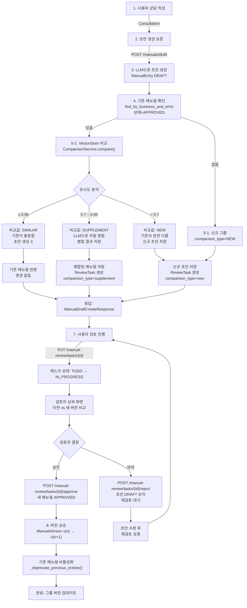
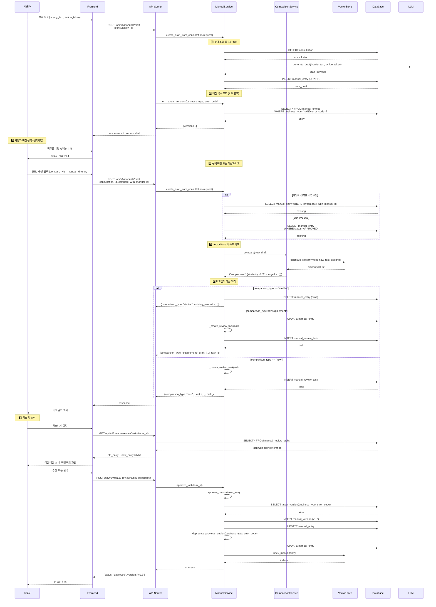
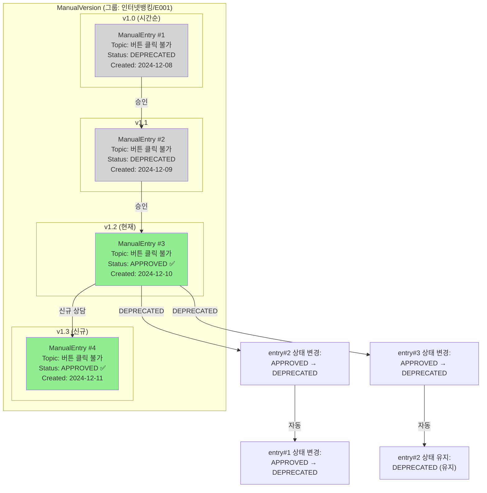
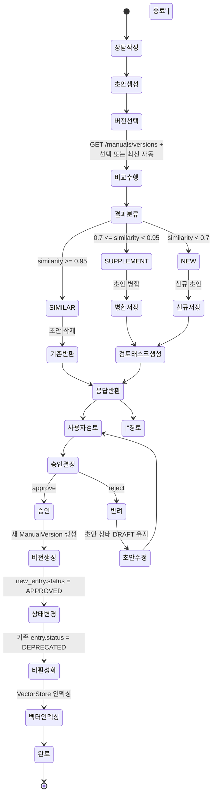

# Unit Spec (v2.1): 문서 세트 버전 관리 및 지능형 비교 시스템

> **문서 변경 이력**
> - v1 (초안): 메뉴얼 독립 버전 방식 (잘못된 방향)
> - v2 (보완): 문서 세트 버전 방식 (사용자 확정 요구사항)
> - v2.1 (개선): 사용자 선택 버전 비교 + 시퀀스/버전 다이어그램 추가

---

## 1. 요구사항 요약

### 1.1 목적

**같은 업무구분/에러코드의 메뉴얼을 문서 세트로 관리하면서, 신규 초안과 기존 메뉴얼을 자동 비교하여 비슷/보완/신규로 분류하고, 비교값에 따라 자동 처리하는 시스템 구축. 사용자가 선택한 과거 버전과 비교 가능**

### 1.2 유형

- ☑ 신규 (ComparisonService, 비교 로직, 버전 선택)
- ☑ 변경 (create_draft_from_consultation, ManualReviewTask)
- ☐ 삭제

### 1.3 핵심 요구사항

#### 입력
```
Consultation {
  inquiry_text: string,
  action_taken: string,
  business_type: string,
  error_code: string
}
```

#### 출력
```
ManualDraftCreateResponse {
  comparison_type: "similar" | "supplement" | "new",
  draft: ManualEntry | null,           # 신규/보완 시에만
  existing_manual: ManualEntry | null, # 비슷 시에만
  task_id: UUID | null,                # 신규/보완 시에만
  message: string                      # UI 안내 메시지
}
```

#### 문서 세트 (그룹) 정의
- **기준:** `business_type` + `error_code` (복합 유니크 키)
- **예시:**
  - "인터넷뱅킹" + "E001" = 1개 그룹
  - "모바일뱅킹" + "E001" = 다른 그룹
  - "인터넷뱅킹" + "E002" = 다른 그룹

#### 버전 비교 선택
- **기본:** 최신 APPROVED 메뉴얼과 비교 (자동)
- **선택:** 사용자가 과거 버전 선택 가능 (선택사항)
- **단계:** 1회 비교만 수행 (성능 최적화)

#### 예외/제약
- VectorStore 미구성 시: 유사도 계산 스킵 → 기본값 `"new"` 처리
- 비교 실패 시: 기본값 `"new"` 처리 (안전한 쪽)
- 자동 병합: LLM 기반, 환각 방지 규칙 적용 필수

#### 처리 흐름 요약
```
상담 → 초안 생성 → 비교 버전 선택(사용자 또는 최신 자동)
                 → 비교(VectorStore 유사도)
                 → 비교값별 처리(비슷/보완/신규)
                 → 검토 태스크 생성(보완/신규)
                 → 검토자 승인
                 → 버전 상승 + 기존 비활성화
```

---

## 2. 구현 대상 파일

| 구분 | 경로                                 | 설명                                      | 변경 내용 |
|-----|--------------------------------------|------------------------------------------|---------:|
| 신규 | `app/services/comparison_service.py` | ComparisonService (비슷/보완/신규 판정)  | 파일 생성 |
| 변경 | `app/services/manual_service.py`     | create_draft_from_consultation() 통합     | 비교 버전 선택 로직 추가 |
| 변경 | `app/services/manual_service.py`     | get_manual_versions() 메서드 추가        | 버전 목록 조회 |
| 변경 | `app/models/task.py`                 | ManualReviewTask.comparison_type 추가    | 필드 1개 추가 |
| 변경 | `app/repositories/manual_rdb.py`     | find_all_by_business_and_error() 개선    | 쿼리 최적화 |
| 변경 | `app/schemas/manual.py`              | ManualDraftCreateResponse 확장            | 스키마 확장 |
| 변경 | `app/routers/manuals.py`             | POST /manuals/draft 응답 + GET /versions | 2개 엔드포인트 |
| 신규 | `alembic/versions/XXX_add_comparison_type.py` | DB 마이그레이션 | comparison_type 필드 추가 |

#### 불필요한 항목 (v1 스펙과 달리)
- ❌ `entry_version` 필드: 문서 세트 버전 (ManualVersion)으로 관리
- ❌ `parent_entry_id` 필드: 버전 체인 추적 불필요
- ✅ `_deprecate_previous_entries()`: 유지 (기존 메뉴얼 비활성화)
- ✅ `ManualVersion`: 그룹 버전 관리 계속 사용

---

## 3. 동작 플로우 (Mermaid)

### 3.1 기본 플로우 (문제점 플로우)



### 3.2 시퀀스 다이어그램 (상세 상호작용)



---

## 4. 버전 관리 다이어그램

### 4.1 버전 히스토리 및 상태 전이



### 4.2 초안 생성부터 승인까지 버전 상태 변화



---

## 5. 테스트 계획

### 5.1 원칙

- **계층별 테스트**: Unit (서비스) → Integration (DB + 서비스) → API (라우터)
- **독립성**: VectorStore & LLM 모두 mock 사용
- **커버리지**: 비교 로직(비슷/보완/신규) + 자동 병합 + 버전 처리 + **버전 선택** 각 경로 검증

### 5.2 구현 예상 테스트 항목

| TC ID | 계층 | 시나리오 | 목적 | 입력/사전조건 | 기대결과 |
|------|------|---------|------|-------------|--------|
| **TC-COMP-001** | Unit | 비교_비슷 | similarity >= 0.95 판정 | new_draft: 0.96 유사도 | `("similar", {"similarity": 0.96})` |
| **TC-COMP-002** | Unit | 비교_보완 | 0.7 <= similarity < 0.95 판정 | new_draft: 0.82 유사도 | `("supplement", {"similarity": 0.82, "merged": {...}})` |
| **TC-COMP-003** | Unit | 비교_신규 | similarity < 0.7 판정 | new_draft: 0.55 유사도 | `("new", {"similarity": 0.55})` |
| **TC-COMP-004** | Unit | 비교_실패 처리 | VectorStore 오류 → 기본값 | VectorStore 예외 발생 | `("new", {})` |
| **TC-SVC-005** | Unit | 초안_신규그룹 | 기존 메뉴얼 없을 때 | business_type/error_code 처음 등록 | comparison_type="new", draft 저장 |
| **TC-SVC-006** | Unit | 초안_비슷_기존반환 | SIMILAR 시 기존 반환 | existing APPROVED, 유사도 0.96 | existing.id 반환, draft=null |
| **TC-SVC-007** | Unit | 초안_보완_병합 | SUPPLEMENT 시 자동 병합 | existing + new_draft 병합 가능 | 병합된 entry 저장, ReviewTask 생성 |
| **TC-SVC-008** | Unit | 초안_신규_태스크 | NEW 시 리뷰 태스크 | existing + new_draft 다름 | draft 저장, ReviewTask(old=existing, new=draft) |
| **TC-SVC-009** | Unit | 버전목록_조회 | 과거 버전 목록 조회 | business_type, error_code | 모든 entry 반환 (최신→오래된 순) |
| **TC-SVC-010** | Unit | 버전선택_비교 | 사용자 선택 버전과 비교 | compare_with_manual_id 지정 | 선택한 버전과만 비교, ReviewTask 생성 |
| **TC-SVC-011** | Unit | 버전미선택_최신비교 | 버전 미선택 시 최신과 비교 | compare_with_manual_id 없음 | 최신 APPROVED와 비교 |
| **TC-API-012** | API | 초안생성_응답구조 | API 계약 검증 | POST /manuals/draft {consultation_id} | 200, comparison_type + message 포함 |
| **TC-API-013** | API | 버전목록_응답 | 버전 목록 API | GET /manuals/versions?business_type=&error_code= | 200, [versions] 배열 반환 |
| **TC-API-014** | API | 검토_비교데이터 | 이전/새 버전 비교 제공 | GET /manual-review/tasks/{id} | old_entry_id, new_entry_id, comparison_type |
| **TC-INTG-015** | Integration | 승인_버전상승 | 버전 증가 | ManualEntry 승인 | ManualVersion.version 증가 (1.0 → 1.1) |
| **TC-INTG-016** | Integration | 승인_비활성화 | 기존 메뉴얼 비활성화 | 같은 그룹 APPROVED 메뉴얼 승인 | 기존 메뉴얼 DEPRECATED |

---

## 6. 사용자 요청 프롬프트 (대화 흐름)

### 6.1 Original User Request (1차)

```
같은 업무구분, 에러코드에 작성된 메뉴얼을 각자 버전 관리하는거야.
...
9. 승인시 메뉴얼 버전 상승. 기존 메뉴얼은 비활성화.
```

### 6.2 User Clarification (2차)

```
아니야, "문서 세트 버전" 형태로 관리하는 거야.
문서 세트의 기준은 업무코드 + 에러코드야.
...
승인시 버전 상승 & 기존 메뉴얼 비활성화는 현재대로.
```

### 6.3 User Suggestion (3차)

```
이렇게 개발이 된다면 승인 안 된 메뉴얼 초안과 과거 버전의 비교가 가능할까??

[분석]
❌ v2 구현으로는 최신 APPROVED만 비교 가능
❌ 과거 DEPRECATED 버전과는 비교 불가능

[개선안]
✅ 사용자가 과거 버전 목록에서 선택 가능하게
✅ 선택한 버전과만 비교 (효율적)
✅ 불필요한 모든 버전 비교 제거 (성능 최적)
```

### 6.4 최종 확정 (v2.1)

✅ **확정된 요구사항:**
- ✅ 문서 세트 = 업무코드 + 에러코드 (1개 그룹)
- ✅ ManualVersion으로 그룹 버전 관리
- ✅ 메뉴얼 비교는 VectorStore 기반 유사도
- ✅ 비교값 분류: SIMILAR (>=0.95), SUPPLEMENT (0.7~0.95), NEW (<0.7)
- ✅ 비교 버전: 최신 APPROVED 자동 또는 사용자 선택
- ✅ 사용자 선택: GET /manuals/versions으로 과거 버전 목록 조회
- ✅ 1회 비교만 수행 (선택한 또는 최신)
- ✅ SIMILAR: 기존 메뉴얼 반환, 신규 초안 생성 안 함
- ✅ SUPPLEMENT: LLM 자동 병합, ReviewTask 생성
- ✅ NEW: 신규 초안 저장, ReviewTask 생성
- ✅ 메뉴얼 승인 시 버전 상승 (v1.0 → v1.1), 기존 DEPRECATED
- ✅ 검토자는 이전 버전(old_entry)과 새 버전(new_entry) 함께 보기
- ✅ API 응답에 comparison_type 포함
- ✅ DB 마이그레이션은 comparison_type만 추가

---

**요청 일시:** 2024-12-11
**문서 버전:** v2.1 (사용자 선택 기능 추가)

---

## 7. 구현 로드맵

### Phase 1: ComparisonService (1주)

**파일:** `app/services/comparison_service.py` (신규)

**작업:**
1. ComparisonService 클래스 생성
2. `compare()` 메서드 구현
   - VectorStore에서 유사도 계산
   - 임계값 기반 비교값 판정 (SIMILAR/SUPPLEMENT/NEW)
   - 비교 메타데이터 반환 (similarity, reason, merged)
3. `_merge_with_llm()` 메서드 (SUPPLEMENT 경로)
   - LLM으로 기존 + 신규 메뉴얼 통합
   - 환각 방지 검증 적용

**체크리스트:**
- [ ] ComparisonService.__init__() (vectorstore, llm_client 의존성)
- [ ] compare() 유사도 계산 로직 (VectorStore 래핑)
- [ ] 비교값 판정 로직 (0.95, 0.7 임계값)
- [ ] _merge_with_llm() LLM 프롬프트 작성
- [ ] 환각 방지 검증 (merge 결과 검증)
- [ ] 예외 처리 (VectorStore 실패 → "new" 기본값)
- [ ] Unit 테스트 (TC-COMP-001~004)

---

### Phase 2: 비교 로직 통합 (1.5주)

**파일:** `app/services/manual_service.py`, `app/routers/manuals.py`

**작업:**
1. create_draft_from_consultation() 확장
   - 기존 메뉴얼 확인 (find_by_business_and_error)
   - ComparisonService.compare() 호출
   - 비교값별 3가지 경로 처리
   - **⭐ NEW: compare_with_manual_id 파라미터 지원**

2. get_manual_versions() 메서드 추가
   - 업무코드+에러코드로 모든 버전 조회
   - 최신→오래된 순 정렬
   - **⭐ NEW: 과거 버전 목록 반환**

3. GET /api/v1/manuals/versions 엔드포인트 추가
   - 버전 목록 조회 API
   - **⭐ NEW: 사용자가 비교 버전 선택할 수 있도록**

**체크리스트:**
- [ ] 기존 메뉴얼 조회 메서드 호출
- [ ] ComparisonService 의존성 주입
- [ ] compare_with_manual_id 파라미터 처리
- [ ] SIMILAR 경로: 기존 메뉴얼 반환
- [ ] SUPPLEMENT 경로: 병합 저장 + ReviewTask
- [ ] NEW 경로: 초안 저장 + ReviewTask
- [ ] get_manual_versions() 구현
- [ ] GET /manuals/versions 엔드포인트
- [ ] Unit 테스트 (TC-SVC-005~014)

**구현 예시:**

```python
# app/schemas/manual.py
class ManualDraftCreateFromConsultationRequest(BaseModel):
    consultation_id: UUID
    compare_with_manual_id: Optional[UUID] = None  # ⭐ NEW

# app/routers/manuals.py
@router.get("/api/v1/manuals/versions")
async def list_manual_versions(
    business_type: str,
    error_code: str,
    service: ManualService = Depends(get_manual_service),
) -> list[dict]:
    """⭐ NEW: 과거 버전 목록 조회"""
    return await service.get_manual_versions(business_type, error_code)

# app/services/manual_service.py
async def get_manual_versions(
    self,
    business_type: str,
    error_code: str,
) -> list[dict]:
    """⭐ NEW: 모든 버전 조회"""
    entries = await self.manual_repo.find_all_by_business_and_error(
        business_type=business_type,
        error_code=error_code,
    )

    results = []
    for entry in entries:
        version_info = entry.version
        results.append({
            "manual_id": str(entry.id),
            "version": version_info.version if version_info else "unknown",
            "topic": entry.topic,
            "status": entry.status.value,
            "created_at": entry.created_at.isoformat(),
        })

    return sorted(results, key=lambda x: x["created_at"], reverse=True)

async def create_draft_from_consultation(
    self, request: ManualDraftCreateFromConsultationRequest
) -> ManualDraftCreateResponse:
    """FR-2: 상담 기반 메뉴얼 초안 생성 + 비교 로직"""

    consultation = await self.consultation_repo.get_by_id(request.consultation_id)
    if consultation is None:
        raise RecordNotFoundError(...)

    # 1. LLM으로 초안 생성
    llm_payload = await self._call_llm_for_draft(...)
    new_draft = await self._persist_manual_entry(
        consultation_id=consultation.id,
        llm_payload=llm_payload,
        business_type=consultation.business_type,
        error_code=consultation.error_code,
    )

    # ⭐ NEW: 비교 버전 결정 (사용자 선택 또는 최신)
    existing = None

    if request.compare_with_manual_id:
        # 사용자가 선택한 버전과 비교
        existing = await self.manual_repo.get_by_id(
            request.compare_with_manual_id
        )
        if existing is None:
            raise RecordNotFoundError(...)
    else:
        # 선택 없으면 최신 APPROVED 버전과 비교
        existing = await self.manual_repo.find_by_business_and_error(
            business_type=consultation.business_type,
            error_code=consultation.error_code,
            status=ManualStatus.APPROVED,
        )

    # 2. 비교 수행
    if existing:
        comparison_type, comparison_data = await self.comparison_service.compare(
            new_draft, existing
        )
    else:
        comparison_type = "new"
        comparison_data = {}

    # 3. 비교값에 따른 처리 (기존과 동일)
    if comparison_type == "similar":
        await self.manual_repo.delete(new_draft)
        return ManualDraftCreateResponse(
            comparison_type="similar",
            existing_manual=ManualEntryResponse.model_validate(existing),
            draft=None,
            task_id=None,
            message="기존 메뉴얼이 충분하여 변경이 필요하지 않습니다.",
        )

    elif comparison_type == "supplement":
        merged = comparison_data.get("merged")
        await self.manual_repo.update(new_draft, {**merged.dict()})

        task = await self._create_review_task(
            new_entry=new_draft,
            old_entry=existing,
            comparison_type="supplement",
        )

        return ManualDraftCreateResponse(
            comparison_type="supplement",
            draft=ManualEntryResponse.model_validate(new_draft),
            existing_manual=None,
            task_id=task.id,
            message="메뉴얼이 보완되었습니다. 검토가 필요합니다.",
        )

    else:  # "new"
        task = await self._create_review_task(
            new_entry=new_draft,
            old_entry=existing,
            comparison_type="new",
        )

        return ManualDraftCreateResponse(
            comparison_type="new",
            draft=ManualEntryResponse.model_validate(new_draft),
            existing_manual=None,
            task_id=task.id,
            message="신규 메뉴얼이 생성되었습니다. 검토가 필요합니다.",
        )
```

---

### Phase 3: 데이터 모델 & 마이그레이션 (1주)

**파일:** `app/models/task.py`, `alembic/versions/`

**작업:**
1. ManualReviewTask에 comparison_type 필드 추가
2. Alembic 마이그레이션 생성 및 적용

**체크리스트:**
- [ ] ManualReviewTask.comparison_type 필드 추가
- [ ] 마이그레이션 스크립트 작성
- [ ] 기존 데이터 마이그레이션 (기본값 "new" 설정)
- [ ] 데이터 검증

---

### Phase 4: API 및 스키마 (1주)

**파일:** `app/schemas/manual.py`, `app/routers/manuals.py`

**작업:**
1. ManualDraftCreateResponse 스키마 정의
2. ManualReviewTaskResponse에 comparison_type 추가
3. POST /manuals/draft 응답 확장
4. GET /manuals/versions 응답 정의
5. API 문서 업데이트

**체크리스트:**
- [ ] ManualDraftCreateResponse 정의
- [ ] ManualReviewTaskResponse.comparison_type 추가
- [ ] POST /manuals/draft 응답 검증
- [ ] GET /manuals/versions 스키마 정의
- [ ] API 테스트 (TC-API-012~014)

---

### Phase 5: 종합 테스트 (1.5주)

**작업:**
1. Unit 테스트 작성
2. Integration 테스트
3. API E2E 테스트
4. 기존 테스트 회귀 검증

**예상 기간:** 5-6주

---

## 8. API 계약 (Request/Response)

### 8.1 버전 목록 조회

**Request:**
```http
GET /api/v1/manuals/versions?business_type=인터넷뱅킹&error_code=E001
```

**Response:**
```json
[
  {
    "manual_id": "550e8400-e29b-41d4-a716-446655440001",
    "version": "1.2",
    "topic": "버튼 클릭 불가",
    "status": "APPROVED",
    "created_at": "2024-12-10T15:30:00Z"
  },
  {
    "manual_id": "550e8400-e29b-41d4-a716-446655440002",
    "version": "1.1",
    "topic": "버튼 클릭 불가",
    "status": "DEPRECATED",
    "created_at": "2024-12-09T10:20:00Z"
  },
  {
    "manual_id": "550e8400-e29b-41d4-a716-446655440003",
    "version": "1.0",
    "topic": "버튼 클릭 불가",
    "status": "DEPRECATED",
    "created_at": "2024-12-08T09:15:00Z"
  }
]
```

---

### 8.2 초안 생성 (비교 버전 선택)

**Request (선택 있음):**
```http
POST /api/v1/manuals/draft
Content-Type: application/json

{
  "consultation_id": "550e8400-e29b-41d4-a716-446655440000",
  "compare_with_manual_id": "550e8400-e29b-41d4-a716-446655440002"
}
```

**Request (선택 없음 - 최신 자동):**
```http
POST /api/v1/manuals/draft
Content-Type: application/json

{
  "consultation_id": "550e8400-e29b-41d4-a716-446655440000"
}
```

**Response (SIMILAR):**
```json
{
  "comparison_type": "similar",
  "draft": null,
  "existing_manual": {
    "id": "550e8400-e29b-41d4-a716-446655440002",
    "topic": "버튼 클릭 불가",
    "status": "APPROVED"
  },
  "task_id": null,
  "message": "기존 메뉴얼이 충분하여 변경이 필요하지 않습니다."
}
```

**Response (SUPPLEMENT):**
```json
{
  "comparison_type": "supplement",
  "draft": {
    "id": "550e8400-e29b-41d4-a716-446655440004",
    "topic": "버튼 클릭 불가",
    "status": "DRAFT"
  },
  "existing_manual": null,
  "task_id": "550e8400-e29b-41d4-a716-446655440005",
  "message": "메뉴얼이 보완되었습니다. 검토가 필요합니다."
}
```

**Response (NEW):**
```json
{
  "comparison_type": "new",
  "draft": {
    "id": "550e8400-e29b-41d4-a716-446655440006",
    "topic": "결제 실패",
    "status": "DRAFT"
  },
  "existing_manual": null,
  "task_id": "550e8400-e29b-41d4-a716-446655440007",
  "message": "신규 메뉴얼이 생성되었습니다. 검토가 필요합니다."
}
```

---

## 9. 참고사항

### 현재 구현 상태 (변경 안 함)
- ✅ ManualVersion (그룹 버전 관리)
- ✅ ManualEntry (메뉴얼 항목)
- ✅ ManualReviewTask (검토 태스크)
- ✅ approve_manual() (버전 상승 + _deprecate)

### v2.1에서 추가 구현 필요
- ❌ ComparisonService (신규)
- ❌ 비교 로직 통합
- ❌ comparison_type 필드
- ❌ **⭐ 사용자 선택 버전 비교** (NEW in v2.1)
- ❌ **⭐ GET /manuals/versions API** (NEW in v2.1)
- ❌ API 응답 확장

### 불필요한 항목 (v1 스펙)
- ❌ entry_version
- ❌ parent_entry_id
- ❌ ManualVersion 역할 변경

---

**문서 버전:** v2.1
**최종 수정:** 2024-12-11
**상태:** 확정 ✅
