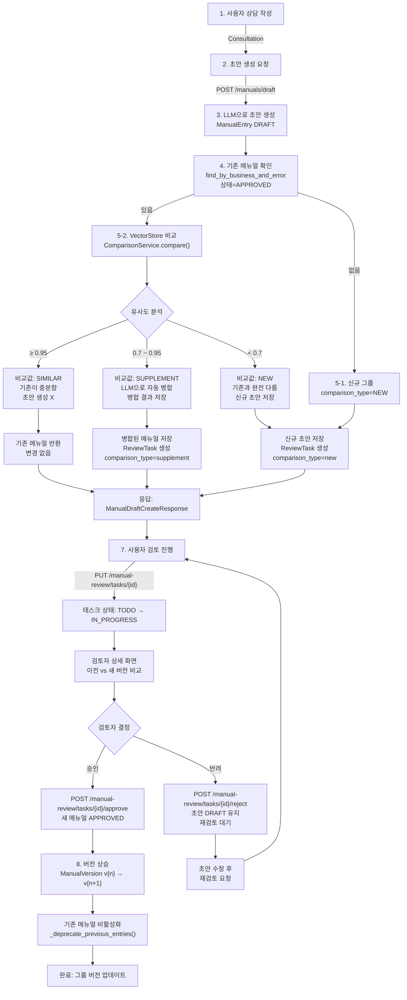

# Unit Spec (v2): 문서 세트 버전 관리 및 지능형 비교 시스템

> **문서 변경 이력**
> - v1 (초안): 메뉴얼 독립 버전 방식 (잘못된 방향)
> - v2 (보완): 문서 세트 버전 방식 (사용자 확정 요구사항)

---

## 1. 요구사항 요약

### 1.1 목적

**같은 업무구분/에러코드의 메뉴얼을 문서 세트로 관리하면서, 신규 초안과 기존 메뉴얼을 자동 비교하여 비슷/보완/신규로 분류하고, 비교값에 따라 자동 처리하는 시스템 구축**

### 1.2 유형

- ☑ 신규 (ComparisonService, 비교 로직)
- ☑ 변경 (create_draft_from_consultation, ManualReviewTask)
- ☐ 삭제

### 1.3 핵심 요구사항

#### 입력
```
Consultation {
  inquiry_text: string,
  action_taken: string,
  business_type: string,
  error_code: string
}
```

#### 출력
```
ManualDraftCreateResponse {
  comparison_type: "similar" | "supplement" | "new",
  draft: ManualEntry | null,           # 신규/보완 시에만
  existing_manual: ManualEntry | null, # 비슷 시에만
  task_id: UUID | null,                # 신규/보완 시에만
  message: string                      # UI 안내 메시지
}
```

#### 문서 세트 (그룹) 정의
- **기준:** `business_type` + `error_code` (복합 유니크 키)
- **예시:**
  - "인터넷뱅킹" + "E001" = 1개 그룹
  - "모바일뱅킹" + "E001" = 다른 그룹
  - "인터넷뱅킹" + "E002" = 다른 그룹

#### 예외/제약
- VectorStore 미구성 시: 유사도 계산 스킵 → 기본값 `"new"` 처리
- 비교 실패 시: 기본값 `"new"` 처리 (안전한 쪽)
- 자동 병합: LLM 기반, 환각 방지 규칙 적용 필수

#### 처리 흐름 요약
```
상담 → 초안 생성 → 기존 메뉴얼 확인(APPROVED)
                 → 비교(VectorStore 유사도)
                 → 비교값별 처리(비슷/보완/신규)
                 → 검토 태스크 생성(보완/신규)
                 → 검토자 승인
                 → 버전 상승 + 기존 비활성화
```

---

## 2. 구현 대상 파일

| 구분 | 경로                                 | 설명                                      | 변경 내용 |
|-----|--------------------------------------|------------------------------------------|---------|
| 신규 | `app/services/comparison_service.py` | ComparisonService (비슷/보완/신규 판정)  | 파일 생성 |
| 변경 | `app/services/manual_service.py`     | create_draft_from_consultation() 통합     | 비교 로직 추가 |
| 변경 | `app/models/task.py`                 | ManualReviewTask.comparison_type 추가    | 필드 1개 추가 |
| 변경 | `app/repositories/manual_rdb.py`     | find_by_business_and_error() 개선        | 쿼리 최적화 |
| 변경 | `app/schemas/manual.py`              | ManualDraftCreateResponse 확장            | 스키마 확장 |
| 변경 | `app/routers/manuals.py`             | POST /manuals/draft 응답 확장             | 응답값 변경 |
| 신규 | `alembic/versions/XXX_add_comparison_type.py` | DB 마이그레이션 | comparison_type 필드 추가 |

#### 불필요한 항목 (v1 스펙과 달리)
- ❌ `entry_version` 필드: 문서 세트 버전 (ManualVersion)으로 관리
- ❌ `parent_entry_id` 필드: 버전 체인 추적 불필요
- ✅ `_deprecate_previous_entries()`: 유지 (기존 메뉴얼 비활성화)
- ✅ `ManualVersion`: 그룹 버전 관리 계속 사용

---

## 3. 동작 플로우 (Mermaid)



---

## 4. 테스트 계획

### 4.1 원칙

- **계층별 테스트**: Unit (서비스) → Integration (DB + 서비스) → API (라우터)
- **독립성**: VectorStore & LLM 모두 mock 사용
- **커버리지**: 비교 로직(비슷/보완/신규) + 자동 병합 + 버전 처리 각 경로 검증

### 4.2 구현 예상 테스트 항목

| TC ID | 계층 | 시나리오 | 목적 | 입력/사전조건 | 기대결과 |
|------|------|---------|------|-------------|--------|
| **TC-COMP-001** | Unit | 비교_비슷 | similarity >= 0.95 판정 | new_draft: 0.96 유사도 | `("similar", {"similarity": 0.96})` |
| **TC-COMP-002** | Unit | 비교_보완 | 0.7 <= similarity < 0.95 판정 | new_draft: 0.82 유사도 | `("supplement", {"similarity": 0.82, "merged": {...}})` |
| **TC-COMP-003** | Unit | 비교_신규 | similarity < 0.7 판정 | new_draft: 0.55 유사도 | `("new", {"similarity": 0.55})` |
| **TC-COMP-004** | Unit | 비교_실패 처리 | VectorStore 오류 → 기본값 | VectorStore 예외 발생 | `("new", {})` |
| **TC-SVC-005** | Unit | 초안_신규그룹 | 기존 메뉴얼 없을 때 | business_type/error_code 처음 등록 | comparison_type="new", draft 저장 |
| **TC-SVC-006** | Unit | 초안_비슷_기존반환 | SIMILAR 시 기존 반환 | existing APPROVED, 유사도 0.96 | existing.id 반환, draft=null |
| **TC-SVC-007** | Unit | 초안_보완_병합 | SUPPLEMENT 시 자동 병합 | existing + new_draft 병합 가능 | 병합된 entry 저장, ReviewTask 생성 |
| **TC-SVC-008** | Unit | 초안_신규_태스크 | NEW 시 리뷰 태스크 | existing + new_draft 다름 | draft 저장, ReviewTask(old=existing, new=draft) |
| **TC-API-009** | API | 초안생성_응답구조 | API 계약 검증 | POST /manuals/draft {consultation_id} | 200, comparison_type + message 포함 |
| **TC-API-010** | API | 검토_비교데이터 | 이전/새 버전 비교 제공 | GET /manual-review/tasks/{id} | old_entry_id, new_entry_id 모두 포함, comparison_type 포함 |
| **TC-INTG-011** | Integration | 승인_버전상승 | 버전 증가 | ManualEntry 승인 | ManualVersion.version 증가 (1.0 → 1.1) |
| **TC-INTG-012** | Integration | 승인_비활성화 | 기존 메뉴얼 비활성화 | 같은 그룹 APPROVED 메뉴얼 승인 | 기존 메뉴얼 DEPRECATED |

### 4.3 샘플 테스트 코드

```python
# tests/unit/test_comparison_service.py
import pytest
from app.services.comparison_service import ComparisonService
from app.models.manual import ManualEntry, ManualStatus

@pytest.mark.asyncio
async def test_comparison_similar():
    """TC-COMP-001: 유사도 >= 0.95 → SIMILAR"""
    service = ComparisonService(mock_vectorstore, mock_llm)

    new_draft = ManualEntry(
        topic="버튼 클릭 불가",
        background="사용자가 로그인 후 버튼을 클릭할 수 없음",
        guideline="F5 새로고침",
        keywords=["버튼", "클릭"],
        business_type="인터넷뱅킹",
        error_code="E001",
    )

    existing = ManualEntry(
        topic="버튼 클릭 불가 - 상세 가이드",
        background="사용자가 로그인 후 버튼을 클릭할 수 없는 경우의 해결 방법",
        guideline="1. F5로 새로고침\n2. 브라우저 캐시 삭제 후 재접속",
        keywords=["버튼", "클릭", "새로고침"],
        business_type="인터넷뱅킹",
        error_code="E001",
        status=ManualStatus.APPROVED,
    )

    # VectorStore mock: similarity=0.96
    comparison_type, data = await service.compare(new_draft, existing)

    assert comparison_type == "similar"
    assert data["similarity"] >= 0.95

@pytest.mark.asyncio
async def test_comparison_supplement():
    """TC-COMP-002: 0.7 <= similarity < 0.95 → SUPPLEMENT"""
    service = ComparisonService(mock_vectorstore, mock_llm)

    new_draft = ManualEntry(
        topic="버튼 클릭 불가",
        background="사용자가 버튼을 클릭할 수 없음",
        guideline="F5 새로고침 후 쿠키 삭제",
        keywords=["버튼"],
        business_type="인터넷뱅킹",
        error_code="E001",
    )

    existing = ManualEntry(
        topic="버튼 클릭 불가",
        background="사용자가 버튼을 클릭할 수 없음",
        guideline="F5 새로고침",
        keywords=["버튼"],
        business_type="인터넷뱅킹",
        error_code="E001",
        status=ManualStatus.APPROVED,
    )

    # VectorStore mock: similarity=0.82
    comparison_type, data = await service.compare(new_draft, existing)

    assert comparison_type == "supplement"
    assert 0.7 <= data["similarity"] < 0.95
    assert data.get("merged") is not None

@pytest.mark.asyncio
async def test_comparison_new():
    """TC-COMP-003: similarity < 0.7 → NEW"""
    service = ComparisonService(mock_vectorstore, mock_llm)

    new_draft = ManualEntry(
        topic="결제 실패",
        business_type="인터넷뱅킹",
        error_code="E001",
    )

    existing = ManualEntry(
        topic="버튼 클릭 불가",
        business_type="인터넷뱅킹",
        error_code="E001",
        status=ManualStatus.APPROVED,
    )

    # VectorStore mock: similarity=0.55
    comparison_type, data = await service.compare(new_draft, existing)

    assert comparison_type == "new"
    assert data["similarity"] < 0.7

@pytest.mark.asyncio
async def test_comparison_vectorstore_error():
    """TC-COMP-004: VectorStore 오류 → 기본값 NEW"""
    service = ComparisonService(mock_vectorstore_error, mock_llm)

    comparison_type, data = await service.compare(new_draft, existing)

    assert comparison_type == "new"  # 기본값

# tests/unit/test_manual_service_comparison.py
@pytest.mark.asyncio
async def test_create_draft_similar_returns_existing():
    """TC-SVC-006: SIMILAR 시 기존 메뉴얼 반환, 신규 초안 생성 X"""
    service = ManualService(
        session=mock_session,
        consultation_repo=mock_consultation_repo,
        manual_repo=mock_manual_repo,
        comparison_service=mock_comparison_similar,  # similarity=0.96
    )

    request = ManualDraftCreateFromConsultationRequest(
        consultation_id=uuid.uuid4(),
    )

    result = await service.create_draft_from_consultation(request)

    assert result.comparison_type == "similar"
    assert result.existing_manual is not None
    assert result.draft is None
    assert result.task_id is None
    assert "변경이 필요하지 않습니다" in result.message

@pytest.mark.asyncio
async def test_create_draft_supplement_auto_merge():
    """TC-SVC-007: SUPPLEMENT 시 자동 병합 및 ReviewTask 생성"""
    service = ManualService(
        session=mock_session,
        consultation_repo=mock_consultation_repo,
        manual_repo=mock_manual_repo,
        comparison_service=mock_comparison_supplement,  # similarity=0.82
    )

    result = await service.create_draft_from_consultation(request)

    assert result.comparison_type == "supplement"
    assert result.draft is not None
    assert result.task_id is not None
    assert "보완" in result.message

    # ReviewTask 생성 검증
    task = await mock_session.get(ManualReviewTask, result.task_id)
    assert task.comparison_type == "supplement"
    assert task.old_entry_id is not None
    assert task.new_entry_id is not None

@pytest.mark.asyncio
async def test_create_draft_new_with_existing():
    """TC-SVC-008: NEW 시 신규 초안 저장 + ReviewTask"""
    service = ManualService(
        session=mock_session,
        consultation_repo=mock_consultation_repo,
        manual_repo=mock_manual_repo,
        comparison_service=mock_comparison_new,  # similarity=0.55
    )

    result = await service.create_draft_from_consultation(request)

    assert result.comparison_type == "new"
    assert result.draft is not None
    assert result.task_id is not None

    # ReviewTask 검증
    task = await mock_session.get(ManualReviewTask, result.task_id)
    assert task.comparison_type == "new"
    assert task.old_entry_id is not None
    assert task.new_entry_id is not None

@pytest.mark.asyncio
async def test_create_draft_new_no_existing():
    """TC-SVC-005: 기존 메뉴얼 없을 때 신규 처리"""
    service = ManualService(
        session=mock_session,
        consultation_repo=mock_consultation_repo,
        manual_repo=mock_manual_repo_empty,  # 기존 메뉴얼 없음
    )

    result = await service.create_draft_from_consultation(request)

    assert result.comparison_type == "new"
    assert result.draft is not None
    assert result.task_id is not None

# tests/integration/test_approve_workflow.py
@pytest.mark.asyncio
async def test_approve_increments_version():
    """TC-INTG-011: 버전 상승 (v1.0 → v1.1)"""
    # Given: APPROVED ManualEntry + ManualVersion v1.0
    existing_version = await create_manual_version(version="1.0")
    existing_entry = await create_manual(
        version_id=existing_version.id,
        status=ManualStatus.APPROVED,
    )

    # When: 새 메뉴얼 승인
    new_entry = await create_manual()
    await service.approve_manual(new_entry.id, request)

    # Then: 새 버전 v1.1 생성됨
    new_version = await session.get(ManualVersion, new_entry.version_id)
    assert new_version.version == "1.1"
    assert new_entry.status == ManualStatus.APPROVED

@pytest.mark.asyncio
async def test_approve_deprecates_previous():
    """TC-INTG-012: 기존 메뉴얼 비활성화"""
    # Given: 같은 그룹 APPROVED 메뉴얼
    version_1_0 = await create_manual_version(version="1.0")
    existing = await create_manual(version_id=version_1_0.id, status=ManualStatus.APPROVED)

    # When: 새 메뉴얼 승인
    new_entry = await create_manual(
        business_type=existing.business_type,
        error_code=existing.error_code,
    )
    await service.approve_manual(new_entry.id, request)

    # Then: 기존 메뉴얼 DEPRECATED
    existing_refresh = await session.get(ManualEntry, existing.id)
    assert existing_refresh.status == ManualStatus.DEPRECATED

    # 새 메뉴얼 APPROVED
    assert new_entry.status == ManualStatus.APPROVED
```

---

## 5. 사용자 요청 프롬프트 (대화 흐름)

### 5.1 Original User Request (1차 - 불완전)

```
같은 업무구분, 에러코드에 작성된 메뉴얼을 각자 버전 관리하는거야.
그리고 그 플로우는 아래와 같아.

[플로우]:
1. 사용자가 상담 작성
2. 상담 기반으로 초안 작성 요청
3. 초안 생성
4. 에러코드와 업무구분코드를 기반으로 기존에 생성된 메뉴얼 있는지 확인
5-1. 없을 경우 신규 생성
5-2. 있을 경우 기존에 작성된 메뉴얼 내용과 신규 작성된 메뉴얼을 비교 후 비교값 확인
: 비교값: [비슷(따로 변경이 필요 없거나 기존에 작성된 내용이 더 자세함), 보완(세부적인 내용이 조금 더 추가됨), 신규(기존에 없었던 내용)]
6. 비교값에 따라 작업 진행.
- 비교값:비슷 => 메뉴얼 수정 없음 (기존 작성된 내용을 사용자에게 보여주며 변경이 없다고 안내창 표기)
- 비교값:보완 => 메뉴얼 수정 (보완된 내용)
- 비교값:신규 => 메뉴얼에 새로 작성된 내용 추가
7. 사용자가 초안을 "검토하기" 진행
8. 검토자가 검토 상세 화면 에서 이전버전 과 새로운 버전을 함께 보며 검토 진행 후 메뉴얼 승인 및 반려.
9. 승인시 메뉴얼 버전 상승. 기존 메뉴얼은 비활성화.
```

### 5.2 Claude 초기 응답 (잘못된 분석)

```
❌ "메뉴얼 독립 버전" 방식으로 해석
- entry_version, parent_entry_id 필드 추가 제안
- ManualVersion 역할 축소 제안
- _deprecate_previous_entries() 제거 제안
```

### 5.3 User Clarification (2차 - 정정)

```
아니야, "문서 세트 버전" 형태로 관리하는 거야.
문서 세트의 기준은 업무코드 + 에러코드야.

즉, 같은 업무코드+에러코드는 하나의 문서 세트로 관리되고,
버전은 ManualVersion으로 관리되는거고,
한 버전에는 한 개의 APPROVED 메뉴얼만 있는거야.

비교값에 따라 처리하되:
- 비슷: 기존 메뉴얼 반환, 신규 초안 생성 X
- 보완: 병합된 메뉴얼 저장, 검토 태스크
- 신규: 신규 초안 저장, 검토 태스크

승인시 버전 상승 & 기존 메뉴얼 비활성화는 현재대로.
```

### 5.4 최종 명확화 (통합)

✅ **확정된 요구사항:**
- ✅ 문서 세트 = 업무코드 + 에러코드 (1개 그룹)
- ✅ ManualVersion으로 그룹 버전 관리 (현재 구조 유지)
- ✅ 메뉴얼 비교는 VectorStore 기반 유사도
- ✅ 비교값 분류: SIMILAR (>=0.95), SUPPLEMENT (0.7~0.95), NEW (<0.7)
- ✅ SIMILAR: 기존 메뉴얼 반환, 신규 초안 생성 안 함
- ✅ SUPPLEMENT: LLM 자동 병합, ReviewTask 생성
- ✅ NEW: 신규 초안 저장, ReviewTask 생성 (기존 + 신규)
- ✅ 메뉴얼 승인 시 버전 상승 (v1.0 → v1.1), 기존 DEPRECATED
- ✅ 검토자는 이전 버전과 새 버전 함께 보기
- ✅ API 응답에 comparison_type 포함
- ✅ DB 마이그레이션은 comparison_type만 추가 (entry_version, parent_entry_id 불필요)

---

**요청 일시:** 2024-12-11
**문서 버전:** v2 (보완)

**컨텍스트/배경:**
- 현재 KHW는 "문서 세트 버전" 정책으로 업무코드+에러코드 기준 그룹별 관리
- 신규 초안과 기존 메뉴얼의 "지능형 비교" 필요
- 검토 워크플로우는 이미 구현되어 있으므로 비교 로직 통합만 필요
- entry_version, parent_entry_id는 불필요 (현재 ManualVersion 구조로 충분)

---

## 6. 구현 로드맵

### Phase 1: ComparisonService (1주)

**파일:** `app/services/comparison_service.py` (신규)

**작업:**
1. ComparisonService 클래스 생성
2. `compare()` 메서드 구현
   - VectorStore에서 유사도 계산
   - 임계값 기반 비교값 판정 (SIMILAR/SUPPLEMENT/NEW)
   - 비교 메타데이터 반환 (similarity, reason, merged)
3. `_merge_with_llm()` 메서드 (SUPPLEMENT 경로)
   - LLM으로 기존 + 신규 메뉴얼 통합
   - 환각 방지 검증 적용

**체크리스트:**
- [ ] ComparisonService.__init__() (vectorstore, llm_client 의존성)
- [ ] compare() 유사도 계산 로직 (VectorStore 래핑)
- [ ] 비교값 판정 로직 (0.95, 0.7 임계값)
- [ ] _merge_with_llm() LLM 프롬프트 작성
- [ ] 환각 방지 검증 (merge 결과 검증)
- [ ] 예외 처리 (VectorStore 실패 → "new" 기본값)
- [ ] Unit 테스트 (TC-COMP-001~004)

**구현 예시:**

```python
# app/services/comparison_service.py

class ComparisonService:
    """VectorStore 기반 메뉴얼 비교"""

    def __init__(
        self,
        vectorstore: VectorStoreProtocol,
        llm_client: LLMClientProtocol,
    ):
        self.vectorstore = vectorstore
        self.llm_client = llm_client

    async def compare(
        self,
        new_draft: ManualEntry,
        existing: ManualEntry,
    ) -> tuple[str, dict[str, Any]]:
        """
        메뉴얼 비교 및 분류

        Returns:
            ("similar", {"similarity": 0.96})
            ("supplement", {"similarity": 0.82, "merged": ManualEntry})
            ("new", {"similarity": 0.55})
        """
        try:
            # 1. VectorStore에서 유사도 계산
            text_new = f"{new_draft.background}\n{new_draft.guideline}"
            text_existing = f"{existing.background}\n{existing.guideline}"

            similarity = await self.vectorstore.calculate_similarity(
                text_new, text_existing
            )

            # 2. 임계값으로 분류
            if similarity >= 0.95:
                return ("similar", {"similarity": similarity})

            elif 0.7 <= similarity < 0.95:
                # LLM으로 자동 병합
                merged = await self._merge_with_llm(new_draft, existing)
                return ("supplement", {
                    "similarity": similarity,
                    "merged": merged,
                })

            else:  # similarity < 0.7
                return ("new", {"similarity": similarity})

        except Exception as e:
            logger.warning(f"Comparison failed: {e}, defaulting to 'new'")
            return ("new", {})

    async def _merge_with_llm(
        self,
        new_draft: ManualEntry,
        existing: ManualEntry,
    ) -> ManualEntry:
        """LLM으로 기존 + 신규 메뉴얼 병합"""
        prompt = self._build_merge_prompt(new_draft, existing)

        result = await self.llm_client.generate(prompt)

        # 응답 파싱 및 ManualEntry 객체 생성
        merged = self._parse_llm_result(result)

        return merged

    def _build_merge_prompt(
        self,
        new_draft: ManualEntry,
        existing: ManualEntry,
    ) -> str:
        """병합 프롬프트 생성"""
        return f"""
        두 메뉴얼을 병합하세요. 기존 메뉴얼의 정확성과 신규 메뉴얼의 보완 내용을 모두 포함하되,
        원본 상담 내용에 없는 정보를 추가하지 마세요 (환각 방지).

        [기존 메뉴얼]
        주제: {existing.topic}
        배경: {existing.background}
        가이드: {existing.guideline}
        키워드: {', '.join(existing.keywords)}

        [신규 초안]
        주제: {new_draft.topic}
        배경: {new_draft.background}
        가이드: {new_draft.guideline}
        키워드: {', '.join(new_draft.keywords)}

        [병합 결과]
        주제:
        배경:
        가이드:
        키워드:
        """
```

---

### Phase 2: 비교 로직 통합 (1.5주)

**파일:** `app/services/manual_service.py`

**작업:**
1. create_draft_from_consultation() 확장
   - 기존 메뉴얼 확인 (find_by_business_and_error + APPROVED)
   - ComparisonService.compare() 호출
   - 비교값별 3가지 경로 처리
2. 응답 구조 확장 (comparison_type, draft, existing_manual, message)

**체크리스트:**
- [ ] 기존 메뉴얼 조회 메서드 호출
- [ ] ComparisonService 의존성 주입
- [ ] SIMILAR 경로: 기존 메뉴얼 반환 (신규 초안 생성 X)
- [ ] SUPPLEMENT 경로: 병합 저장 + ReviewTask (comparison_type=supplement)
- [ ] NEW 경로: 초안 저장 + ReviewTask (comparison_type=new)
- [ ] 환각 검증 로직 유지 (기존과 동일)
- [ ] Unit 테스트 (TC-SVC-005~008)

**구현 예시:**

```python
# app/services/manual_service.py

async def create_draft_from_consultation(
    self, request: ManualDraftCreateFromConsultationRequest
) -> ManualDraftCreateResponse:
    """
    FR-2: 상담 기반 메뉴얼 초안 생성 + 비교 로직
    """

    # 1. 상담 조회
    consultation = await self.consultation_repo.get_by_id(request.consultation_id)
    if consultation is None:
        raise RecordNotFoundError(...)

    # 2. LLM으로 초안 생성
    llm_payload = await self._call_llm_for_draft(...)
    new_draft = await self._persist_manual_entry(
        consultation_id=consultation.id,
        llm_payload=llm_payload,
        business_type=consultation.business_type,
        error_code=consultation.error_code,
    )

    # 3. 기존 메뉴얼 확인
    existing = await self.manual_repo.find_by_business_and_error(
        business_type=consultation.business_type,
        error_code=consultation.error_code,
        status=ManualStatus.APPROVED,
    )

    # 4. 비교 수행
    if existing:
        comparison_type, comparison_data = await self.comparison_service.compare(
            new_draft, existing
        )
    else:
        comparison_type = "new"
        comparison_data = {}

    # 5. 비교값에 따른 처리
    if comparison_type == "similar":
        # 기존 메뉴얼 반환 (신규 초안 삭제)
        await self.manual_repo.delete(new_draft)

        return ManualDraftCreateResponse(
            comparison_type="similar",
            existing_manual=ManualEntryResponse.model_validate(existing),
            draft=None,
            task_id=None,
            message="기존 메뉴얼이 충분하여 변경이 필요하지 않습니다.",
        )

    elif comparison_type == "supplement":
        # 병합된 메뉴얼 저장
        merged = comparison_data.get("merged")
        await self.manual_repo.update(new_draft, {**merged.dict()})

        # ReviewTask 생성
        task = await self._create_review_task(
            new_entry=new_draft,
            old_entry=existing,
            comparison_type="supplement",
        )

        return ManualDraftCreateResponse(
            comparison_type="supplement",
            draft=ManualEntryResponse.model_validate(new_draft),
            existing_manual=None,
            task_id=task.id,
            message="메뉴얼이 보완되었습니다. 검토가 필요합니다.",
        )

    else:  # comparison_type == "new"
        # ReviewTask 생성
        task = await self._create_review_task(
            new_entry=new_draft,
            old_entry=existing,
            comparison_type="new",
        )

        return ManualDraftCreateResponse(
            comparison_type="new",
            draft=ManualEntryResponse.model_validate(new_draft),
            existing_manual=None,
            task_id=task.id,
            message="신규 메뉴얼이 생성되었습니다. 검토가 필요합니다.",
        )
```

---

### Phase 3: 데이터 모델 & 마이그레이션 (1주)

**파일:** `app/models/task.py`, `alembic/versions/`

**작업:**
1. ManualReviewTask에 comparison_type 필드 추가
2. Alembic 마이그레이션 생성 및 적용

**체크리스트:**
- [ ] ManualReviewTask.comparison_type 필드 추가
- [ ] 마이그레이션 스크립트 작성
- [ ] 기존 데이터 마이그레이션 (기본값 "new" 설정)
- [ ] 데이터 검증

**마이그레이션 예시:**

```python
# alembic/versions/20241211_add_comparison_type.py

def upgrade():
    op.add_column(
        'manual_review_tasks',
        sa.Column('comparison_type', sa.String(20), nullable=False, server_default='new')
    )

def downgrade():
    op.drop_column('manual_review_tasks', 'comparison_type')
```

---

### Phase 4: API 및 스키마 (1주)

**파일:** `app/schemas/manual.py`, `app/routers/manuals.py`

**작업:**
1. ManualDraftCreateResponse 스키마 정의
2. ManualReviewTaskResponse에 comparison_type 추가
3. POST /manuals/draft 응답 확장
4. API 문서 업데이트

**체크리스트:**
- [ ] ManualDraftCreateResponse 정의
  - [ ] comparison_type
  - [ ] draft (또는 null)
  - [ ] existing_manual (또는 null)
  - [ ] task_id (또는 null)
  - [ ] message
- [ ] ManualReviewTaskResponse.comparison_type 추가
- [ ] POST /manuals/draft 응답 검증
- [ ] API 테스트 (TC-API-009~010)

**스키마 예시:**

```python
# app/schemas/manual.py

class ManualDraftCreateResponse(BaseModel):
    """POST /manuals/draft 응답"""

    comparison_type: str  # "similar" | "supplement" | "new"

    draft: Optional[ManualEntryResponse] = None
    """신규 초안 (SUPPLEMENT, NEW 경우만)"""

    existing_manual: Optional[ManualEntryResponse] = None
    """기존 메뉴얼 (SIMILAR 경우만)"""

    task_id: Optional[UUID] = None
    """검토 태스크 ID (SUPPLEMENT, NEW 경우만)"""

    message: str
    """UI 안내 메시지"""


class ManualReviewTaskResponse(BaseModel):
    """ReviewTask 응답"""

    id: UUID
    old_entry_id: Optional[UUID] = None
    new_entry_id: UUID
    similarity: float

    # *** 추가 필드 ***
    comparison_type: str  # "similar" | "supplement" | "new"

    status: str
    reviewer_id: Optional[str] = None
    review_notes: Optional[str] = None
```

---

### Phase 5: 종합 테스트 (1.5주)

**작업:**
1. Unit 테스트 작성 (ComparisonService, ManualService)
2. Integration 테스트 (DB + 서비스)
3. API E2E 테스트
4. 기존 테스트 회귀 검증

**체크리스트:**
- [ ] Unit 테스트 커버리지 >= 90%
- [ ] Integration 테스트 모든 경로 검증
- [ ] API 테스트 (happy path + error cases)
- [ ] 기존 테스트 회귀 검증
- [ ] 성능 테스트 (초안 생성 시간)

**예상 기간:** 5-6주

---

## 7. 리스크 및 완화 전략

| 리스크 | 영향 | 가능성 | 완화 전략 |
|-------|------|--------|---------|
| VectorStore 유사도 계산 오류 | 비교값 오분류 | 중 | 임계값 조정 옵션 제공, 검토자 최종 검증 |
| LLM 자동 병합 품질 저하 | 잘못된 병합 콘텐츠 | 중 | 환각 방지 검증 + 검토자 최종 승인 필수 |
| VectorStore 미구성 | 모든 비교가 "new" 처리됨 | 낮음 | 기본값 처리로 안전성 보장, 검토자 최종 판단 |
| DB 마이그레이션 실패 | 운영 중단 | 낮음 | 파일럿 환경 사전 검증, 롤백 계획 |
| ComparisonService 의존성 주입 실패 | 초안 생성 실패 | 낮음 | 단위 테스트 충분히 작성 |

---

## 8. 배포 계획

### Pre-deployment
1. Staging 환경에서 전체 시나리오 테스트
2. VectorStore 유사도 계산 성능 검증
3. LLM 병합 품질 샘플 검증
4. 롤백 계획 수립

### Deployment
1. DB 마이그레이션 실행 (comparison_type 추가)
2. ComparisonService 배포
3. ManualService 업데이트 배포
4. API 응답 변경 (기존 클라이언트 호환성 확인)

### Post-deployment
1. 모니터링 (에러율, 응답 시간)
2. 비교값 분포 모니터링 (similar/supplement/new 비율)
3. 사용자 피드백 수집
4. 임계값 조정 (필요시)

---

## 9. API 계약 (Request/Response)

### Request

```http
POST /api/v1/manuals/draft
Content-Type: application/json

{
  "consultation_id": "550e8400-e29b-41d4-a716-446655440000"
}
```

### Response (SIMILAR)

```json
{
  "comparison_type": "similar",
  "draft": null,
  "existing_manual": {
    "id": "550e8400-e29b-41d4-a716-446655440001",
    "topic": "버튼 클릭 불가 - 상세 가이드",
    "background": "사용자가 로그인 후 버튼을 클릭할 수 없는 경우의 해결 방법",
    "guideline": "1. F5로 새로고침\n2. 브라우저 캐시 삭제 후 재접속",
    "keywords": ["버튼", "클릭"],
    "business_type": "인터넷뱅킹",
    "error_code": "E001",
    "status": "APPROVED"
  },
  "task_id": null,
  "message": "기존 메뉴얼이 충분하여 변경이 필요하지 않습니다."
}
```

### Response (SUPPLEMENT)

```json
{
  "comparison_type": "supplement",
  "draft": {
    "id": "550e8400-e29b-41d4-a716-446655440002",
    "topic": "버튼 클릭 불가",
    "background": "사용자가 버튼을 클릭할 수 없음",
    "guideline": "1. F5로 새로고침\n2. 브라우저 캐시 삭제 후 재접속\n3. 쿠키 삭제 후 재시도",
    "keywords": ["버튼", "클릭", "쿠키"],
    "business_type": "인터넷뱅킹",
    "error_code": "E001",
    "status": "DRAFT"
  },
  "existing_manual": null,
  "task_id": "550e8400-e29b-41d4-a716-446655440003",
  "message": "메뉴얼이 보완되었습니다. 검토가 필요합니다."
}
```

### Response (NEW)

```json
{
  "comparison_type": "new",
  "draft": {
    "id": "550e8400-e29b-41d4-a716-446655440004",
    "topic": "결제 실패",
    "background": "사용자가 결제 시 실패 메시지 수신",
    "guideline": "1. 카드사 연락\n2. 계좌 확인",
    "keywords": ["결제", "실패"],
    "business_type": "인터넷뱅킹",
    "error_code": "E002",
    "status": "DRAFT"
  },
  "existing_manual": null,
  "task_id": "550e8400-e29b-41d4-a716-446655440005",
  "message": "신규 메뉴얼이 생성되었습니다. 검토가 필요합니다."
}
```

---

## 10. 참고사항

### 현재 구현 상태 (변경 안 함)
- ✅ ManualVersion (그룹 버전 관리)
- ✅ ManualEntry (메뉴얼 항목)
- ✅ ManualReviewTask (검토 태스크)
- ✅ approve_manual() (버전 상승 + _deprecate)

### 추가 구현 필요
- ❌ ComparisonService (신규)
- ❌ 비교 로직 통합
- ❌ comparison_type 필드
- ❌ API 응답 확장

### 불필요한 항목 (v1 스펙)
- ❌ entry_version
- ❌ parent_entry_id
- ❌ ManualVersion 역할 변경

---

**문서 버전:** v2
**최종 수정:** 2024-12-11
**상태:** 확정 ✅
