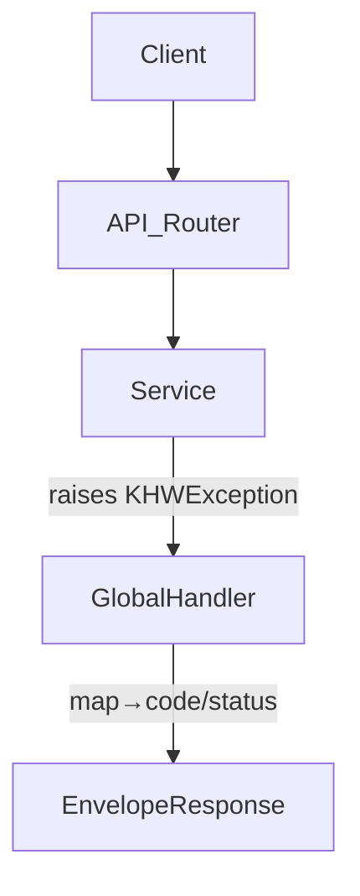

# API Common Response Envelope

## 1. 요구사항
- **목적:** 서비스/도메인 예외를 FastAPI 전역 핸들러로 공통 응답 포맷(`success`, `data`, `error`, `meta`, `feedback`)으로 전달하여 `Internal Server Error` 같은 뭉개진 메시지를 피함.
- **유형:** 변경
- **핵심 요구:**  
  - 입력: `KHWException` 계열 (RecordNotFound/Validation/BusinessLogic/LLM/NeedsReReview 등) 및 기타 런타임 예외.  
  - 출력: 실패 시 `success=false`, `data=null`, `error={code,message,details?,hint?}`(code 필수, 매핑 없으면 `INTERNAL.UNEXPECTED`), `feedback=[]`, `meta={requestId,timestamp}`.  
  - `details/hint`: 선택적이나 409/422/429(충돌/검증/LLM Rate Limit) 등에서는 활성화.  
  - 상태코드 매핑: 400/404/409/422/429/500 등, 미매핑은 500.  
  - `meta.requestId`: `X-Request-ID` 우선, 없으면 `uuid4`. `timestamp`: ISO8601.

## 2. 구현 파일
| 구분 | 경로 | 설명 |
| --- | --- | --- |
| 신규 | `app/schemas/response.py` | `{success,data,error,meta,feedback}` envelope Pydantic 정의 |
| 신규 | `app/api/error_handlers.py` | 전역 예외 매핑 + envelope 반환 로직 |
| 변경 | `app/api/main.py` | FastAPI 앱 생성 시 핸들러/미들웨어 등록 |
| 참조 | `app/core/exceptions.py` | 도메인 예외 종류, 코드 매핑 기준 |

## 3. 처리 흐름

## 4. 테스트 계획
| TC ID | 계층 | 시나리오 | 검증 | 입력/조건 | 기대 결과 |
| --- | --- | --- | --- | --- | --- |
| TC-API-001 | API | `RecordNotFoundError` | 404 + 코드/메시지 | 임시 라우터에서 raise | 404, `code` 매핑, `success=false`, `feedback=[]` |
| TC-API-002 | API | `ValidationError` | 400/422 + details | `details` 포함 raise | 400/422, `details`, `code` 규칙 |
| TC-API-003 | API | `LLMRateLimitError` | 429 + details | raise | 429, `details`, `code` |
| TC-API-004 | API | 런타임 예외 | fallback 500 | `RuntimeError` raise | 500, `code=INTERNAL.UNEXPECTED`, 메시지 |
- 테스트 방식: FastAPI 앱에 핸들러 등록 후 `httpx.AsyncClient`로 임시 라우트(raise) 호출.

## 5. 정책 확정
- `error.code`: API_REFER rule 따름, 필수, 매핑 없으면 `INTERNAL.UNEXPECTED`.  
- `details/hint`: 선택적, 409/422/429 처럼 설명 필요할 때 채움.  
- `feedback`: 항상 배열 (기본 `[]`), 실제 항목은 정책상 제한.  
- `meta`: `requestId`는 헤더 우선, 없으면 uuid4. `timestamp` ISO8601.

## 6. 아키텍처 정합성
- API 계층에서만 핸들링, 서비스/레포는 FastAPI 의존성 없음.  
- 핸들러는 재사용 가능한 서비스 위에만 적용, MCP 등 다른 프론트엔드에 영향 없음.
