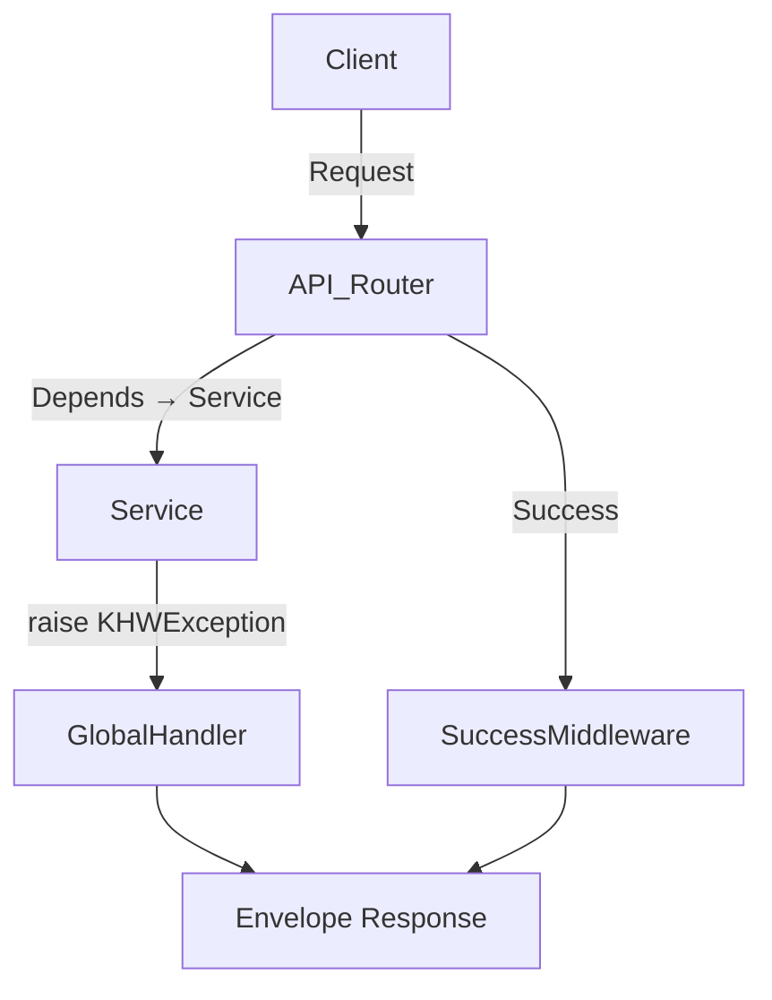

# API Common Response Envelope

## 1. 요구사항
- **목적:** FastAPI API/Routers가 전달하는 모든 JSON 응답을 동일한 envelope(`success`, `data`, `error`, `meta`, `feedback`)으로 바꿔, 실패/성공 여부를 일관되게 표현하고 프론트엔드가 메세지를 그대로 수신하도록 한다.
- **실패채널:** `KHWException` 계열(RecordNotFound/Validation/BusinessLogic/NeedsReReview/LLM*/VectorStore 등)을 catch하여 `success=false`, `data=null` + `{code,message,details?,hint?}` 구조(코드 필수, 매핑 없으면 `INTERNAL.UNEXPECTED`)로 응답. 상태코드 매핑: 400/404/409/422/429/503/500.
- **성공채널:** `status < 400`이고 JSON을 반환하면 성공 envelope을 생성(`success=true`, `data=<payload>`, `error=null`, `feedback=[]`)하여 기존 API 호출(`/manuals`, `/tasks`, etc.)도 공통 규격으로 응답.
- **공통 메타:** `meta`는 `requestId`(헤더 우선/X-Request-ID, 없으면 uuid4) + `timestamp`(UTC ISO8601).  
- **예외 처리 우선순위:** (1) `KHWException`, (2) FastAPI `HTTPException`, (3) 기타 `Exception`.

## 2. 구현 파일
| 구분 | 경로 | 설명 |
| --- | --- | --- |
| 신규 | `app/schemas/response.py` | 공통 envelope/feedback/error/meta Pydantic 정의 |
| 신규 | `app/api/response_utils.py` | `build_meta` helper로 모든 핸들러/미들웨어에 동일한 헤더/타임스탬프 제공 |
| 신규 | `app/api/error_handlers.py` | 예외 → 상태/에러코드/메시지 매핑 + 실패 envelope 반환 |
| 신규 | `app/api/response_middleware.py` | 정상 `application/json` 응답(상태<400, docs 제외)을 envelope으로 래핑하고 `Content-Length` 헤더 조정 |
| 변경 | `app/api/main.py` | 예외 핸들러+미들웨어 등록 |
| 확인 | `tests/unit/test_error_handlers.py` | `record`, `custom`, `success` 엔드포인트로 실패/성공 흐름 검증 |

## 3. 처리 흐름 (Mermaid)

- 실패는 `error_handlers` → envelope, 성공은 `response_middleware`가 body를 감싸며 OpenAPI docs 경로(`/docs`, `/openapi.json`, `/redoc`)는 제외.

## 4. 테스트 계획
| TC ID | 계층 | 시나리오 | 목적 | 입력/조건 | 기대 결과 |
| --- | --- | --- | --- | --- | --- |
| TC-API-001 | API | `RecordNotFoundError` | 404 + code/feedback | `raise RecordNotFoundError` | 404, `success=false`, `error.code="RecordNotFoundError"`, `feedback=[]` |
| TC-API-002 | API | `KHWException` fallback | 500 + INTERNAL.UNEXPECTED | `raise KHWException` | 500, `error.code="INTERNAL.UNEXPECTED"`, `meta` 포함 |
| TC-API-003 | API | 성공 JSON | envelope 적용 | `return {"ok": True}` | 200, `success=true`, `data={"ok":True}`, `error=null` |
| TC-API-004 | API | OpenAPI/docs 요청 | middleware skip | GET `/docs` | 원본 `openapi` definition 유지 |
- 자동화: `uv run pytest tests/unit/test_error_handlers.py`.

## 5. 정책 확정
- `error.code`: API code rule (`RecordNotFoundError`, `ValidationError`, `BusinessLogicError`, `LLMRateLimitError`, ...)을 사용하고 매핑 없으면 `INTERNAL.UNEXPECTED`.  
- `details/hint`: 422/409/429 등 설명 필요 시 포함.  
- `feedback`: 기본 `[]`, 실제 힌트는 정책적으로 제한.  
- `meta`: `requestId`는 `X-Request-ID` 또는 UUID4, `timestamp` UTC ISO8601.
- 성공 envelope은 `success=true`, `data` 필수, `error=null`, `feedback=[]`.

## 6. 아키텍처 정합성
- FastAPI app(`app/api/main.py`)에서 예외 핸들러 + 성공 미들웨어를 등록하여 모든 `app/routers` 엔드포인트가 공통 envelope 적용.  
- 서비스/리포지토리는 FastAPI 의존 없이 `KHWException`을 raise; API layer만 envelope/메타를 책임.  
- `SuccessEnvelopeMiddleware`는 `status>=400`/docs 경로/이미 envelope 포함 응답을 skip하여 `error_handlers`와 충돌 없이 통합.

## 7. 구현 보완 및 운영 팁
- `response_utils.build_meta`을 통해 예외/미들웨어가 동일한 `requestId`/`timestamp` 로직을 공유.  
- `response_middleware`는 `Content-Length` 헤더를 제거하여 응답 크기 불일치 오류(예: `/docs`)를 방지.  
- docs/openapi/redoc 경로는 미들웨어 스킵셋(`SKIP_PATHS`)에 등록해 원본 정의가 유지됩니다.  
- `tests/unit/test_error_handlers.py`에서 `uv run pytest tests/unit/test_error_handlers.py`로 envelope 동작을 계속 검증 중입니다.
