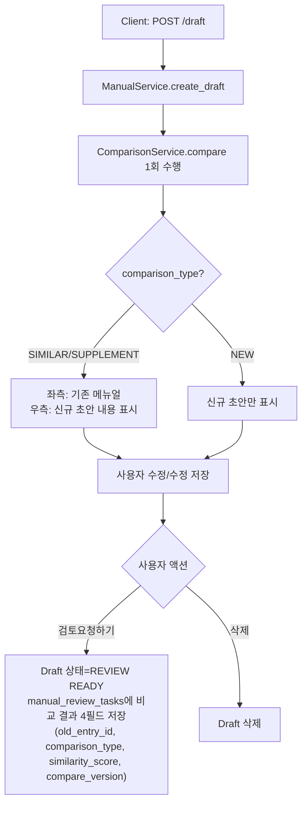
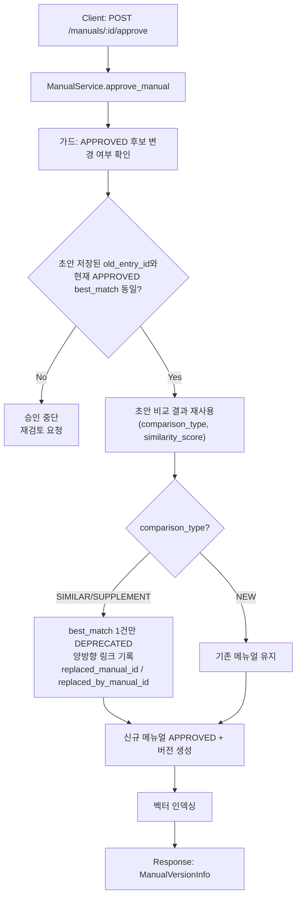
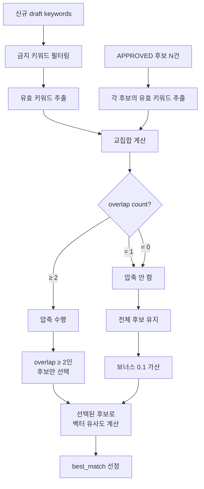
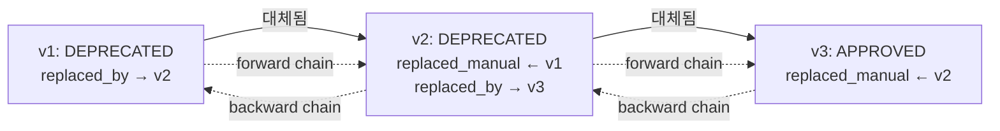

# Unit Spec: Multiple APPROVED Manuals 정책 구현

**작성일**: 2025-12-16
**버전**: 3.1 (초안/승인 로직 분리 + 비교 근거 저장)
**상태**: 구현 준비 완료

---

## 1. 요구사항 요약

### 1.1 핵심 정책

- **다중 APPROVED 허용**: 같은 (business_type, error_code)에 여러 APPROVED 메뉴얼 공존
- **비교는 넓게, 폐기는 좁게**: 모든 APPROVED 중 best_match 선정, 해당 1건만 DEPRECATED
- **초안/승인 로직 분리**:
  - `/draft`에서 비교를 1회 수행해 판정(SIMILAR/SUPPLEMENT/NEW)·근거를 **초안/검토 엔티티에만 저장**한다.
  - `/manuals/:id/approve`에서는 비교 재실행 대신 **가드**로만 사용: 초안 생성 후 APPROVED 후보가 바뀌지 않았는지 확인하고, 바뀌면 승인 중단 + 재검토 요청.
- **키워드 기반 최적화**: sub_category 대신 LLM 생성 키워드로 후보 압축, 교집합 개수 기반 단계화
- **대체 관계 추적**: 승인 시 양방향 링크 기록 (replaced_manual_id, replaced_by_manual_id)

### 1.2 로직 분리에 따른 최소 저장 필드

- **초안/검토 엔티티(`manual_review_tasks` 등 DRAFT/REVIEW 테이블)에 저장 (4)**  
  `old_entry_id` · `comparison_type (SIMILAR/SUPPLEMENT/NEW)` · `similarity_score` · `compare_version`  
  - 비교 결과(근거)는 승인본이 아닌 **검토 태스크 엔티티**에 둔다. `manual_entries`에는 메뉴얼 고유 데이터만 보관.
  - compare_version으로 당시 룰/threshold를 재현 가능하게 남긴다.
- **승인 시 저장 (2)**  
  `replaced_manual_id`(신규 APPROVED에 기록) · `replaced_by_manual_id`(기존 DEPRECATED에 기록)

### 1.3 변경 범위

| 구분 | 파일/테이블 | 변경 유형 | 설명 |
|------|-----------|----------|------|
| **DB 스키마** | `manual_review_tasks` (DRAFT/REVIEW) | 컬럼 추가 | `old_entry_id`, `comparison_type`, `similarity_score`, `compare_version` (초안 시 저장) |
| **DB 스키마** | `manual_entries` | 컬럼 추가 | `replaced_manual_id`, `replaced_by_manual_id` (승인 시) |
| **서비스** | `ComparisonService` | 로직 변경 | 모든 APPROVED 중 best_match 선정, 키워드 압축 단계화 |
| **서비스** | `ManualService` | 로직 변경 | `/draft`에서 compare 저장, `/approve`에서 후보 변경 가드 + DEPRECATED |
| **Repository** | `ManualEntryRepository` | 메서드 추가 | `find_all_approved_by_group`, `find_replacement_chain` |
| **테스트** | `tests/unit/test_multiple_manuals.py` | 신규 생성 | 정책 검증 테스트 |

### 1.4 핵심 설계 원칙

**초안 작성 단계 (`POST /draft`)**
- **목적**: 초안 유형(SIMILAR/SUPPLEMENT/NEW)과 비교 근거를 보여주고 사용자가 수정·검토 요청 여부를 결정
- **compare 실행**: 초안 생성 직후 1회 실행, 결과 4개 필드(DRAFT/REVIEW)에 저장
- **UI/응답**: SIMILAR/SUPPLEMENT 시 **좌측 기존·우측 신규** 비교 뷰 제공, NEW는 신규 초안만 표시
- **행동**: 사용자가 초안을 수정 → `검토요청하기` 또는 삭제
- **DEPRECATED 처리**: 하지 않음

**승인 단계 (`POST /manuals/:id/approve`)**
- **목적**: 검토자가 현행 APPROVED와 초안본을 비교 후 승인/반려, 승인 시 버전 관리 + DEPRECATED 처리
- **compare 재검증**: 후보 변경 감지만 수행(가드). 초안 생성 이후 APPROVED 후보가 바뀌면 승인 중단 + 재검토 요청.
- **저장 위치**: 승인 시 대체 관계 2개 필드만 기록(replaced_manual_id, replaced_by_manual_id)
- **DEPRECATED 처리**: best_match 1건만 처리

---

## 2. 동작 플로우 (Mermaid)

### 2.1 초안 작성/검토 플로우 (`POST /draft`)



### 2.2 승인 플로우 + 가드 (`POST /manuals/:id/approve`)



### 2.3 키워드 압축 단계화 상세



### 2.4 대체 관계 추적 체인



---

## 3. DB 스키마 변경

### 3.1 Migration Script

```python
# alembic/versions/20251216_multiple_approved_manuals.py
"""add comparison audit + replacement tracking for multiple approved manuals

Revision ID: 20251216_0001
Revises: 20251211_0003
Create Date: 2025-12-16
"""

from alembic import op
import sqlalchemy as sa
from sqlalchemy.dialects.postgresql import UUID
from app.models.manual import ComparisonType


def upgrade():
    # 0. 초안/검토 비교 근거 저장용 테이블: manual_review_tasks (예시)
    op.create_table(
        'manual_review_tasks',
        sa.Column('id', UUID(as_uuid=True), primary_key=True),
        sa.Column('manual_id', UUID(as_uuid=True), sa.ForeignKey('manual_entries.id', ondelete='CASCADE'), nullable=False),
        sa.Column('status', sa.String(20), nullable=False, server_default='DRAFT'),
        sa.Column('old_entry_id', UUID(as_uuid=True), sa.ForeignKey('manual_entries.id', ondelete='SET NULL'), nullable=True, comment='초안 비교 시 기준이 된 APPROVED 메뉴얼 ID'),
        sa.Column('comparison_type', sa.Enum(ComparisonType, name='manual_comparison_type'), nullable=True, comment='초안 비교 결과: SIMILAR/SUPPLEMENT/NEW'),
        sa.Column('similarity_score', sa.Float(), nullable=True, comment='비교 시 계산된 유사도 점수'),
        sa.Column('compare_version', sa.String(20), nullable=True, comment='비교 로직/threshold 버전 키'),
        sa.Column('created_at', sa.DateTime(timezone=True), server_default=sa.func.now()),
        sa.Column('updated_at', sa.DateTime(timezone=True), server_default=sa.func.now(), onupdate=sa.func.now()),
    )

    op.create_index(
        'idx_manual_review_tasks_manual_id',
        'manual_review_tasks',
        ['manual_id']
    )

    # 1. replaced_manual_id 추가 (이 메뉴얼이 대체한 구 메뉴얼)
    op.add_column(
        'manual_entries',
        sa.Column(
            'replaced_manual_id',
            UUID(as_uuid=True),
            sa.ForeignKey('manual_entries.id', ondelete='SET NULL'),
            nullable=True,
            comment='이 메뉴얼이 대체한 구 메뉴얼 ID (DEPRECATED 시킨 대상)',
        )
    )

    # 2. replaced_by_manual_id 추가 (이 메뉴얼을 대체한 신 메뉴얼)
    op.add_column(
        'manual_entries',
        sa.Column(
            'replaced_by_manual_id',
            UUID(as_uuid=True),
            sa.ForeignKey('manual_entries.id', ondelete='SET NULL'),
            nullable=True,
            comment='이 메뉴얼을 대체한 신규 메뉴얼 ID (DEPRECATED 된 경우)',
        )
    )

    # 3. 인덱스 추가
    op.create_index(
        'idx_manual_entries_replaced_manual_id',
        'manual_entries',
        ['replaced_manual_id']
    )

    op.create_index(
        'idx_manual_entries_replaced_by',
        'manual_entries',
        ['replaced_by_manual_id']
    )

    # 4. 복합 인덱스 (다중 APPROVED 조회 최적화)
    op.create_index(
        'idx_manual_group_status',
        'manual_entries',
        ['business_type', 'error_code', 'status']
    )


def downgrade():
    op.drop_index('idx_manual_review_tasks_manual_id')
    op.drop_table('manual_review_tasks')

    op.drop_index('idx_manual_group_status')
    op.drop_index('idx_manual_entries_replaced_by')
    op.drop_index('idx_manual_entries_replaced_manual_id')

    op.drop_column('manual_entries', 'replaced_by_manual_id')
    op.drop_column('manual_entries', 'replaced_manual_id')
```

### 3.2 Updated Model

```python
# app/models/manual.py
class ManualEntry(BaseModel):
    __tablename__ = "manual_entries"

    # 기존 필드
    keywords: Mapped[list[str]] = mapped_column(
        JSONB,
        nullable=False,
        default=list,
        server_default="[]",
        comment="1-3개 핵심 키워드 (LLM 추출)",
    )
    topic: Mapped[str] = mapped_column(String(200), nullable=False)
    background: Mapped[str] = mapped_column(Text, nullable=False)
    guideline: Mapped[str] = mapped_column(Text, nullable=False)

    business_type: Mapped[str | None] = mapped_column(String(50), index=True)
    error_code: Mapped[str | None] = mapped_column(String(50), index=True)
    status: Mapped[ManualStatus] = mapped_column(
        SQLEnum(ManualStatus, name="manual_status"),
        nullable=False,
        default=ManualStatus.DRAFT,
    )

    # 추가: 대체 관계 추적 (양방향 링크)
    replaced_manual_id: Mapped[UUID | None] = mapped_column(
        ForeignKey("manual_entries.id", ondelete="SET NULL"),
        nullable=True,
        comment="이 메뉴얼이 대체한 구 메뉴얼 ID",
    )

    replaced_by_manual_id: Mapped[UUID | None] = mapped_column(
        ForeignKey("manual_entries.id", ondelete="SET NULL"),
        nullable=True,
        comment="이 메뉴얼을 대체한 신 메뉴얼 ID",
    )

    # Relationships (기존 유지 + 추가)
    replaced_manual: Mapped[Optional["ManualEntry"]] = relationship(
        "ManualEntry",
        foreign_keys=[replaced_manual_id],
        remote_side="ManualEntry.id",
        back_populates="replaced_by_manuals",
    )

    replaced_by_manuals: Mapped[list["ManualEntry"]] = relationship(
        "ManualEntry",
        foreign_keys=[replaced_manual_id],
        back_populates="replaced_manual",
    )

    replaced_by: Mapped[Optional["ManualEntry"]] = relationship(
        "ManualEntry",
        foreign_keys=[replaced_by_manual_id],
        remote_side="ManualEntry.id",
        back_populates="deprecated_manuals",
    )

    deprecated_manuals: Mapped[list["ManualEntry"]] = relationship(
        "ManualEntry",
        foreign_keys=[replaced_by_manual_id],
        back_populates="replaced_by",
    )

# 초안/검토 비교 근거 저장 전용
class ManualReviewTask(BaseModel):
    __tablename__ = "manual_review_tasks"

    id: Mapped[UUID] = mapped_column(primary_key=True, default=uuid4)
    manual_id: Mapped[UUID] = mapped_column(
        ForeignKey("manual_entries.id", ondelete="CASCADE"),
        nullable=False,
    )
    status: Mapped[str] = mapped_column(String(20), nullable=False, default="DRAFT")
    old_entry_id: Mapped[UUID | None] = mapped_column(
        ForeignKey("manual_entries.id", ondelete="SET NULL"),
        nullable=True,
        comment="초안 비교 시 기준이 된 APPROVED 메뉴얼 ID",
    )
    comparison_type: Mapped[ComparisonType | None] = mapped_column(
        SQLEnum(ComparisonType, name="manual_comparison_type"),
        nullable=True,
        comment="초안 비교 결과: SIMILAR/SUPPLEMENT/NEW",
    )
    similarity_score: Mapped[float | None] = mapped_column(
        Float,
        nullable=True,
        comment="비교 시 계산된 유사도 점수",
    )
    compare_version: Mapped[str | None] = mapped_column(
        String(20),
        nullable=True,
        comment="비교 로직/threshold 버전 키",
    )

    manual: Mapped["ManualEntry"] = relationship("ManualEntry", foreign_keys=[manual_id])
```

### 3.3 승인 가드 룰 (비교 재검증 최소화)

- `/approve`는 full 비교를 재실행하지 않는다.
- 초안 저장 값과 현재 APPROVED best_match의 ID가 다르면 승인 중단 + 재검토 요청.
- 동일하면 초안에 저장된 `old_entry_id`, `comparison_type`, `similarity_score`, `compare_version`을 그대로 사용해 승인·버전·DEPRECATED를 처리한다.

---

## 4. 후보 압축 로직 튜닝

### 4.1 압축 전략 개요

**문제점:**
- 교집합 1개가 "의미 없는 키워드(예: '오류', '실패')"일 경우, 오히려 best_match가 틀어질 수 있음

**해결 방안:**
- 교집합 개수 기반 단계화
- 희귀도가 낮은 키워드는 압축에 사용하지 않음 (금지 키워드 목록 운영)

### 4.2 압축 단계 정의

```python
# app/core/config.py (설정 추가)

# 키워드 압축 설정
KEYWORD_COMPRESSION_MIN_OVERLAP = 2  # 압축 수행 최소 교집합 개수
KEYWORD_COMPRESSION_BONUS_WEIGHT = 0.1  # overlap=1일 때 유사도 보너스

# 금지 키워드 (희귀도 낮음, 압축에 사용 안 함)
KEYWORD_FORBIDDEN_FOR_COMPRESSION = {
    "오류", "에러", "error", "실패", "fail", "문제", "issue",
    "확인", "체크", "check", "조치", "처리", "해결",
}
```

### 4.3 압축 로직 구현

```python
# app/services/comparison_service.py

from app.core.config import (
    KEYWORD_COMPRESSION_MIN_OVERLAP,
    KEYWORD_COMPRESSION_BONUS_WEIGHT,
    KEYWORD_FORBIDDEN_FOR_COMPRESSION,
)

class ComparisonService:
    """신규 draft와 기존 메뉴얼 비교 서비스 (v3.0)"""

    async def compare(
        self,
        new_draft: ManualEntry,
        compare_with_manual_id: UUID | None = None,
        *,
        similarity_threshold_similar: float = 0.95,
        similarity_threshold_supplement: float = 0.7,
    ) -> ComparisonResult:
        """
        정책: 비교는 넓게, 폐기는 좁게

        1. 모든 APPROVED 조회
        2. (선택적) 키워드로 후보 압축 (단계화)
        3. 벡터 유사도로 best_match 선정 (키워드 보너스 가산)
        4. 최종 판정 (SIMILAR/SUPPLEMENT/NEW)
        """

        logger.info(
            "comparison_started",
            new_draft_id=str(new_draft.id),
            business_type=new_draft.business_type,
            error_code=new_draft.error_code,
            keywords=new_draft.keywords,
        )

        # Step 1: 1차 후보 수집 (모든 APPROVED)
        candidates = await self.manual_repo.find_all_approved_by_group(
            business_type=new_draft.business_type,
            error_code=new_draft.error_code,
        )

        if not candidates:
            logger.info(
                "comparison_no_candidates",
                new_draft_id=str(new_draft.id),
            )
            return ComparisonResult(
                comparison_type=ComparisonType.NEW,
                existing_manual=None,
                similarity_score=None,
                reason="no_approved_manuals_in_group",
            )

        logger.info(
            "comparison_candidates_collected",
            new_draft_id=str(new_draft.id),
            total_candidates=len(candidates),
        )

        # Step 2: 키워드로 후보 압축 (단계화)
        keyword_scores = {}  # candidate.id → overlap_score
        filtered_candidates = candidates

        if new_draft.keywords:
            # 유효 키워드 추출 (금지 키워드 제외)
            valid_keywords = self._filter_valid_keywords(new_draft.keywords)

            if valid_keywords:
                new_keywords_set = set(valid_keywords)
                candidate_overlaps = []

                for candidate in candidates:
                    if not candidate.keywords:
                        candidate_overlaps.append((candidate, 0, set()))
                        continue

                    candidate_valid_keywords = self._filter_valid_keywords(
                        candidate.keywords
                    )
                    candidate_keywords_set = set(candidate_valid_keywords)

                    # 교집합 계산
                    overlap = new_keywords_set & candidate_keywords_set
                    overlap_count = len(overlap)

                    candidate_overlaps.append((candidate, overlap_count, overlap))
                    keyword_scores[candidate.id] = overlap_count

                # 압축 단계 적용
                overlap_2_or_more = [
                    c for c, count, _ in candidate_overlaps
                    if count >= KEYWORD_COMPRESSION_MIN_OVERLAP
                ]

                if overlap_2_or_more:
                    # overlap ≥ 2 → 압축 수행
                    filtered_candidates = overlap_2_or_more

                    logger.info(
                        "comparison_candidates_compressed",
                        new_draft_id=str(new_draft.id),
                        total_candidates=len(candidates),
                        filtered_candidates=len(filtered_candidates),
                        compression_reason="overlap_ge_2",
                        reduction_ratio=f"{len(filtered_candidates)/len(candidates):.2%}",
                        filter_keywords=valid_keywords,
                    )
                else:
                    # overlap < 2 → 압축 안 함, 전체 후보 유지
                    # keyword_scores는 유사도 보너스로만 사용
                    logger.info(
                        "comparison_no_compression",
                        new_draft_id=str(new_draft.id),
                        keywords=valid_keywords,
                        message="교집합 ≥ 2인 후보 없음, 전체 후보 유지 (보너스만 적용)",
                    )

        # Step 3: 벡터 유사도로 best_match 선정 (키워드 보너스 가산)
        best_match = None
        best_similarity = 0.0
        best_final_score = 0.0

        new_draft_text = self._build_manual_text(new_draft)

        for candidate in filtered_candidates:
            candidate_text = self._build_manual_text(candidate)

            # 벡터 유사도 계산
            similarity = await self.vectorstore.similarity(
                text1=new_draft_text,
                text2=candidate_text,
            )

            # 키워드 보너스 가산 (overlap = 1일 때만)
            keyword_bonus = 0.0
            overlap_count = keyword_scores.get(candidate.id, 0)

            if overlap_count == 1:
                keyword_bonus = KEYWORD_COMPRESSION_BONUS_WEIGHT

            final_score = similarity + keyword_bonus

            logger.debug(
                "comparison_similarity_calculated",
                new_draft_id=str(new_draft.id),
                candidate_id=str(candidate.id),
                similarity=f"{similarity:.2f}",
                keyword_overlap=overlap_count,
                keyword_bonus=f"{keyword_bonus:.2f}",
                final_score=f"{final_score:.2f}",
            )

            if final_score > best_final_score:
                best_final_score = final_score
                best_similarity = similarity  # 원본 유사도 (보너스 제외)
                best_match = candidate

        logger.info(
            "comparison_best_match_selected",
            new_draft_id=str(new_draft.id),
            best_match_id=str(best_match.id) if best_match else None,
            best_similarity=f"{best_similarity:.2f}",
            best_final_score=f"{best_final_score:.2f}",
        )

        # Step 4: 최종 판정 (원본 유사도 기준)
        if best_similarity >= similarity_threshold_similar:
            return ComparisonResult(
                comparison_type=ComparisonType.SIMILAR,
                existing_manual=best_match,
                similarity_score=best_similarity,
                reason=f"vector_similarity_{best_similarity:.2f}_above_{similarity_threshold_similar}",
            )
        elif best_similarity >= similarity_threshold_supplement:
            return ComparisonResult(
                comparison_type=ComparisonType.SUPPLEMENT,
                existing_manual=best_match,
                similarity_score=best_similarity,
                reason=f"vector_similarity_{best_similarity:.2f}_between_{similarity_threshold_supplement}_and_{similarity_threshold_similar}",
            )
        else:
            return ComparisonResult(
                comparison_type=ComparisonType.NEW,
                existing_manual=None,
                similarity_score=best_similarity,
                reason=f"vector_similarity_{best_similarity:.2f}_below_{similarity_threshold_supplement}",
            )

    def _filter_valid_keywords(self, keywords: list[str]) -> list[str]:
        """
        유효 키워드 필터링 (금지 키워드 제외)

        Args:
            keywords: 원본 키워드 리스트

        Returns:
            금지 키워드를 제외한 유효 키워드 리스트
        """
        return [
            kw for kw in keywords
            if kw.lower() not in KEYWORD_FORBIDDEN_FOR_COMPRESSION
        ]

    def _build_manual_text(self, manual: ManualEntry) -> str:
        """벡터 비교용 텍스트 구성"""
        return f"{manual.topic}\n{manual.background}\n{manual.guideline}"
```

---

## 5. ManualService 구현 (DEPRECATED + 대체 관계)

### 5.1 approve_manual 메서드

```python
# app/services/manual_service.py

async def approve_manual(
    self,
    manual_id: UUID,
    request: ManualApproveRequest,
) -> ManualVersionInfo:
    """
    메뉴얼 승인 (compare 재실행 없음, 가드만 수행)

    0. 초안 비교 결과 존재 여부 확인 (comparison_type 등)
    1. 가드: 초안 대비 APPROVED 후보 변경 여부 확인
    2. 버전 생성
    3. best_match만 DEPRECATED + 대체 관계 기록
    4. 신규 메뉴얼 APPROVED
    5. 벡터 인덱싱
    """

    manual = await self.manual_repo.get_by_id(manual_id)
    if manual is None:
        raise RecordNotFoundError(f"ManualEntry(id={manual_id}) not found")

    review = await self.review_task_repo.get_by_manual_id(manual_id)
    if not review or not review.comparison_type:
        raise InvalidStateError("draft comparison result missing")

    logger.info(
        "manual_approve_start",
        manual_id=str(manual_id),
        approver_id=str(request.approver_id),
        comparison_type=review.comparison_type.value,
        old_entry_id=str(review.old_entry_id) if review.old_entry_id else None,
    )

    # Step 1: 가드 - 초안 이후 APPROVED 후보 변경 여부 확인
    current_best = await self.comparison_service.find_best_match_candidate(manual)
    if current_best and current_best.id != review.old_entry_id:
        raise NeedsReReviewError(
            "approved candidate changed after draft; please re-run review"
        )

    # Step 2: 버전 생성
    latest_version = await self.version_repo.get_latest_version(
        business_type=manual.business_type,
        error_code=manual.error_code,
    )
    next_version_num = self._next_version_number(latest_version)

    next_version = ManualVersion(
        version=str(next_version_num),
        business_type=manual.business_type,
        error_code=manual.error_code,
    )
    await self.version_repo.create(next_version)

    # Step 3: best_match만 DEPRECATED + 대체 관계 기록
    if review.comparison_type in [
        ComparisonType.SIMILAR,
        ComparisonType.SUPPLEMENT,
    ]:
        if review.old_entry_id:
            old_manual = await self.manual_repo.get_by_id(review.old_entry_id)

            # 양방향 링크 설정
            old_manual.status = ManualStatus.DEPRECATED
            old_manual.replaced_by_manual_id = manual.id  # 구 → 신
            manual.replaced_manual_id = old_manual.id  # 신 → 구

            await self.manual_repo.update(old_manual)

            await self._log_replacement_event(
                old_manual_id=old_manual.id,
                new_manual_id=manual.id,
                comparison_type=review.comparison_type,
                similarity_score=review.similarity_score,
                approver_id=request.approver_id,
            )

    # Step 4: 신규 메뉴얼 APPROVED
    manual.status = ManualStatus.APPROVED
    manual.version_id = next_version.id
    await self.manual_repo.update(manual)

    # Step 5: 벡터 인덱싱
    await self._index_manual_vector(manual)

    return ManualVersionInfo(
        version=next_version.version,
        approved_at=next_version.created_at,
    )
```

### 5.2 대체 관계 이벤트 로그

```python
# app/services/manual_service.py

async def _log_replacement_event(
    self,
    old_manual_id: UUID,
    new_manual_id: UUID,
    comparison_type: ComparisonType,
    similarity_score: float | None,
    approver_id: UUID,
) -> None:
    """
    메뉴얼 대체 이벤트 로그 기록 (감사 추적)

    이벤트는 구조화된 로그로 저장
    """

    event = {
        "event_type": "manual_replaced",
        "old_manual_id": str(old_manual_id),
        "new_manual_id": str(new_manual_id),
        "comparison_type": comparison_type.value,
        "similarity_score": similarity_score,
        "approver_id": str(approver_id),
        "timestamp": datetime.utcnow().isoformat(),
    }

    # 구조화된 로그
    logger.info(
        "manual_replacement_event",
        **event,
    )
```

---

## 6. Repository 구현

### 6.1 find_all_approved_by_group

```python
# app/repositories/manual_rdb.py

class ManualEntryRDBRepository(BaseRepository[ManualEntry]):

    async def find_all_approved_by_group(
        self,
        business_type: str,
        error_code: str,
    ) -> list[ManualEntry]:
        """
        같은 그룹의 모든 APPROVED 메뉴얼 조회

        Args:
            business_type: 업무 구분
            error_code: 에러 코드

        Returns:
            APPROVED 상태인 메뉴얼 리스트 (생성일 역순)
        """
        stmt = (
            select(ManualEntry)
            .where(
                ManualEntry.business_type == business_type,
                ManualEntry.error_code == error_code,
                ManualEntry.status == ManualStatus.APPROVED,
            )
            .order_by(ManualEntry.created_at.desc())
        )

        result = await self.session.execute(stmt)
        return list(result.scalars().all())

    async def find_replacement_chain(
        self,
        manual_id: UUID,
        direction: Literal["forward", "backward"] = "forward",
    ) -> list[ManualEntry]:
        """
        대체 관계 체인 조회

        Args:
            manual_id: 시작 메뉴얼 ID
            direction:
                - forward: 이 메뉴얼이 대체한 메뉴얼들 (과거 방향)
                - backward: 이 메뉴얼을 대체한 메뉴얼들 (미래 방향)

        Returns:
            대체 관계 체인 (시간 순서)

        예시:
            v1 → v2 → v3 → v4

            find_replacement_chain(v3, "forward") → [v2, v1]
            find_replacement_chain(v3, "backward") → [v4]
        """
        chain = []
        current_id = manual_id

        # 최대 100번 반복 (무한 루프 방지)
        for _ in range(100):
            stmt = select(ManualEntry).where(ManualEntry.id == current_id)
            result = await self.session.execute(stmt)
            current = result.scalar_one_or_none()

            if not current:
                break

            if direction == "forward":
                # 이 메뉴얼이 대체한 구 메뉴얼
                if current.replaced_manual_id:
                    chain.append(current)
                    current_id = current.replaced_manual_id
                else:
                    break
            else:  # backward
                # 이 메뉴얼을 대체한 신 메뉴얼
                if current.replaced_by_manual_id:
                    chain.append(current)
                    current_id = current.replaced_by_manual_id
                else:
                    break

        return chain
```

---

## 7. 테스트 계획

### 7.1 단위 테스트

```python
# tests/unit/test_multiple_manuals.py

import pytest
from app.models.manual import ManualEntry, ManualStatus
from app.services.comparison_service import ComparisonService, ComparisonType
from app.services.manual_service import ManualService


@pytest.mark.asyncio
async def test_compare_with_keyword_overlap_ge_2():
    """키워드 교집합 ≥ 2 → 압축 수행"""

    # Given: 3개의 APPROVED 메뉴얼
    m1 = create_manual(keywords=["한도", "초과", "결제"], topic="한도 초과")
    m2 = create_manual(keywords=["통신", "오류", "네트워크"], topic="통신 오류")
    m3 = create_manual(keywords=["카드", "정지", "도난"], topic="카드 정지")

    await approve_all([m1, m2, m3])

    # When: 한도 + 초과 키워드 신규 초안 (overlap = 2)
    new_draft = create_manual(keywords=["한도", "초과", "부족"])

    comparison = await comparison_service.compare(new_draft)

    # Then: m1만 후보로 선정되어 비교
    assert comparison.existing_manual == m1


@pytest.mark.asyncio
async def test_compare_with_keyword_overlap_eq_1():
    """키워드 교집합 = 1 → 압축 안 함, 보너스만 적용"""

    # Given: 2개의 APPROVED 메뉴얼
    m1 = create_manual(keywords=["한도", "초과"], topic="한도 초과 v1")
    m2 = create_manual(keywords=["통신", "오류"], topic="통신 오류 v1")

    await approve_all([m1, m2])

    # When: overlap = 1인 신규 초안
    new_draft = create_manual(keywords=["한도", "부족"])

    comparison = await comparison_service.compare(new_draft)

    # Then: 전체 후보 대상으로 best_match 선정
    # (m1에 키워드 보너스 0.1 가산)
    assert comparison.existing_manual in [m1, m2]


@pytest.mark.asyncio
async def test_compare_forbidden_keyword_exclusion():
    """금지 키워드는 압축에 사용되지 않음"""

    # Given: 2개의 APPROVED 메뉴얼
    m1 = create_manual(keywords=["오류", "한도"], topic="한도 오류")
    m2 = create_manual(keywords=["오류", "통신"], topic="통신 오류")

    await approve_all([m1, m2])

    # When: "오류" + "한도" 신규 초안
    # "오류"는 금지 키워드 → 유효 키워드는 "한도"만
    new_draft = create_manual(keywords=["오류", "한도"])

    comparison = await comparison_service.compare(new_draft)

    # Then: 유효 키워드 overlap = 1 → 압축 안 함
    # (전체 후보 대상, 보너스만 적용)
    assert comparison.existing_manual in [m1, m2]


@pytest.mark.asyncio
async def test_deprecate_only_best_match():
    """best_match만 DEPRECATED, 나머지 유지"""

    # Given: 3개의 APPROVED 메뉴얼
    m1 = create_manual(keywords=["한도", "초과"], topic="한도 초과 v1")
    m2 = create_manual(keywords=["통신", "오류"], topic="통신 오류 v1")
    m3 = create_manual(keywords=["카드", "정지"], topic="카드 정지 v1")

    await approve_all([m1, m2, m3])

    # When: m1과 유사한 메뉴얼 승인
    m4 = create_manual(keywords=["한도", "초과"], topic="한도 초과 v2")
    await manual_service.approve_manual(m4.id)

    # Then: m1만 DEPRECATED, m2/m3은 APPROVED 유지
    m1_after = await manual_repo.get_by_id(m1.id)
    m2_after = await manual_repo.get_by_id(m2.id)
    m3_after = await manual_repo.get_by_id(m3.id)
    m4_after = await manual_repo.get_by_id(m4.id)

    assert m1_after.status == ManualStatus.DEPRECATED
    assert m2_after.status == ManualStatus.APPROVED  # 유지!
    assert m3_after.status == ManualStatus.APPROVED  # 유지!
    assert m4_after.status == ManualStatus.APPROVED


@pytest.mark.asyncio
async def test_replacement_relationship_tracking():
    """대체 관계 양방향 링크 검증"""

    # Given: APPROVED 메뉴얼
    m1 = create_manual(topic="v1")
    await manual_service.approve_manual(m1.id)

    # When: 유사한 메뉴얼 승인 (m1을 대체)
    m2 = create_manual(topic="v2")
    await manual_service.approve_manual(m2.id)

    # Then: 양방향 링크 확인
    m1_after = await manual_repo.get_by_id(m1.id)
    m2_after = await manual_repo.get_by_id(m2.id)

    # m1 → m2 (구 → 신)
    assert m1_after.replaced_by_manual_id == m2.id

    # m2 → m1 (신 → 구)
    assert m2_after.replaced_manual_id == m1.id


@pytest.mark.asyncio
async def test_replacement_chain():
    """대체 관계 체인 조회"""

    # Given: v1 → v2 → v3 → v4
    m1 = create_manual(topic="v1")
    await manual_service.approve_manual(m1.id)

    m2 = create_manual(topic="v2")
    await manual_service.approve_manual(m2.id)  # m1 DEPRECATED

    m3 = create_manual(topic="v3")
    await manual_service.approve_manual(m3.id)  # m2 DEPRECATED

    m4 = create_manual(topic="v4")
    await manual_service.approve_manual(m4.id)  # m3 DEPRECATED

    # When: v3에서 forward 체인 조회
    forward_chain = await manual_repo.find_replacement_chain(m3.id, "forward")

    # Then: [v2, v1] 반환
    assert len(forward_chain) == 2
    assert forward_chain[0].id == m2.id
    assert forward_chain[1].id == m1.id

    # When: v3에서 backward 체인 조회
    backward_chain = await manual_repo.find_replacement_chain(m3.id, "backward")

    # Then: [v4] 반환
    assert len(backward_chain) == 1
    assert backward_chain[0].id == m4.id


@pytest.mark.asyncio
async def test_draft_saves_comparison_fields_and_split_view():
    """초안 생성 시 비교 결과 4필드 저장 + 좌우 비교 뷰 데이터 제공"""

    existing = create_manual(topic="v1", keywords=["한도", "초과"])
    await manual_service.approve_manual(existing.id)

    draft = await manual_service.create_draft_from_consultation(
        consultation_id=uuid4(),
        business_type="결제",
        error_code="E001",
        inquiry="한도 초과로 결제 실패",
    )

    review = await review_task_repo.get_by_manual_id(draft.id)
    assert review.comparison_type == ComparisonType.SIMILAR
    assert review.old_entry_id == existing.id
    assert review.similarity_score is not None
    assert review.compare_version is not None

    # UI/응답: 좌측 기존, 우측 신규
    response = await manual_router.get_draft_view(draft.id)
    assert response.left.manual_id == existing.id
    assert response.right.manual_id == draft.id


@pytest.mark.asyncio
async def test_approve_guard_requires_rereview_when_candidate_changes():
    """승인 시 후보가 바뀌면 재검토 요청(NeedsReReviewError)"""

    original = create_manual(topic="v1", keywords=["한도", "초과"])
    await manual_service.approve_manual(original.id)

    draft = await manual_service.create_draft_from_consultation(
        consultation_id=uuid4(),
        business_type="결제",
        error_code="E001",
        inquiry="한도 초과로 결제 실패",
    )

    # 새 APPROVED가 추가되어 best_match 변경
    newer = create_manual(topic="v2", keywords=["한도", "초과", "연체"])
    await manual_service.approve_manual(newer.id)

    with pytest.raises(NeedsReReviewError):
        await manual_service.approve_manual(draft.id)
```

### 7.2 통합 테스트

```python
# tests/integration/test_multiple_manuals_workflow.py

@pytest.mark.asyncio
async def test_complete_workflow_multiple_causes():
    """실제 워크플로우: 3가지 원인의 메뉴얼 생성 + 승인"""

    # 1. 한도 초과 케이스
    c1 = await create_consultation(
        inquiry="카드 한도 부족으로 결제 실패",
        business_type="결제",
        error_code="E001",
    )
    draft1 = await manual_service.create_draft_from_consultation(c1.id)
    await manual_service.approve_manual(draft1.id)

    # 2. 통신 오류 케이스
    c2 = await create_consultation(
        inquiry="네트워크 장애로 결제 실패",
        business_type="결제",
        error_code="E001",  # 같은 에러코드!
    )
    draft2 = await manual_service.create_draft_from_consultation(c2.id)
    await manual_service.approve_manual(draft2.id)

    # 3. 카드 정지 케이스
    c3 = await create_consultation(
        inquiry="도난 신고 카드로 결제 시도",
        business_type="결제",
        error_code="E001",  # 같은 에러코드!
    )
    draft3 = await manual_service.create_draft_from_consultation(c3.id)
    await manual_service.approve_manual(draft3.id)

    # 검증: 3개 모두 APPROVED
    approved_manuals = await manual_repo.find_all_approved_by_group(
        business_type="결제",
        error_code="E001",
    )

    assert len(approved_manuals) == 3
    assert all(m.status == ManualStatus.APPROVED for m in approved_manuals)

    # 키워드가 다름
    keywords_list = [set(m.keywords) for m in approved_manuals]
    assert len(keywords_list) == 3

    # 검색 시 모두 반환
    search_results = await manual_service.search_manuals(
        query="카드 결제 오류",
        business_type="결제",
    )

    assert len(search_results) >= 3
```

---

## 8. 운영 가이드

### 8.1 대체 관계 추적

```python
# scripts/trace_replacement_history.py
"""
특정 메뉴얼의 대체 관계 히스토리 조회
"""

async def trace_replacement_history(manual_id: UUID):
    """
    메뉴얼의 전체 대체 관계 히스토리 출력

    예시:
        v1 (2024-01-01 DEPRECATED)
          ↓ replaced_by (similarity: 0.96)
        v2 (2024-03-15 DEPRECATED)
          ↓ replaced_by (similarity: 0.92)
        v3 (2024-06-20 APPROVED) ← 현재 버전
    """

    # 1. Forward chain (과거 방향)
    forward = await manual_repo.find_replacement_chain(manual_id, "forward")

    # 2. Backward chain (미래 방향)
    backward = await manual_repo.find_replacement_chain(manual_id, "backward")

    # 3. 현재 메뉴얼
    current = await manual_repo.get_by_id(manual_id)

    # 4. 전체 체인 구성
    full_chain = list(reversed(forward)) + [current] + backward

    # 5. 출력
    print(f"메뉴얼 대체 히스토리 (총 {len(full_chain)}건)")
    print("=" * 80)

    for i, manual in enumerate(full_chain):
        print(f"\nv{i+1}: {manual.topic}")
        print(f"  ID: {manual.id}")
        print(f"  생성일: {manual.created_at}")
        print(f"  상태: {manual.status.value}")
        print(f"  키워드: {manual.keywords}")

        if manual.replaced_by_manual_id:
            next_manual = full_chain[i + 1] if i + 1 < len(full_chain) else None
            if next_manual:
                print(f"  ↓ 대체됨 (→ v{i+2})")
```

### 8.2 금지 키워드 관리

```python
# scripts/manage_forbidden_keywords.py
"""
금지 키워드 목록 관리 스크립트
"""

async def analyze_keyword_frequency():
    """
    전체 메뉴얼의 키워드 빈도 분석
    """
    manuals = await manual_repo.find_all(status=ManualStatus.APPROVED)

    keyword_freq = {}
    for manual in manuals:
        for keyword in manual.keywords:
            keyword_freq[keyword] = keyword_freq.get(keyword, 0) + 1

    # 빈도 순 정렬
    sorted_keywords = sorted(keyword_freq.items(), key=lambda x: x[1], reverse=True)

    print("키워드 빈도 분석 (상위 20개)")
    print("=" * 80)
    for keyword, count in sorted_keywords[:20]:
        ratio = count / len(manuals) * 100
        print(f"{keyword:20s} {count:5d}건 ({ratio:.1f}%)")

    # 50% 이상 등장하는 키워드 → 금지 키워드 후보
    high_freq_keywords = [
        kw for kw, count in sorted_keywords
        if count / len(manuals) >= 0.5
    ]

    print(f"\n금지 키워드 후보 (50% 이상 등장): {high_freq_keywords}")
```

---

## 9. 성능 최적화

### 9.1 인덱스 전략

```sql
-- 복합 인덱스 (다중 APPROVED 조회 최적화)
CREATE INDEX idx_manual_group_status
ON manual_entries(business_type, error_code, status);

-- 대체 관계 역추적
CREATE INDEX idx_manual_entries_replaced_by
ON manual_entries(replaced_by_manual_id);

-- 대체 관계 순방향 추적
CREATE INDEX idx_manual_entries_replaced_manual_id
ON manual_entries(replaced_manual_id);
```

### 9.2 캐싱 전략

```python
# app/services/comparison_service.py
from functools import lru_cache

# 후보 조회 결과 캐싱 (선택적)
@lru_cache(maxsize=100)
async def _get_candidates_cached(
    business_type: str,
    error_code: str,
) -> tuple[ManualEntry, ...]:
    """
    후보 조회 결과 캐싱
    (APPROVED 상태 변경이 적은 경우에만 유효)
    """
    candidates = await self.manual_repo.find_all_approved_by_group(
        business_type=business_type,
        error_code=error_code,
    )
    return tuple(candidates)  # immutable
```

---

## 10. 롤백 계획

### 10.1 DB 롤백

```bash
# 마이그레이션 롤백
alembic downgrade -1

# 데이터 복구 (replaced_* 필드 제거 전 백업)
```

### 10.2 코드 롤백

```yaml
영향 범위:
  - ComparisonService: 기존 로직으로 복원
  - ManualService: 기존 DEPRECATED 로직으로 복원
  - Repository: 새 메서드 사용 중단

테스트:
  - 기존 테스트 통과 확인
  - 다중 APPROVED 제거 확인
```

---

## 11. 관련 파일

### 11.1 수정 파일

- `app/models/manual.py`: 필드 추가 (old_entry_id, comparison_type, similarity_score, compare_version, replaced_manual_id, replaced_by_manual_id)
- `app/core/config.py`: 키워드 압축 설정 추가
- `app/services/comparison_service.py`: 비교 로직 변경 (압축 단계화, 보너스 가산) + 가드용 `find_best_match_candidate`
- `app/services/manual_service.py`: 초안 비교 결과 저장, 승인 시 가드 + DEPRECATED + 대체 관계 기록
- `app/routers/manuals.py`: /draft 좌우 비교 뷰, 검토요청 처리
- `app/repositories/manual_rdb.py`: find_all_approved_by_group, find_replacement_chain 추가
- `alembic/versions/20251216_multiple_approved_manuals.py`: 마이그레이션

### 11.2 테스트 파일

- `tests/unit/test_multiple_manuals.py`: 정책 검증
- `tests/integration/test_multiple_manuals_workflow.py`: 전체 플로우

### 11.3 운영 스크립트

- `scripts/trace_replacement_history.py`: 대체 관계 추적
- `scripts/manage_forbidden_keywords.py`: 금지 키워드 관리

---

## 12. 체크리스트

### 12.1 구현 전 확인

- [ ] DB 백업 완료
- [ ] 마이그레이션 스크립트 검토
- [ ] 테스트 환경 준비
- [ ] 금지 키워드 초기 목록 정의

### 12.2 구현 중 확인

- [ ] 비교 로직 (후보 압축 단계화) 동작 확인
- [ ] 키워드 보너스 가산 로직 확인
- [ ] DEPRECATED + 대체 관계 기록 확인
- [ ] 초안 비교 결과 4필드 저장 확인
- [ ] 승인 가드 동작 확인 (후보 변경 시 재검토)
- [ ] 단위 테스트 통과
- [ ] 통합 테스트 통과

### 12.3 구현 후 확인

- [ ] 다중 APPROVED 메뉴얼 생성 확인
- [ ] 검색 품질 확인 (모든 케이스 반환)
- [ ] 압축 단계화 효과 측정 (overlap ≥ 2 비율)
- [ ] 대체 관계 추적 스크립트 동작 확인
- [ ] 성능 측정 (후보 압축 효과)
- [ ] 초안 좌우 비교 UI 렌더링 확인

---

**작성자**: AI + 사용자 협업
**최종 검토**: 필요
**예상 구현 기간**: 2-3주
