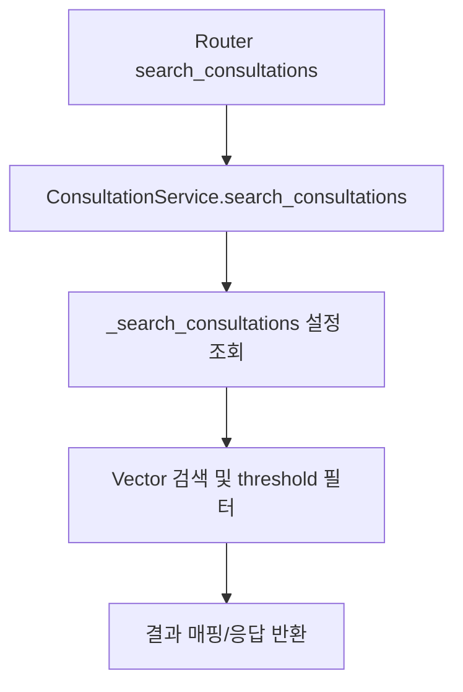

# Unit Spec

## 1. 요구사항 요약

- **목적:** 상담 검색 시 `NameError: settings not defined` 오류를 제거하고 검색이 정상 동작하도록 수정
- **유형:** ☑ 변경 ☐ 신규 ☐ 삭제
- **핵심 요구사항:**
  - 입력: `query`(string), `top_k`(int), 필터 파라미터(지점/업무유형/에러코드/기간 등)
  - 출력: 기존 상담 검색 결과 스키마(유사도 점수 포함 리스트)
  - 예외/제약: `settings.search_similarity_threshold` 접근 시 NameError가 발생하지 않도록 설정 주입/참조 방식 수정
  - 처리흐름 요약: 검색 서비스에서 설정 값을 안전하게 참조한 뒤 유사도 필터링 후 결과 반환

---

## 2. 구현 대상 파일

| 구분 | 경로 | 설명 |
| ---- | ---- | ---- |
| 변경 | app/services/consultation_service.py | 검색 로직에서 설정 참조 수정 |
| 변경 | app/services/manual_service.py | 동일 패턴의 설정 참조 수정(재발 방지) |
| 참조 | app/core/config.py | settings 정의 위치 확인 |

---

## 3. 동작 플로우 (Mermaid)



---

## 4. 테스트 계획

### 4.1 원칙
- 기존 API 계약 유지 확인, 오류 재현 후 해결 검증
- 외부 의존성(LLM/VectorStore)은 기존 목/모의 구현 사용

### 4.2 구현 예상 테스트 항목(각 항목의 목적 포함)

| TC ID | 계층 | 시나리오 | 목적 | 입력/사전조건 | 기대결과 |
| ----- | ---- | -------- | ---- | ------------- | -------- |
| TC-SVC-001 | Unit | 설정 threshold 참조 | NameError 없이 threshold 사용 | 기본 검색 파라미터 | 함수 호출 시 예외 없음, threshold 값 적용 |
| TC-API-002 | API | 상담 검색 정상 응답 | 검색 API 200/스키마 유지 | `GET /api/v1/consultations/search?query=...&top_k=2` | 200, 결과 리스트 반환, 예외 없음 |

---

## 5. 사용자 요청 기록

### 원본 요청 (1차)
```
상담 검색 요청 시 NameError 발생 (settings 미정의)
```

### 사용자 명확화 (2차+)
```
수정해줘 → 승인
```

### 최종 확정 (체크리스트)
- ✅ 상담 검색 NameError 제거
- ✅ 검색 응답 스키마/동작 유지
- ✅ 동일 패턴 재발 방지를 위해 manual_service 설정 참조도 정리

---

## 프로세스 안내
1. Unit Spec 작성/저장 → 사용자 승인 완료
2. 코드 수정 및 검증 진행 (본 문서 기준)
3. 변경사항 발생 시 Unit Spec 업데이트 후 공유
