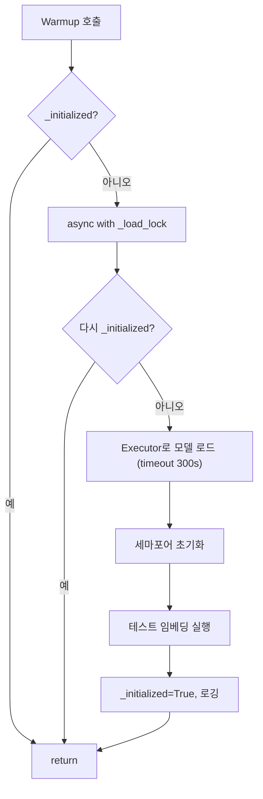

# Unit Spec - EmbeddingService warmup 변경

## 1. 요구사항 요약
- **목적:** EmbeddingService의 `warmup` 메서드를 비동기 초기화/워밍업 로직으로 교체하여 첫 요청 지연 방지
- **유형:** ☑ 변경
- **핵심 요구사항:**
  - 입력: 없음 (서비스 초기화 시 호출)
  - 출력: 없음 (`None` 리턴)
  - 예외/제약: 모델 로드 타임아웃 300초 시 `VectorIndexError`; 기타 예외 시 동일 예외 래핑
  - 처리흐름 요약: 이미 초기화 여부 확인 → Lock 획득 → 모델 로드(Executor) → 세마포어 초기화 → 테스트 임베딩 실행 → 상태 플래그 설정 및 로깅

---

## 2. 구현 대상 파일

| 구분 | 경로 | 설명 |
| ---- | ---- | ---- |
| 변경 | app/llm/embedder.py | `EmbeddingService.warmup` 메서드 교체 |

---

## 3. 동작 플로우 (Mermaid)

---

## 4. 테스트 계획

### 4.1 원칙
- 비동기 로직은 pytest-asyncio 사용
- 모델 로드/임베딩 호출은 모킹
- 타임아웃/예외 경로 검증

### 4.2 구현 예상 테스트 항목

| TC ID | 계층 | 시나리오 | 목적 | 입력/사전조건 | 기대결과 |
| ----- | ---- | -------- | ---- | ------------- | -------- |
| TC-SVC-001 | Unit | 이미 초기화 상태 | 중복 워밍업 방지 | `_initialized=True` | 추가 동작 없이 return |
| TC-SVC-002 | Unit | 정상 워밍업 | 모델 로드/테스트 임베딩/플래그 설정 | 모킹된 SentenceTransformer, _encode_async | 모델/세마포어 설정, `_initialized=True`, 호출 순서 검증 |
| TC-SVC-003 | Unit | 모델 로드 타임아웃 | 타임아웃 처리 | run_in_executor 모킹해 TimeoutError 발생 | `VectorIndexError` 발생, 로깅 호출 |
| TC-SVC-004 | Unit | 기타 예외 | 예외 래핑 | 모델 로드 중 임의 예외 | `VectorIndexError` 발생 |

---

## 5. 사용자 요청 기록
- 원본 요청: MCP serena `replace_symbol_body`로 `EmbeddingService/warmup` 교체 가능 여부 문의
- 추가 요청: “이렇게 진행해줄 수 있어?”
- 최종 확정: “승인”

---

## 최종 확정 (체크리스트)
- ✅ `EmbeddingService.warmup` 비동기 워밍업 로직으로 교체
- ✅ 타임아웃/예외 시 `VectorIndexError` 처리
- ✅ 첫 임베딩 사전 수행 및 로깅
