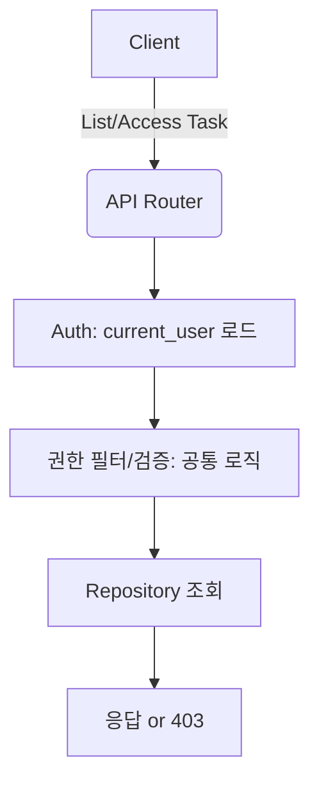

# FR-20 사용자별 검토(Task) 항목 노출 제어 Unit Spec

## 1. 요구사항 요약

- **목적:** 메뉴얼 검토(Task) 목록 및 단건 접근을 사용자 역할/소속 부서 기준으로 제한한다.
- **유형:** ☑ 변경
- **핵심 요구사항:**
  - 입력: `current_user(역할/employee_id/소속부서)`, `status/limit`(목록 필터), `task_id`(단건 접근)
  - 출력: 권한에 맞는 Task 목록/단건 응답, 권한 없음 시 `403 Forbidden`
  - 예외/제약: Task ID 직접 접근 시 권한 검증 필수, 권한 없는 접근은 403
  - 처리흐름 요약: Task 생성 시 reviewer_department_id 자동 설정 → 목록/단건 접근 시 현재 사용자 부서 기반 필터링/검증

---

## 2. 구현 대상 파일

| 구분 | 경로 | 설명 |
| ---- | ---- | ---- |
| 변경 | `app/models/task.py` | `ManualReviewTask`에 `reviewer_department_id` 컬럼 추가 |
| 변경 | `app/schemas/manual.py` | `ManualReviewTaskResponse`에 `reviewer_department_id` 노출 |
| 변경 | `app/services/manual_service.py` | 리뷰 태스크 생성 시 `reviewer_department_id` 자동 설정 |
| 변경 | `app/services/task_service.py` | 목록/단건 접근 권한 필터/검증 로직 추가 |
| 변경 | `app/repositories/manual_rdb.py` | Task 조회 시 부서 필터 적용 메서드 추가 |
| 변경 | `app/repositories/task_repository.py` | TaskFilter에 `reviewer_department_id` 추가 |
| 변경 | `app/routers/tasks.py` | 리스트/승인/반려/시작 시 권한 체크 반영 |
| 변경 | `app/routers/manuals.py` | `/{manual_id}/review-tasks` 접근 제어 추가 |
| 변경 | `app/mcp/tools.py` | MCP에서 Task 조회 시 권한 정책 정의/적용 |
| 신규 | `app/core/permissions.py` | Task 권한 조회 공통 로직 제공 |
| 신규 | `alembic/versions/*_add_task_department_scope.py` | DB 마이그레이션 (컬럼/인덱스) |
| 변경 | `tests/unit/test_task_access_control.py` | 권한 필터/검증 유닛 테스트 |
| 변경 | `tests/api/test_task_visibility.py` | API 접근 제어 시나리오 테스트 |

---

## 3. 동작 플로우 (Mermaid)



---

## 4. 테스트 계획

### 4.1 원칙

- **테스트 우선(TDD)**: 권한 필터/검증 로직부터 테스트 작성
- **계층별 커버리지**: Unit → API 순서로 P0 커버
- **독립성/재현성**: DB는 테스트 DB/fixture, 외부 연동 모킹
- **판정 기준**: role/department 기준 필터 결과와 403을 명시 검증

### 4.2 구현 예상 테스트 항목(각 항목의 목적 포함)

| TC ID | 계층 | 시나리오 | 목적(무엇을 검증?) | 입력/사전조건 | 기대결과 |
| --- | --- | --- | --- | --- | --- |
| TC-API-001 | API | CONSULTANT 목록 조회 | CONSULTANT 접근 차단 | current_user=CONSULTANT | 403 |
| TC-API-002 | API | REVIEWER 목록 조회 | 본인 부서 Task만 노출 | reviewer_department_id 일치 | 해당 Task만 반환 |
| TC-API-003 | API | ADMIN 목록 조회 | 전체 Task 노출 | current_user=ADMIN | 전체 반환 |
| TC-API-004 | API | Task ID 직접 접근 | 권한 없는 경우 403 | 타 부서 Task 접근 | 403 Forbidden |
| TC-UNIT-005 | Unit | 권한 필터 함수 | 부서 조건 필터 검증 | mock task/user | 기대 조건만 True |
| TC-UNIT-006 | Unit | Task 생성 기본값 | reviewer_department_id 자동 설정 | 상담자 부서 포함 | 값 설정 확인 |

---

## 5. 사용자 요청 기록

### 원본 요청 (1차)
```
[RFP_KHW_v6.md] , [onboarding.md]
너는 Python 전문 개발자야.
내가 보낸 문서를 분석하고 아래의 요구사항 개발에 대한 Unit_spec을 작성해줘.

[요구사항]
- RFP 파일에 명시된 FR-20
```

### Claude 분석 (필요시)
```
- manual_review_tasks에 reviewer_id는 승인자 기록으로 이미 사용 중.
- FR-20의 노출 제어는 reviewer_department_id 중심으로 구현.
- reviewer_role/reviewer_user_id는 현재 요구에서 제외.
```

### 사용자 명확화 (2차+)
```
- 정책: reviewer_role 제거, reviewer_department_id 기준으로 제한
- REVIEWER/ADMIN만 Task 조회 가능
- 권한 조회 로직은 공통 모듈로 분리
- ADMIN은 전체 조회 가능
```

### 최종 확정 (체크리스트)
- ✅ reviewer_role 추가하지 않음
- ✅ reviewer_department_id로 부서 단위 노출 제어
- ✅ reviewer_id는 승인자 기록 용도로 유지
- ✅ REVIEWER/ADMIN만 Task 접근 가능
- ✅ ADMIN은 전체 조회 가능
- ✅ Task 권한 조회 로직은 공통 모듈로 분리
- ✅ Task ID 직접 접근 시 권한 검증 및 403
