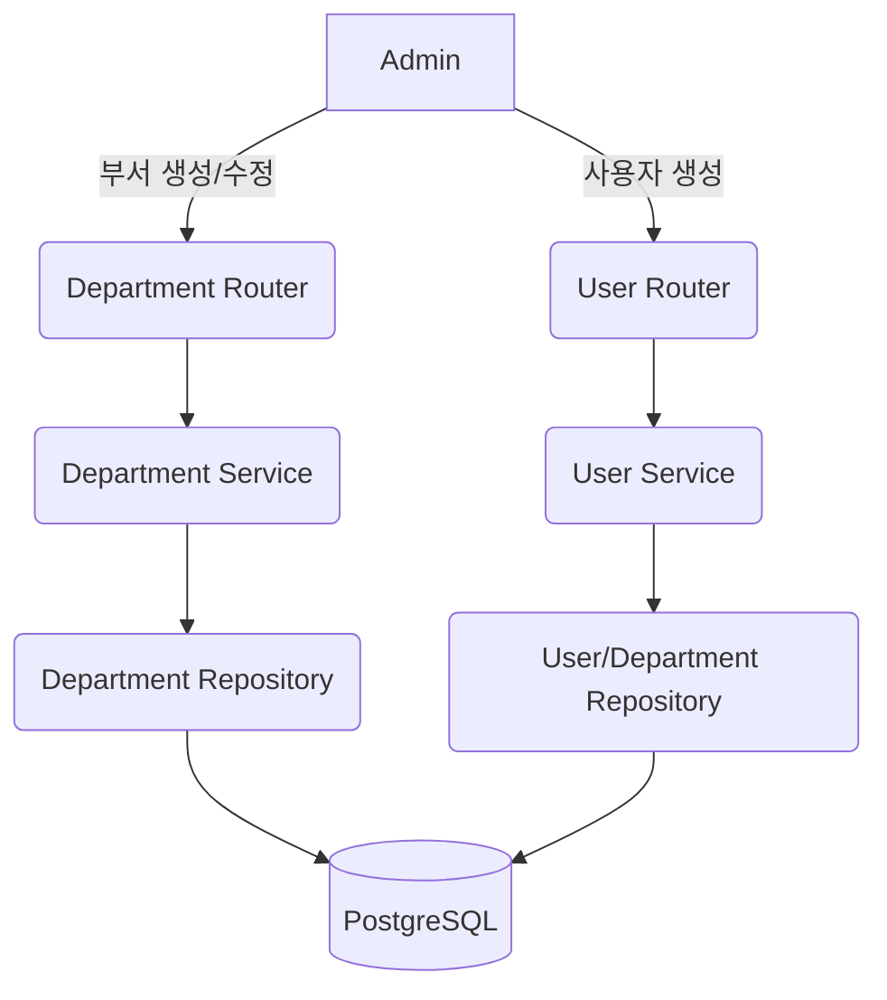

# FR-19 부서 및 사용자 매핑 관리 Unit Spec

## 1. 요구사항 요약

- **목적:** 사용자-부서 소속 정보를 정규화하여 부서 기반 권한/조회 범위 기준을 제공
- **유형:** ☑ 변경 ☐ 신규 ☐ 삭제
- **핵심 요구사항:**
  - 입력: `user_id`, `department_code/name`, `department_ids[]`, `is_primary`
  - 출력: 사용자 소속 부서 목록, 기본 부서(Primary) 정보
  - 예외/제약:
    * 사용자당 최소 1개 부서 소속 필수
    * `UserDepartment`는 `(user_id, department_id)` 유니크
    * `is_primary=true`는 사용자당 1개만 허용
  - 처리흐름 요약: 부서 등록/조회 → 사용자-부서 매핑 생성/갱신 → 사용자 조회 시 소속 부서 제공

## 2. 구현 대상 파일

| 구분 | 경로 | 설명 |
| ---- | ---- | ---- |
| 신규 | `app/models/department.py` | Department + UserDepartment SQLAlchemy 모델 정의 |
| 변경 | `app/models/user.py` | 기존 `department` 컬럼 제거 |
| 신규 | `app/schemas/department.py` | 부서/매핑 DTO 
| 변경 | `app/schemas/user.py` | 사용자 응답에 부서 목록 포함 |
| 신규 | `app/repositories/department_repository.py` | 부서/매핑 CRUD |
| 변경 | `app/repositories/user_repository.py` | 회원가입 시 부서 매핑 생성 |
| 신규 | `app/services/department_service.py` | 부서/매핑 비즈니스 로직 |
| 변경 | `app/services/user_service.py` | 회원가입 시 최소 1부서 검증 및 매핑 생성 |
| 신규 | `app/routers/departments.py` | 관리자 내부용 부서/매핑 API |
| 신규 | `alembic/versions/20251219_department_and_user_department.py` | 마이그레이션 |

## 3. 동작 플로우 (Mermaid)



## 4. 테스트 계획

### 4.1 원칙
- **테스트 우선(TDD)**: 서비스/레포지토리 단위 테스트를 먼저 작성
- **계층별 커버리지**: Unit → API(E2E-lite)
- **독립성/재현성**: 테스트 DB는 세션/트랜잭션 롤백

### 4.2 구현 예상 테스트 항목

| TC ID | 계층 | 시나리오 | 목적 | 입력 / 사전조건 | 기대결과 |
| ----- | ---- | -------- | ---- | -------------- | -------- |
| TC-REPO-001 | Unit | 부서 생성 | Department 저장/조회 | `department_code` | 정상 저장, Unique 제약 |
| TC-REPO-002 | Unit | 사용자-부서 매핑 생성 | 유니크 제약 및 기본부서 | user + dept | 매핑 생성, `is_primary` 단일성 |
| TC-SVC-003 | Unit | 회원가입 시 부서 필수 | 최소 1부서 검증 | 부서 입력 없음 | ValidationError |
| TC-SVC-004 | Unit | 기본부서 변경 | `is_primary` 단일성 | 기존 primary 존재 | 기존 primary 자동 해제 |
| TC-API-005 | API | 부서 목록 조회 | 관리자 내부 API 스키마 | `GET /admin/departments` | 200 + 목록 |
| TC-API-006 | API | 사용자 매핑 갱신 | 내부 매핑 저장 | `PUT /admin/users/{id}/departments` | 200 + 매핑 반영 |

## 5. 사용자 요청 이력

### 원본 요청 (1차)
```
[RFP_KHW_v6.md], [onboarding.md] 분석 후 FR-19에 대한 Unit Spec 작성
```

### Claude 분석 (필요시)
```
현재 User 모델의 department 문자열은 FR-19 요구사항과 불일치. Department/UserDepartment 정규화 필요하며,
기존 컬럼 제거 및 마이그레이션을 고려해야 함. 관리자 내부용 부서/매핑 API를 추가하고,
회원가입 입력은 내부에서 최소 1개 부서 매핑을 생성하도록 설계.
```

### 사용자 명확화 (결정 요청 회신)
```
1. API 범위: 관리자용 부서/매핑 추가 (내부 관리 전용)
2. `users.department` 컬럼 제거
3. 매핑은 내부에서 생성
```

### 최종 확정 체크리스트
- ✅ 관리자 내부용 부서/매핑 API 추가
- ✅ `users.department` 컬럼 제거
- ✅ 회원가입 시 부서 매핑 내부 생성
