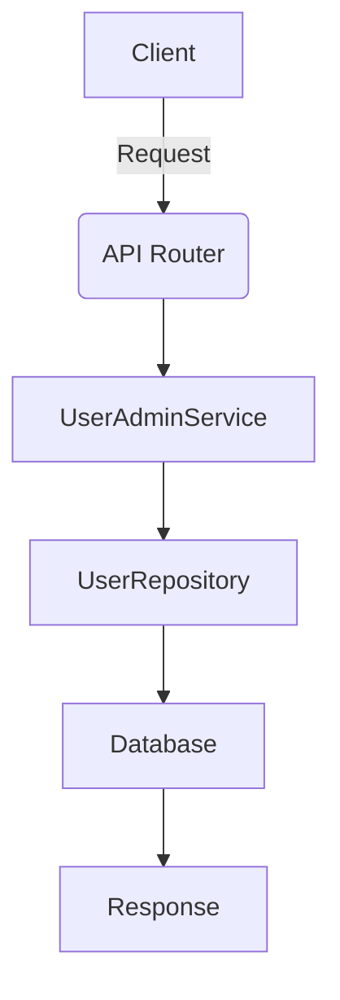

# Unit Spec: 사용자 관리 기능 (조회/생성/수정)

## 1. 요구사항 요약

- **목적:** 사용자 조회/생성/수정(비밀번호 변경 포함) API 제공
- **유형:** 신규
- **핵심 요구사항:**
  - 입력:
    - 조회: `employee_id`, `department`(user_department 기반), `is_active`, `role`, `name`
    - 생성: 사용자 기본 정보 + **부서 연결 필수**
    - 수정: 사용자 기본 정보 + **비밀번호 변경 필수 지원**
  - 출력: 사용자 리스트/단건 DTO, 생성/수정 결과 DTO
  - 예외/제약:
    - 부서 연결 누락 시 400
    - 중복 `employee_id` 또는 `username`은 400
    - 비밀번호 정책 준수
      - 최소 길이 12자
      - 특수문자 1개 이상 포함
      - 영어 대문자 1자 이상 포함
      - 영어 소문자 1자 이상 포함
  - 처리흐름 요약: Router → Service → Repository → DB

---

## 2. 구현 대상 파일

| 구분 | 경로 | 설명 |
| ---- | ---- | ---- |
| 신규 | app/routers/users.py | 사용자 조회/생성/수정 API |
| 신규 | app/services/user_admin_service.py | 사용자 관리 비즈니스 로직 |
| 변경 | app/repositories/user_repository.py | 조회 필터/페이징/정렬/생성/수정 메서드 확장 |
| 변경 | app/schemas/user.py | 요청/응답 DTO 추가 |
| 변경 | app/models/user.py | 부서 연결 관계 확인(유지) |
| 변경 | app/api/main.py | router 등록 |
| 변경 | alembic/versions/*.py | (필요 시) 인덱스/제약 추가 |
| 참조 | app/core/security.py | 비밀번호 해시/검증 로직 |

---

## 3. 동작 플로우 (Mermaid)



---

## 4. 테스트 계획

### 4.1 원칙

- **테스트 우선(TDD)**: 조회/생성/수정 API부터 작성
- **계층별 커버리지**: Unit → Integration → API(E2E-lite)
- **독립성/재현성**: DB는 테스트 DB or 모킹
- **판정 기준**: 상태코드/필드/부서연결/비밀번호 변경 여부 명시 검증

### 4.2 구현 예상 테스트 항목(각 항목의 목적 포함)

| TC ID | 계층 | 시나리오 | 목적(무엇을 검증?) | 입력/사전조건 | 기대결과 |
| --- | --- | --- | --- | --- | --- |
| TC-API-001 | API | 사용자 조회 필터 | 필터링 정확성 | employee_id/role/부서/name | 200 + 필터 반영 |
| TC-API-002 | API | 사용자 조회 페이징/정렬 | page/page_size/sort 검증 | 다양한 조합 | 200 + 정렬/페이징 |
| TC-API-003 | API | 사용자 생성 정상 | 부서 연결 필수 + 저장 | 유효 payload | 201 |
| TC-API-004 | API | 사용자 생성 실패(부서 누락) | 부서 필수 검증 | 부서 없음 | 400 |
| TC-API-005 | API | 사용자 생성 실패(중복) | 중복 employee_id/username 처리 | 기존 데이터 | 400 |
| TC-API-006 | API | 사용자 수정 정상 | 일반 필드 업데이트 | 유효 payload | 200 |
| TC-API-007 | API | 비밀번호 변경 | 정책 검증 + 해시 변경 | 새 비밀번호 | 200 |
| TC-SVC-008 | Unit | 비밀번호 변경 로직 | 해시 처리 검증 | mock repo | 해시 업데이트 |
| TC-SVC-009 | Unit | 조회 필터/정렬 로직 | 쿼리 조건 검증 | mock repo | 조건 반영 |

---

## 5. 사용자 요청 기록

### 원본 요청 (1차)
```
현재 사용자 관리용 기능이 없어. 요구사항에 맞춰 unit_spec을 작성해줘.
[요구사항]
- 사용자 조회 기능 (필터 : users.emplyee_id, 소속부서, users.is_active, users.role, user.name)
- 사용자 생성 기능 (부서 연결 필수)
- 사용자 정보 수정 (비밀번호 변경 기능 필수)
```

### 사용자 명확화 (2차+)
```
1. 기존 user_department 유지
2. 페이징 및 정렬 필요.
3. 비밀번호 정책 있음.
```

### 사용자 추가 (3차)
```
비밀번호 정책 : 최소 길이 12자, 특수문자 1개 이상 포함, 영어 대문자 1나 이상 포함, 영어 소문자 1자 이상 포함
문서만 먼저 만들어줘.
```

### 최종 확정 (체크리스트)
- ✅ 기존 user_department 유지
- ✅ 조회 페이징/정렬 포함
- ✅ 비밀번호 정책 적용
