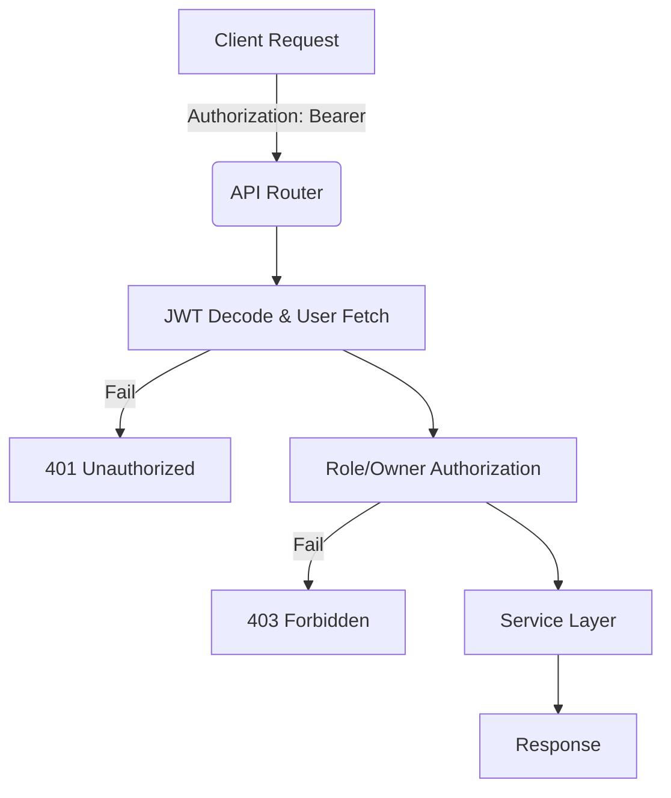

# Unit Spec: FR-18 사용자 인증 및 접근 제어

## 1. 요구사항 요약

- **목적:** 인증된 사용자만 API 접근 가능하도록 하고 역할(Role) 기반으로 기능 접근 범위를 분리
- **유형:** 변경
- **핵심 요구사항:**
  - 입력: `Authorization: Bearer <JWT>` 헤더, JWT payload(`sub`, `role`)
  - 출력: 인증 실패 시 `401`, 인가 실패 시 `403`
  - 예외/제약:
    - 모든 `/api/v1/**`, `/admin/**` 엔드포인트는 인증 필요
    - 인증 예외: `/api/v1/auth/login`, `/api/v1/auth/signup`
    - FR-7(메뉴얼 승인) → REVIEWER 이상만 가능
    - FR-15(공통코드 관리) → ADMIN만 가능
    - FR-16(초안 조회) → 초안 작성자 또는 ADMIN만 가능
  - 처리흐름 요약: Router에서 JWT 검증 → 사용자 조회 → 역할/소유자 검증 → 서비스 호출

---

## 2. 구현 대상 파일

| 구분 | 경로 | 설명 |
| ---- | ---- | ---- |
| 변경 | app/core/dependencies.py | JWT 인증 의존성 및 역할 기반 인가 헬퍼 추가 |
| 변경 | app/routers/consultations.py | 인증 의존성 적용 |
| 변경 | app/routers/manuals.py | FR-7/FR-16 인가 규칙 적용 |
| 변경 | app/routers/tasks.py | 리뷰 태스크 인가 규칙 적용 |
| 변경 | app/routers/common_codes.py | `/admin/**` ADMIN 전용 인가 |
| 변경 | app/api/main.py | Swagger OAuth2 Bearer 적용 여부 확인 |
| 참조 | app/core/jwt.py | 토큰 생성/검증 로직 |
| 참조 | app/models/user.py | UserRole 정의 |
| 참조 | app/core/exceptions.py | AuthorizationError 등 예외 활용 |

---

## 3. 동작 플로우 (Mermaid)



---

## 4. 테스트 계획

### 4.1 원칙

- **테스트 우선(TDD)**: 인증/인가 규칙부터 테스트 작성
- **계층별 커버리지**: Unit → Integration → API(E2E-lite) 순서로 최소 P0 커버
- **독립성/재현성**: 외부 연동(LLM/DB/File I/O)은 모킹 또는 임베디드 스토리지 사용
- **판정 기준**: 기대 상태코드/스키마/부작용(저장/로그)을 명시적으로 검증

### 4.2 구현 예상 테스트 항목(각 항목의 목적 포함)

| TC ID | 계층 | 시나리오 | 목적(무엇을 검증?) | 입력/사전조건 | 기대결과 |
| ---- | ---- | -------- | ------------------ | ------------- | -------- |
| TC-API-001 | API | 인증 헤더 없음 | 보호된 `/api/v1/**` 인증 필수 확인 | 헤더 없음 | `401` |
| TC-API-002 | API | 만료/잘못된 토큰 | JWT 검증 실패 처리 | 잘못된 토큰 | `401` |
| TC-API-003 | API | FR-7 승인 접근 (CONSULTANT) | REVIEWER 이상만 승인 가능 | role=CONSULTANT | `403` |
| TC-API-004 | API | FR-15 admin 접근 (REVIEWER) | ADMIN 전용 보호 | role=REVIEWER | `403` |
| TC-API-005 | API | FR-16 초안 조회 (작성자) | 작성자 본인 접근 허용 | role=CONSULTANT + owner | `200` |
| TC-API-006 | API | FR-16 초안 조회 (비작성자) | 작성자 외 차단 | role=CONSULTANT + not owner | `403` |
| TC-API-007 | API | 인증 예외 경로 접근 | `/auth/login`, `/auth/signup` 무인증 허용 | 헤더 없음 | `200/201` |
| TC-SVC-008 | Unit | Service Layer 인증 비의존 | 서비스가 FastAPI 의존성 없이 동작 | mock repo | 정상 동작 |

---

## 5. 사용자 요청 기록

### 원본 요청 (1차)
```
[RFP_KHW_v6.md](docs/RFP_KHW_v6.md) , [onboarding.md](onboarding.md)
너는 Python 전문 개발자야. 
내가 보낸 문서를 분석하고 아래의 요구사항 개발에 대한 Unit_spec을 작성해줘.

[요구사항]
- RFP 파일에 명시된 FR-18
```

### Claude 분석 (필요시)
```
- 기존 JWT 로그인/회원가입은 있으나 /api/v1 라우터 전반에 인증 의존성이 미적용
- FR-18은 전 엔드포인트 인증 + 역할 기반 인가가 요구됨
```

### 사용자 명확화 (2차+)
```
[추가 확인사항  회신]
- 인증 예외 `/api/v1/auth/login` , `/api/v1/auth/signup`
```

### 최종 확정 (체크리스트)
- ✅ 모든 `/api/v1/**`, `/admin/**` 엔드포인트 인증 적용
- ✅ 인증 예외 `/api/v1/auth/login`, `/api/v1/auth/signup`
- ✅ FR-7/FR-15/FR-16 역할 기반 인가 규칙 반영
- ✅ Service Layer는 인증 객체에 의존하지 않음
