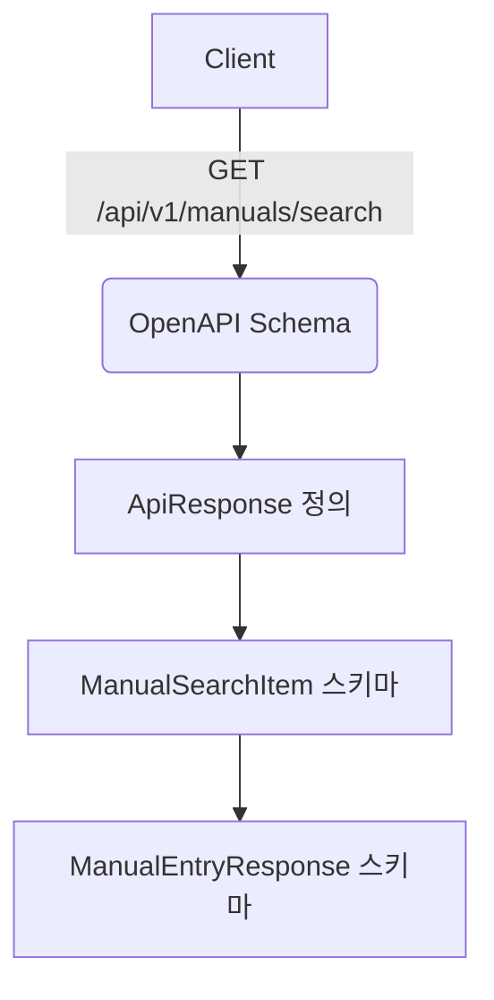

# Unit Spec

## 1. 요구사항 요약

- **목적:** `/api/v1/manuals/search`의 OpenAPI 응답 스펙을 실제 응답(ApiResponse<T>)과 일치시켜 프론트 타입 혼선을 제거
- **유형:** ☑ 변경
- **핵심 요구사항:**
  - 입력: 기존 GET `/api/v1/manuals/search` 요청 파라미터(변경 없음)
  - 출력: `ApiResponse<List<{ manual: ManualEntryResponse, similarity_score: number }>>`
  - 예외/제약: `manual.guideline`은 string 유지, `manual.guidelines`는 제거 또는 deprecated 처리
  - 처리흐름 요약: OpenAPI 스키마/예시를 실제 응답 구조로 정렬

---

## 2. 구현 대상 파일

| 구분 | 경로 | 설명 |
| ---- | ---- | ---- |
| 변경 | `app/routers/manuals.py` | `/api/v1/manuals/search` OpenAPI 스키마 및 응답 래핑 |
| 변경 | `app/schemas/manual.py` | `ManualSearchResult` 스키마(유사도 범위) |
| 변경 | `app/schemas/response.py` | 공통 응답 Envelope 스키마 참조 |
| 변경 | `app/api/response_middleware.py` | 이미 래핑된 응답 재직렬화 처리 |
| 참조 | `API_COMMON_USAGE.md` | 프론트 공통 규격 문서 |

> 파일 경로 확정 완료

---

## 3. 동작 플로우 (Mermaid)



---

## 4. 테스트 계획

### 4.1 원칙

- **테스트 우선(TDD)**: 문서/스키마 변경이므로 문서 스냅샷 또는 스키마 검증 기준 정리
- **계층별 커버리지**: 문서(OpenAPI) → 프론트 타입 생성 기준 확인
- **독립성/재현성**: 실제 API 호출 없이 스키마 자체 검증 가능하도록 확인
- **판정 기준**: OpenAPI 응답 스키마 구조가 실제 응답과 동일함을 검증

### 4.2 구현 예상 테스트 항목(각 항목의 목적 포함)

| TC ID | 계층 | 시나리오 | 목적(무엇을 검증?) | 입력/사전조건 | 기대결과 |
| ---- | ---- | -------- | ------------------ | ------------- | -------- |
| TC-API-001 | 문서 | 200 응답 스키마 | ApiResponse 래핑 구조 보장 | OpenAPI 스키마 | `success/data/error/meta/feedback` 필드 존재 |
| TC-API-002 | 문서 | data 항목 구조 | `{ manual, similarity_score }` 구조 확인 | OpenAPI 스키마 | `manual` 객체 + `similarity_score:number` |
| TC-API-003 | 문서 | guideline 필드 | `manual.guideline` 타입 string 확인 | OpenAPI 스키마 | string 타입 |
| TC-API-004 | 문서 | guidelines 필드 | 제거 또는 deprecated 상태 명시 | OpenAPI 스키마 | 없거나 deprecated 표시 |

---

## 5. 사용자 요청 기록

### 원본 요청 (1차)
```
/api/v1/manuals/search OpenAPI 스펙 수정
- ApiResponse<T> 래핑 구조로 수정
- manual.guideline string 유지
- manual.guidelines 제거 또는 deprecated
- data[i] 구조 { manual, similarity_score }
- similarity_score number (0~1)
```

### Claude 분석 (필요시)
```
OpenAPI 스키마 위치와 공통 ApiResponse 정의 위치 확인 필요.
실제 응답과의 불일치가 스키마 타입 배열 정의/예시 문제일 가능성 높음.
```

### 사용자 명확화 (2차+)
```
(없음)
```

### 최종 확정 (체크리스트)
- ✅ 200 응답을 ApiResponse<T> 구조로 맞춘다
- ✅ manual.guideline은 string으로 유지한다
- ✅ manual.guidelines는 제거 또는 deprecated 처리한다
- ✅ similarity_score는 number(0~1)로 명시한다
