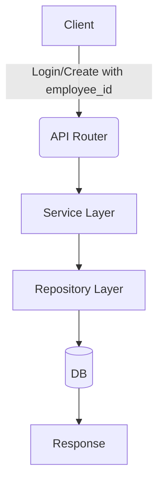

# Unit Spec

## 1. 요구사항 요약

- **목적:** users 테이블의 `username`을 제거하고 로그인/식별을 `employee_id`로 일원화
- **유형:** ☑ 변경
- **핵심 요구사항:**
  - 입력: 사용자 생성/로그인 시 `employee_id` 기반
  - 출력: 사용자 응답에서 `username` 제거, `employee_id` 유지
  - 예외/제약: 중복 `employee_id`는 400, 로그인 실패 시 401
  - 처리흐름 요약: 인증/조회/정렬/중복검사 모두 `employee_id` 기준으로 전환

---

## 2. 구현 대상 파일

| 구분 | 경로 | 설명 |
| ---- | ---- | ---- |
| 변경 | app/models/user.py | `username` 컬럼 제거 |
| 변경 | app/schemas/user.py | `username` 필드 제거/대체 |
| 변경 | app/repositories/user_repository.py | 조회/정렬/생성 로직 변경 |
| 변경 | app/services/user_service.py | 회원가입/로그인 기준 변경 |
| 변경 | app/services/user_admin_service.py | 중복 검사 및 생성 로직 변경 |
| 변경 | app/routers/auth.py | 로그인 payload 필드 전환 |
| 변경 | tests/unit/api/test_auth_login.py | 로그인 입력/검증 변경 |
| 변경 | tests/unit/test_dependencies.py | User 생성 인자 변경 |
| 변경 | alembic/versions/20251221_1200_drop_username_from_users.py | username 컬럼 제거 마이그레이션 |
| 변경 | docs/20241219_swagger_authorize_fix.md | 문서의 입력 필드 업데이트 |
| 변경 | docs/20251219_사용자_관리_UnitSpec.md | 문서의 중복 조건 업데이트 |

---

## 3. 동작 플로우 (Mermaid)



---

## 4. 테스트 계획

### 4.1 원칙

- **테스트 우선(TDD)**: 본 섹션의 항목을 우선 구현하고 코드 작성.
- **계층별 커버리지**: Unit → Integration → API(E2E-lite) 순서로 최소 P0 커버.
- **독립성/재현성**: 외부 연동(LLM/DB/File I/O)은 모킹 또는 임베디드 스토리지 사용.
- **판정 기준**: 기대 상태코드/스키마/부작용(저장/로그)을 명시적으로 검증.

### 4.2 구현 예상 테스트 항목(각 항목의 목적 포함)

| TC ID | 계층 | 시나리오 | 목적(무엇을 검증?) | 입력/사전조건 | 기대결과 |
| --- | --- | --- | --- | --- | --- |
| TC-API-001 | API | 로그인 폼 입력 | OAuth2 폼 입력 매핑 검증 | `employee_id`, `password` | `200`, 토큰 반환 |
| TC-API-002 | API | 로그인 JSON 입력 | JSON 입력 매핑 검증 | `employee_id`, `password` | `200`, 토큰 반환 |
| TC-SVC-003 | Unit | 로그인 조회 | `employee_id` 조회로 인증 수행 | 정상 사번 | 토큰 발급 |
| TC-SVC-004 | Unit | 사용자 생성 중복 | 중복 `employee_id` 처리 | 기존 사용자 | `DuplicateRecordError` |

---

## 5. 사용자 요청 기록

### 원본 요청 (1차)
```
현재 프로젝트에 users DB에 username을 삭제하고 싶어. employee_id로 대처하려고해. 현재 프로젝트에서 username을 employee_id 가 대처가 가능한지 분석해줘.
```

### Claude 분석 (필요시)
```
username은 현재 인증/계정 생성/관리 로직에만 사용되며, 도메인 핵심 흐름은 employee_id 기반이므로 대체 가능. JWT 클레임과 로그인 입력 필드 변경 필요.
```

### 사용자 명확화 (2차+)
```
1. employee_id 로 변경.
2. employee_id 로 교체
3. username 삭제
```

### 최종 확정 (체크리스트)
- ✅ 로그인 입력 필드 employee_id로 변경
- ✅ JWT payload를 employee_id로 교체
- ✅ username 필드/컬럼 삭제
