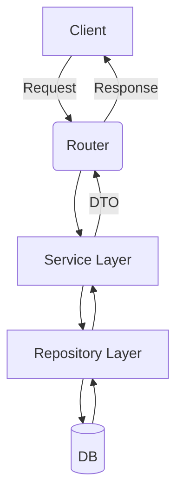

# Unit Spec

## 1. 요구사항 요약

- **목적:** 권한 체크를 서비스로 이동하고, 서비스가 eager-load 기반 조회와 응답 구성을 전담하여 lazy-load/N+1 위험을 제거한다.
- **유형:** ☑ 변경
- **핵심 요구사항:**
  - 입력: manual_id, current_user, 기타 기존 파라미터
  - 출력: 기존과 동일한 응답 DTO
  - 예외/제약: 기능 변경 없음, async 환경에서 lazy-load 금지, selectinload 기반 eager-load 적용
  - 처리흐름 요약: Router → Service에서 권한 체크 + eager-load 조회 + DTO 구성 → 응답

---

## 2. 구현 대상 파일

| 구분 | 경로 | 설명 |
| ---- | ---- | ---- |
| 변경 | `app/services/manual_service.py` | 권한 체크 이동, eager-load 포함 조회 메서드 추가/수정 |
| 변경 | `app/routers/manuals.py` | 라우터에서 repo 직접 조회 제거, 서비스 호출로 대체 |
| 변경 | `app/repositories/manual_rdb.py` | selectinload 기반 repo 메서드 보강/활용 |
| 변경 | `app/services/task_service.py` | 리뷰 태스크 응답 생성 시 selectinload 기반 사용 |
| 변경 | `app/repositories/manual_rdb.py` | ManualReviewTask 조회 시 selectinload 옵션 추가 |
| 변경 | `app/services/manual_service.py` | 리뷰 태스크 응답 생성 시 selectinload 기반 사용 |

---

## 3. 동작 플로우 (Mermaid)



---

## 4. 테스트 계획

### 4.1 원칙

- **테스트 우선(TDD)**: 변경 로직에 대한 테스트 우선 작성
- **계층별 커버리지**: Unit → Integration → API(E2E-lite)
- **독립성/재현성**: DB/외부 연동은 모킹 또는 테스트 DB 사용
- **판정 기준**: 상태코드/응답 스키마/권한 검증 확인

### 4.2 구현 예상 테스트 항목

| TC ID | 계층 | 시나리오 | 목적(무엇을 검증?) | 입력/사전조건 | 기대결과 |
| --- | --- | --- | --- | --- | --- |
| TC-SVC-001 | Unit | 초안 조회 권한 체크 | 서비스에서 권한 차단 로직 검증 | DRAFT + 타인 사용자 | 403 에러 |
| TC-SVC-002 | Unit | eager-load 조회 | 관계 접근 시 MissingGreenlet 방지 | DRAFT + consultation 포함 | 오류 없음 |
| TC-SVC-003 | Unit | 리뷰 태스크 응답 | selectinload 기반 관계 조회 | 태스크 여러 건 | N+1 방지, 응답 일치 |
| TC-API-004 | API | 초안 diff 조회 | 라우터에서 서비스 호출 흐름 검증 | draft_id + 사용자 | 200 + 응답 정상 |
| TC-API-005 | API | 메뉴얼 단건 조회 | 권한 체크/응답 구성 정상 | manual_id + 사용자 | 200 + 응답 정상 |

---

## 5. 사용자 요청 기록

### 원본 요청 (1차)
```
SQLAlchemyAsyncORMGuidelines 기준으로 검토. 리팩토링 중점:
- 기능 변경 금지
- 가독성
- 의존성 최소화
- 중복 제거
```

### Claude 분석 (필요시)
```
lazy-load 및 N+1 리스크 제거, 권한 체크 위치 정리 필요.
```

### 사용자 명확화 (2차+)
```
- 권한 체크를 서비스로 이동하고 서비스가 조회/eager-load/응답 구성
- selectinload 기반(관계 eager-load)
```

### 최종 확정 (체크리스트)
- ✅ 권한 체크를 서비스로 이동
- ✅ 서비스가 조회 + eager-load + 응답 구성 담당
- ✅ selectinload 기반 eager-load 적용
