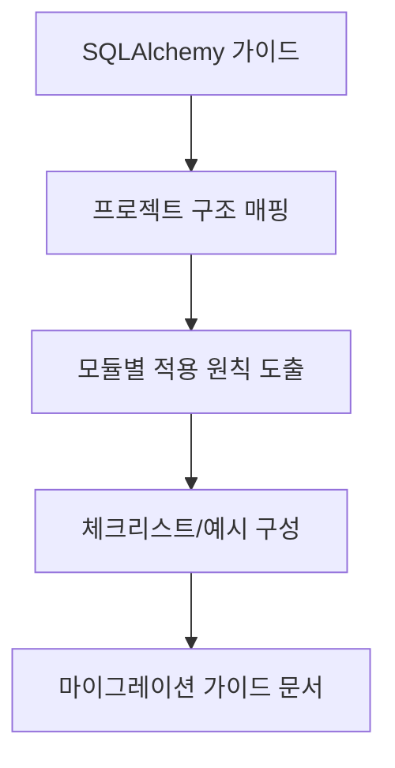

# Unit Spec

## 1. 요구사항 요약

- **목적:** `SQLAlchemyAsyncORMGuidelines_202512221243.md`를 기반으로, 현재 프로젝트 전반(레포 구조별) 마이그레이션 가이드를 재작성한다.
- **유형:** ☑ 신규
- **핵심 요구사항:**
  - 입력: 기존 가이드 문서 + 현행 프로젝트 구조
  - 출력: 프로젝트 구조별 마이그레이션 가이드 문서 1종
  - 예외/제약: manuals에 한정하지 않고 전체 모듈을 포괄
  - 처리흐름 요약: 레포 구조별 체크리스트/예시/적용 포인트 정리 → 문서화

---

## 2. 구현 대상 파일

| 구분 | 경로 | 설명 |
| ---- | ---- | ---- |
| 신규 | `docs/20251222_SQLAlchemyAsyncORM_전체_마이그레이션_가이드.md` | 프로젝트 전반 마이그레이션 가이드 |

---

## 3. 동작 플로우 (Mermaid)



---

## 4. 테스트 계획

### 4.1 원칙

- **문서 산출물 검증**: 구조/범위/일관성/누락 여부 점검
- **프로젝트 구조 정합성**: app/ 하위 레이어에 맞는 섹션 구성
- **실무 적용성**: 실제 코드 변경 시 체크리스트로 바로 사용 가능해야 함

### 4.2 구현 예상 테스트 항목(각 항목의 목적 포함)

| TC ID | 계층 | 시나리오 | 목적(무엇을 검증?) | 입력/사전조건 | 기대결과 |
| --- | --- | --- | --- | --- | --- |
| TC-DOC-001 | 문서 | 레포 구조별 섹션 구성 | app/* 레이어 모두 포함 여부 | 프로젝트 구조 | 누락 없이 섹션 존재 |
| TC-DOC-002 | 문서 | 원칙 일관성 | lazy-load 금지/서비스 책임/DTO 변환 원칙 반영 | 기존 가이드 | 핵심 원칙 모두 포함 |
| TC-DOC-003 | 문서 | 적용 체크리스트 | 마이그레이션 단계별 체크 가능 여부 | 문서 초안 | 체크리스트/예시 포함 |

---

## 5. 사용자 요청 기록

### 원본 요청 (1차)
```
SQLAlchemyAsyncORMGuidelines 기반으로 전체 프로젝트 마이그레이션 가이드 재작성
```

### 사용자 명확화 (2차+)
```
- 레포지토리 구조별
- 파일명: docs/20251222_SQLAlchemyAsyncORM_전체_마이그레이션_가이드.md
```

### 최종 확정 (체크리스트)
- ✅ 레포지토리 구조별 구성
- ✅ manuals 외 전체 모듈 포함
- ✅ 지정 파일명 사용
