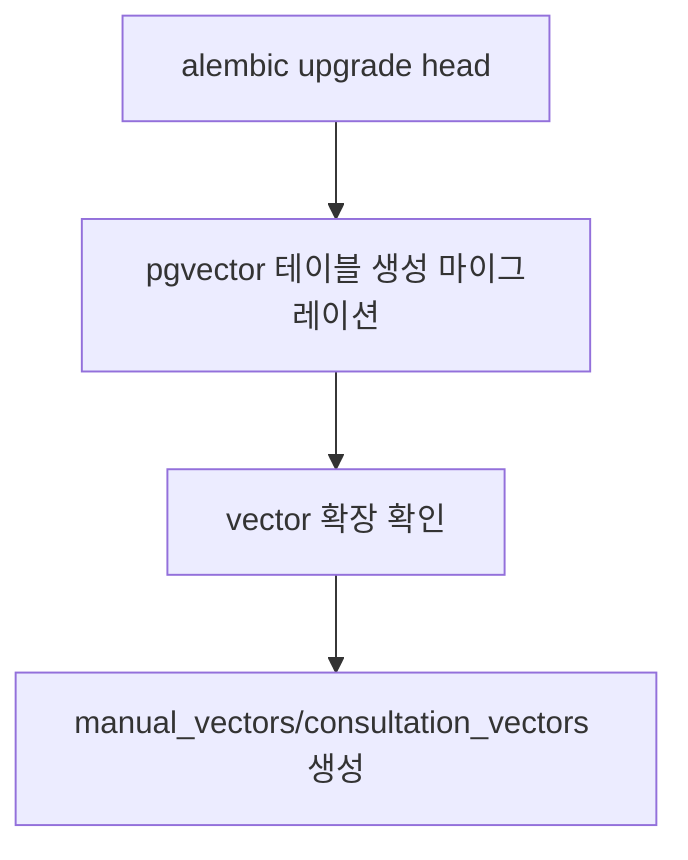

## 1. 요구사항 요약

- **목적:** Alembic 마이그레이션으로 `manual_vectors`/`consultation_vectors` 테이블을 생성
- **유형:** 변경
- **핵심 요구사항:**
  - 입력: 없음
  - 출력: 384 차원 벡터 테이블 및 인덱스 생성
  - 예외/제약: `vector` 확장 설치 필요, 기존 테이블 존재 시 `IF NOT EXISTS` 처리
  - 처리흐름 요약: 마이그레이션 실행 시 테이블 생성 → 인덱스 생성

---

## 2. 구현 대상 파일

| 구분 | 경로 | 설명 |
| ---- | ---- | ---- |
| 신규 | `alembic/versions/20251223_0001_create_pgvector_tables_384d.py` | 벡터 테이블 생성 마이그레이션 |

---

## 3. 동작 플로우 (Mermaid)



---

## 4. 테스트 계획

| TC ID | 계층 | 시나리오 | 목적 | 입력/사전조건 | 기대결과 |
| --- | --- | --- | --- | --- | --- |
| TC-DB-001 | Integration | 신규 DB 마이그레이션 | 테이블 생성 확인 | 빈 DB | 두 테이블/인덱스 생성 |
| TC-DB-002 | Integration | 재실행 | idempotent 검증 | 테이블 존재 | 에러 없이 통과 |

---

## 5. 사용자 요청 기록

### 원본 요청 (1차)
```
이 내용은 alembic 으로는 못해?
```

### 최종 확정 (체크리스트)
- ✅ Alembic으로 벡터 테이블 생성
- ✅ 384 차원 기준
- ✅ 기존 테이블 존재 시 안전 처리
