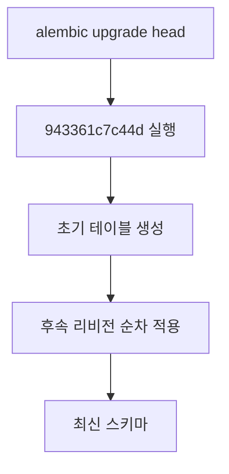

## 1. 요구사항 요약

- **목적:** 새 DB에서도 `alembic upgrade head`만으로 전체 스키마가 생성되도록 초기 마이그레이션을 정상화
- **유형:** 변경
- **핵심 요구사항:**
  - 입력: 기존 alembic 마이그레이션 체인
  - 출력: 초기 마이그레이션에 테이블 생성 로직 포함
  - 예외/제약: 기존 리비전 체인 유지, 새 DB에서 순차 적용 가능해야 함
  - 처리흐름 요약: 초기 스키마 생성 → 후속 리비전 순차 적용

---

## 2. 구현 대상 파일

| 구분 | 경로 | 설명 |
| ---- | ---- | ---- |
| 변경 | `alembic/versions/20251205_0955_943361c7c44d_initial_schema_from_models.py` | 초기 스키마 생성 로직 추가 |
| 변경 | `alembic/versions/20251209_1512_a11804d6157b_fix_common_code_group_id_column_type.py` | 벡터 테이블 drop을 IF EXISTS로 안전화 |

---

## 3. 동작 플로우 (Mermaid)



---

## 4. 테스트 계획

### 4.1 원칙

- **테스트 우선(TDD)**: 마이그레이션 적용 가능한지 우선 검증
- **계층별 커버리지**: Migration integration 레벨
- **독립성/재현성**: 새 DB에서 적용 테스트
- **판정 기준**: `upgrade head` 성공 및 `alembic current` 최신 리비전 일치

### 4.2 구현 예상 테스트 항목(각 항목의 목적 포함)

| TC ID | 계층 | 시나리오 | 목적(무엇을 검증?) | 입력/사전조건 | 기대결과 |
| --- | --- | --- | --- | --- | --- |
| TC-DB-001 | Integration | 새 DB에 `upgrade head` | 초기 스키마 생성 가능 여부 | 빈 DB | 모든 테이블 생성 성공 |
| TC-DB-002 | Integration | 후속 리비전 적용 | 체인 정합성 확인 | TC-DB-001 이후 | 전체 리비전 적용 성공 |

---

## 5. 사용자 요청 기록

### 원본 요청 (1차)
```
추후에 우리는 또 다른 DB 로 옮길 수도 있어서 정식 해결 방법대로 처리해야될 것 같은데
```

### 최종 확정 (체크리스트)
- ✅ 새 DB에서도 `alembic upgrade head`로 스키마 생성 가능
- ✅ 초기 마이그레이션에 실제 테이블 생성 반영
- ✅ 리비전 체인 유지
