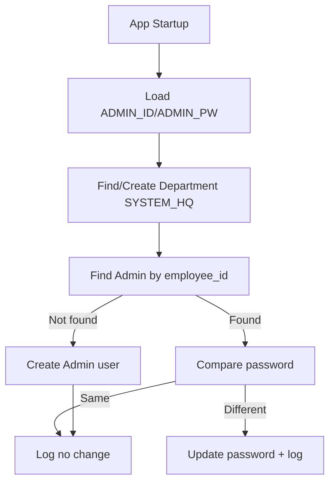

# Unit Spec: 시스템 시작 시 관리자 계정 자동 생성

## 1. 요구사항 요약

- **목적:** 시스템 시작 시 관리자 계정 및 부서를 확인하고 필요 시 자동 생성/갱신
- **유형:** ☑ 변경
- **핵심 요구사항:**
  - 입력: `.env`의 `ADMIN_ID`, `ADMIN_PW`
  - 출력: 로그(단계별 처리/생성/갱신 여부)
  - 예외/제약: `ADMIN_ID` 또는 `ADMIN_PW` 누락 시 로그 출력 후 스킵(요청 확인 필요)
  - 처리흐름 요약: 시스템 시작 시 `SYSTEM_HQ` 부서 확인/생성 → 관리자 계정 확인/생성 → 비밀번호 변경 여부 반영 및 로그 출력

---

## 2. 구현 대상 파일

| 구분 | 경로 | 설명 |
| ---- | ---- | ---- |
| 변경 | `main.py` | 앱 시작 시 초기화 훅 추가 |
| 변경 | `app/services/user_service.py` | 관리자 계정 조회/생성/갱신 로직 |
| 변경 | `app/services/department_service.py` | `SYSTEM_HQ` 부서 조회/생성 로직 |
| 참조 | `app/models/` | User/Department 모델 구조 확인 |
| 참조 | `app/repositories/` | 사용자/부서 조회 및 생성 |

---

## 3. 동작 플로우 (Mermaid)



---

## 4. 테스트 계획

### 4.1 원칙

- **테스트 우선(TDD)**: 로직 단위 테스트 선 작성
- **계층별 커버리지**: Unit → Integration 최소 P0
- **독립성/재현성**: DB는 테스트용 in-memory 또는 모킹
- **판정 기준**: 로그 메시지/DB 변경 여부 명시 검증

### 4.2 구현 예상 테스트 항목(각 항목의 목적 포함)

| TC ID | 계층 | 시나리오 | 목적(무엇을 검증?) | 입력/사전조건 | 기대결과 |
| ---- | ---- | ---- | ---- | ---- | ---- |
| TC-SVC-001 | Unit | SYSTEM_HQ 없음 | 부서 자동 생성 검증 | 부서 조회 None | 부서 생성 호출됨 |
| TC-SVC-002 | Unit | SYSTEM_HQ 있음 | 부서 생성 중단 검증 | 부서 조회 existing | 생성 호출 없음 |
| TC-SVC-003 | Unit | 관리자 없음 | 관리자 생성 검증 | user 조회 None | ADMIN 생성됨 |
| TC-SVC-004 | Unit | 관리자 있음+PW 동일 | 변경 없음 검증 | 동일 PW | update 없음, 로그 출력 |
| TC-SVC-005 | Unit | 관리자 있음+PW 다름 | PW 갱신 검증 | 다른 PW | update 발생, 로그 출력 |

---

## 5. 사용자 요청 기록

### 원본 요청 (1차)
```
현재 프로젝트에서 기능을 만들어줘.
배경 : 시스템 시작시 관리자 계정 확인 및 자동 생성
[요구사항]

- .env 에 있는 ADMIN_ID, ADMIN_PW 에 정보를 조회
- ADMIN_ID => users.employee_id, ADMIN_PW => password
- AMDIN의 role은 ADMIN
- 부서 정보 조회 department_code = SYSTEM_HQ, department_name = 시스템관리
- 부서 정보 없을 경우 생성
- ADMIN의 부서 => department_code = SYSTEM_HQ 연결
- admin 계정이 pw 가 기존과 다를 경우 pw 변경 및 갱신됨을 로그로 출력
[주의사항]
- admin 계정이 이미 있을 경우 신규 생성 중단, 없을 경우 생성
- 부서에서 SYSTEM_HQ가 없을 경우 신규 생성 , 있을 경우 생성 중단
- 각 단계별로 로그 출력
```

### 사용자 명확화 (2차+)
```
승인
```

### 최종 확정 (체크리스트)
- ✅ 시스템 시작 시 ADMIN 계정/부서 확인 및 생성
- ✅ SYSTEM_HQ 부서 연결
- ✅ 비밀번호 변경 시 갱신 및 로그 출력
- ✅ 단계별 로그 출력
