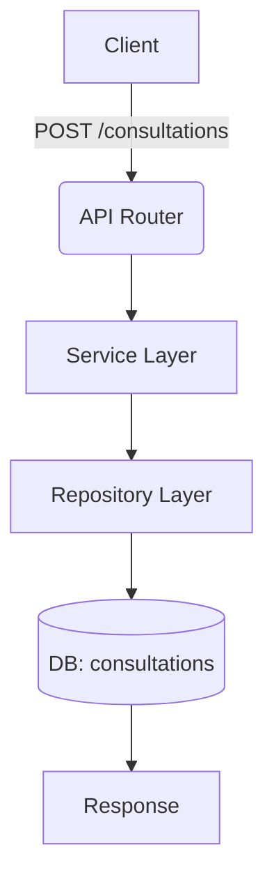

## 1. 요구사항 요약

- **목적:** 상담 등록 시 DB 컬럼 불일치로 발생하는 500 오류를 제거
- **유형:** ☑ 변경
- **핵심 요구사항:**
  - 입력: `POST /api/v1/consultations` payload
  - 출력: `201` 및 정상 응답
  - 예외/제약: `consultations.metadata_fields` 컬럼 미존재 시 500 발생 → 스키마 수정
  - 처리흐름 요약: 상담 저장 전에 DB 스키마가 모델과 일치하도록 컬럼명 변경

---

## 2. 구현 대상 파일

| 구분 | 경로 | 설명 |
| ---- | ---- | ---- |
| 신규 | `alembic/versions/20251224_0001_rename_consultations_metadata_fields.py` | consultations 컬럼명 변경 마이그레이션 |
| 신규 | `alembic/versions/20251224_0002_merge_heads.py` | Alembic 다중 head 병합 |
| 참조 | `app/models/consultation.py` | 모델 필드 정의 확인 |

---

## 3. 동작 플로우 (Mermaid)



---

## 4. 테스트 계획

### 4.1 원칙

- **테스트 우선(TDD)**: 마이그레이션 적용 후 최소 P0 확인
- **계층별 커버리지**: Integration 수준으로 확인
- **독립성/재현성**: 로컬 DB 기준
- **판정 기준**: 기대 상태코드/스키마/부작용(저장)을 검증

### 4.2 구현 예상 테스트 항목(각 항목의 목적 포함)

| TC ID | 계층 | 시나리오 | 목적(무엇을 검증?) | 입력/사전조건 | 기대결과 |
| --- | --- | --- | --- | --- | --- |
| TC-API-001 | API | 상담 등록 정상 케이스 | API 계약/상태코드/응답 스키마 검증 | 예시 payload | `201`, 응답 스키마 정상 |

---

## 5. 사용자 요청 기록

### 원본 요청 (1차)
```
상담 등록 API 실행시 column "metadata_fields" does not exist 오류 발생
```

### 사용자 명확화 (2차+)
```
승인
```

### 최종 확정 (체크리스트)
- ✅ DB 컬럼 불일치가 원인
- ✅ 마이그레이션으로 해결
- ✅ 정상 등록 테스트로 확인
