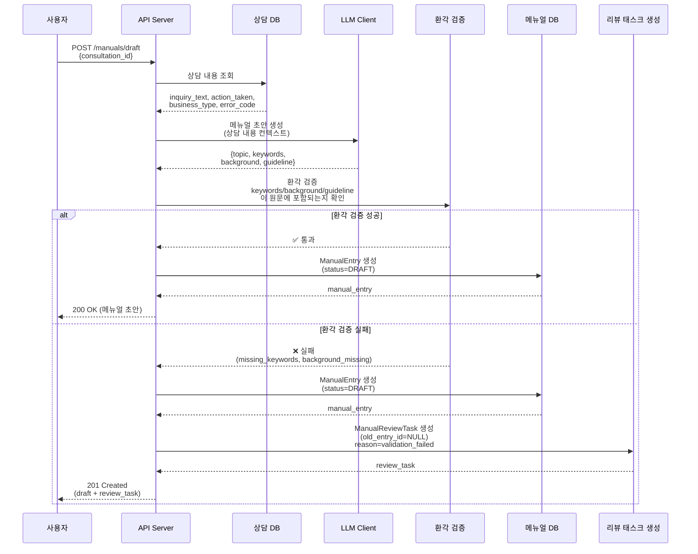
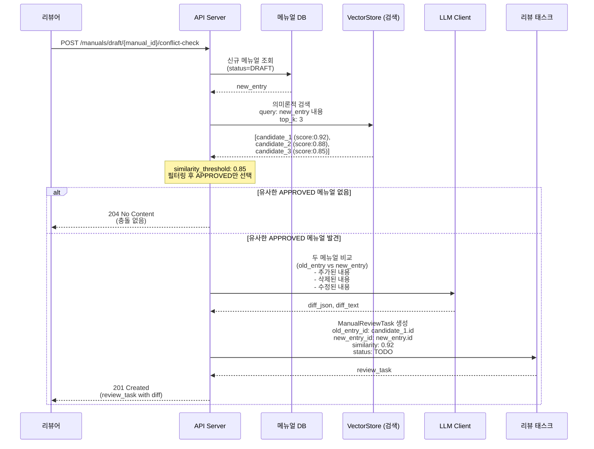
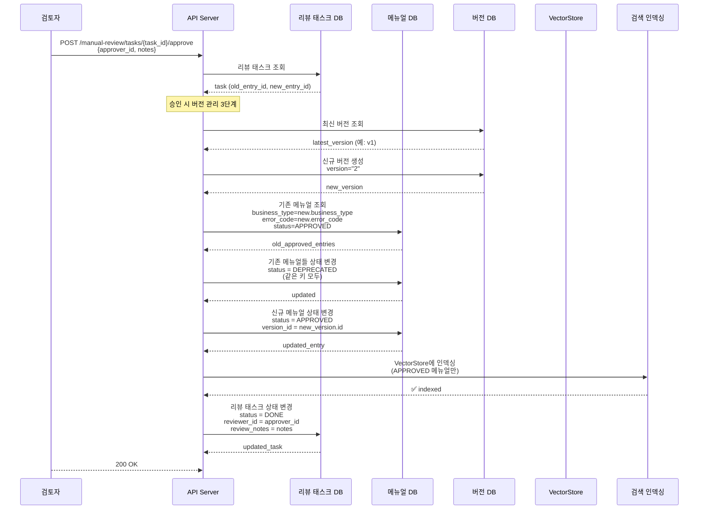
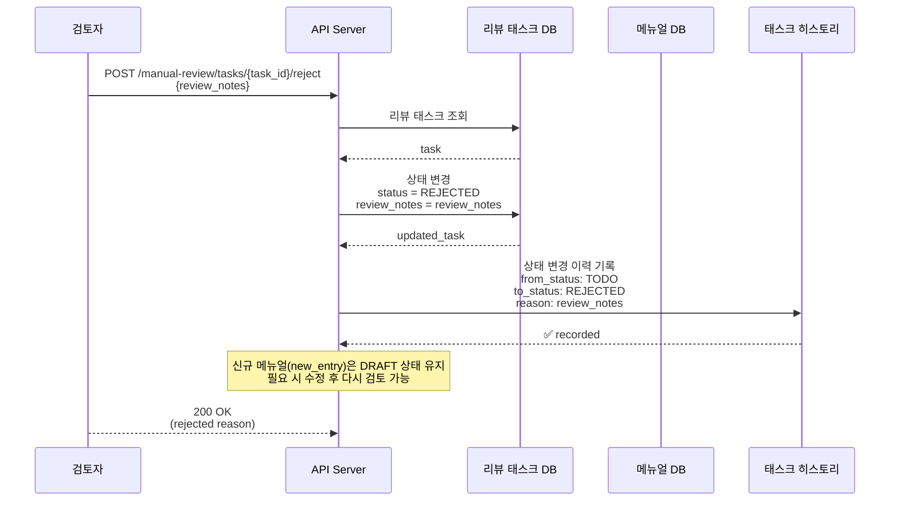
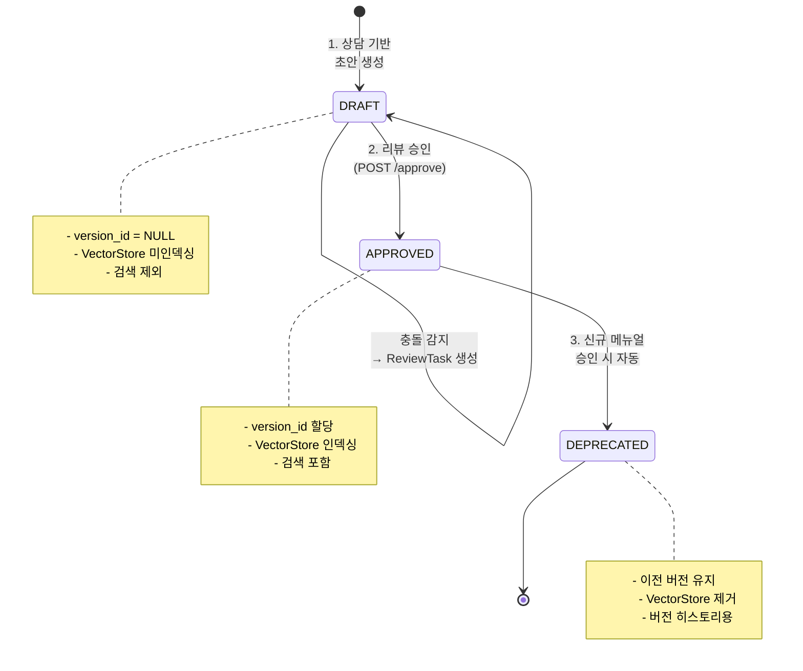
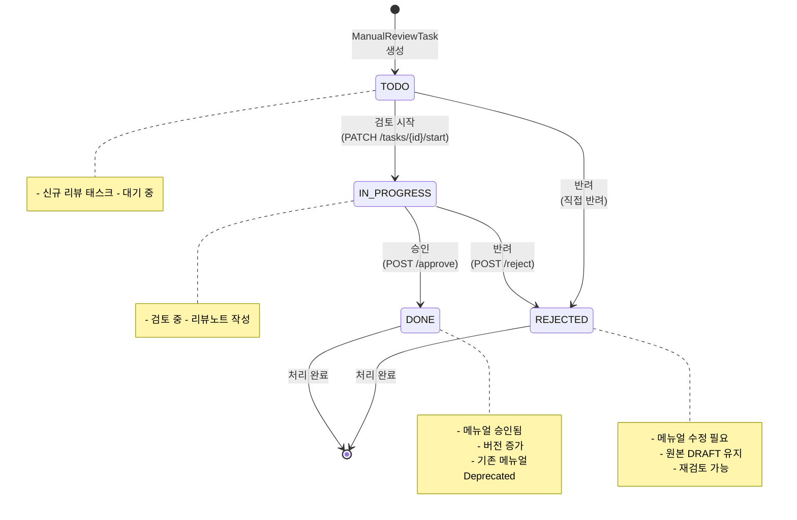
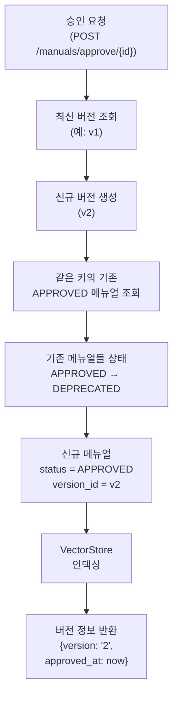
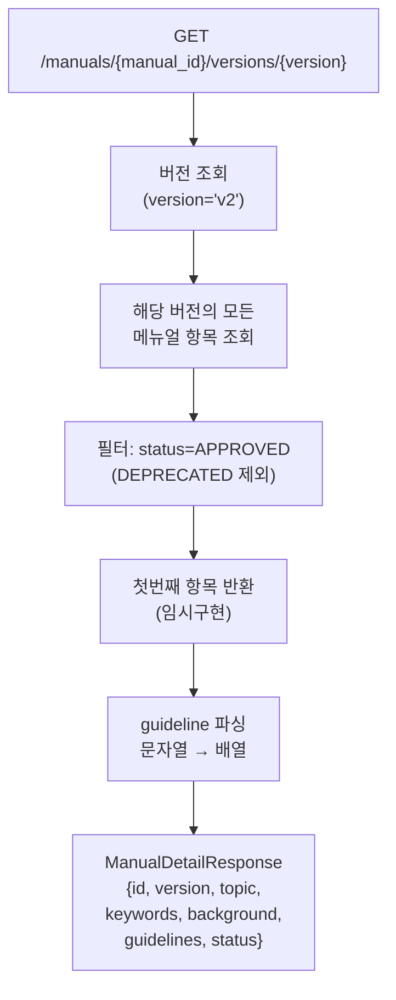
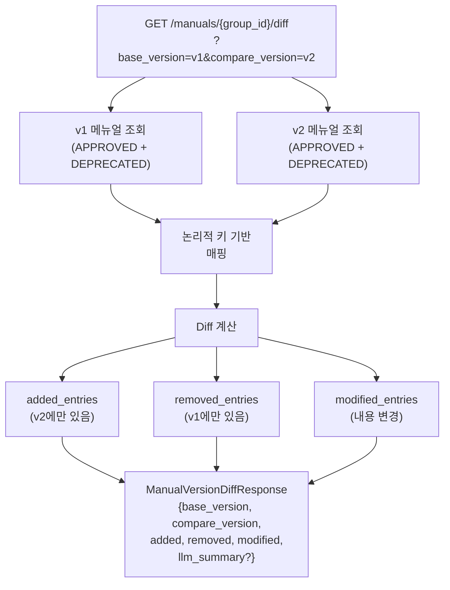

# 메뉴얼 워크플로우 및 버전 관리 (FR-2, FR-4, FR-5, FR-6, FR-14)

## 📋 목차
1. [개요](#개요)
2. [데이터 모델](#데이터-모델)
3. [핵심 개념](#핵심-개념)
4. [워크플로우 시퀀스](#워크플로우-시퀀스)
5. [상태 전이](#상태-전이)
6. [버전 관리](#버전-관리)
7. [API 엔드포인트](#api-엔드포인트)
8. [실제 시나리오](#실제-시나리오)

---

## 개요

KHW의 메뉴얼 워크플로우는 **상담 내용을 기반으로 자동 생성된 초안**을 **검토 및 승인하고**, **버전을 관리**하는 프로세스입니다.

**주요 특징:**
- ✅ 상담 기반 자동 초안 생성 (LLM)
- ✅ 환각 검증으로 품질 보장
- ✅ 자동 충돌 감지 및 리뷰 워크플로우
- ✅ 업무코드 + 에러코드 기반 메뉴얼 그룹화
- ✅ 금융권 정책: 버전 일괄 관리
- ✅ 의미론적 검색을 통한 메뉴얼 조회

---

## 데이터 모델

### 엔티티 관계도 (ERD)

```
┌─────────────────────────────────────────────────────────┐
│                  Consultation (상담)                     │
│  id, inquiry_text, action_taken, business_type, error_code │
└──────────────┬──────────────────────────────────────────┘
               │ 1:N (source_consultation_id)
               │
┌──────────────▼──────────────────────────────────────────┐
│               ManualEntry (메뉴얼 항목)                  │
│  id, topic, keywords, background, guideline             │
│  status: DRAFT | APPROVED | DEPRECATED                  │
│  version_id: FK → ManualVersion                         │
│  business_type, error_code (논리적 키)                   │
└──────────────┬──────────────────────────────────────────┘
               │
        ┌──────┴──────┬──────────┐
        │             │          │
        │ 1:1         │ 1:N      │
        │             │          │
        │  ┌──────────▼─┐  ┌─────▼──────────────┐
        │  │ManualVector│  │ManualReviewTask    │
        │  │ Index      │  │ id, status(TODO/   │
        │  └────────────┘  │ IN_PROGRESS/DONE/  │
        │                  │ REJECTED)          │
        │                  │ old_entry_id       │
        │                  │ new_entry_id       │
        │                  │ similarity, notes   │
        │                  └────────┬───────────┘
        │                           │ 1:N
        │                           │
        │                    ┌──────▼────────┐
        │                    │ TaskHistory    │
        │                    │ from/to status │
        │                    └────────────────┘
        │
        └────────────────────┐
                             │ 1:N
                             │
                    ┌────────▼──────────┐
                    │ ManualVersion     │
                    │ version: "1","2"..│
                    │ description       │
                    │ changelog         │
                    └───────────────────┘
```

### 핵심 모델 속성

#### ManualEntry
```python
class ManualEntry:
    # 콘텐츠
    keywords: list[str]          # 1-3개 핵심 키워드
    topic: str                   # 메뉴얼 주제
    background: str              # 배경 정보
    guideline: str               # 조치사항/가이드라인

    # 분류
    business_type: str | None    # 업무구분 (논리적 키)
    error_code: str | None       # 에러코드 (논리적 키)

    # 상태
    status: ManualStatus         # DRAFT | APPROVED | DEPRECATED

    # 참조
    source_consultation_id: UUID # 원본 상담
    version_id: UUID | None      # 소속 버전 (DRAFT는 NULL)
```

#### ManualVersion
```python
class ManualVersion:
    version: str                 # "1", "2", "3", ...
    description: str | None      # 버전 설명
    changelog: dict | None       # 변경사항 JSON
    entries: list[ManualEntry]   # 이 버전의 메뉴얼들
```

#### ManualReviewTask
```python
class ManualReviewTask:
    # 비교 대상
    old_entry_id: UUID | None    # 기존 APPROVED 메뉴얼 (없으면 신규)
    new_entry_id: UUID           # 신규 DRAFT 메뉴얼

    # 메타데이터
    similarity: float            # 유사도 점수 (0-1)
    status: TaskStatus           # TODO → IN_PROGRESS → DONE/REJECTED

    # 검토 정보
    reviewer_id: str | None      # 검토자
    review_notes: str | None     # 검토 메모
    decision_reason: str | None  # 결정 사유
```

---

## 핵심 개념

### 1️⃣ 논리적 키 (Logical Key)

**메뉴얼을 구분하는 유니크한 식별자:**

```
logical_key = "{business_type}::{error_code}"

예시:
  "인터넷뱅킹::ERR_LOGIN_001"  → 인터넷뱅킹 서비스의 로그인 오류 메뉴얼
  "모바일뱅킹::ERR_OTP_002"    → 모바일뱅킹 서비스의 OTP 오류 메뉴얼
```

**용도:**
- ✅ 같은 키를 가진 메뉴얼들을 하나의 "그룹"으로 취급
- ✅ 승인 시 이전 버전의 같은 키 메뉴얼 자동 Deprecated
- ✅ 버전 비교 시 어떤 항목이 추가/삭제/수정되었는지 판단
- ✅ VectorStore 검색 시 필터링

### 2️⃣ 메뉴얼 상태 (Status)

```
DRAFT (초안)
  ├─ 상담 기반으로 자동 생성
  ├─ 환각 검증 실패 시 리뷰 태스크 생성
  ├─ 충돌 감지 시 비교 리뷰 태스크 생성
  ├─ version_id = NULL (미할당)
  └─ 검색 대상 제외 (VectorStore 미인덱싱)

APPROVED (승인됨)
  ├─ 검토자 승인 완료
  ├─ version_id = 할당된 버전
  ├─ 같은 키의 기존 APPROVED 메뉴얼 → DEPRECATED
  ├─ VectorStore에 인덱싱
  └─ 검색 결과에 포함

DEPRECATED (이전 버전)
  ├─ 신규 메뉴얼 승인 시 이전 메뉴얼 자동 변경
  ├─ version_id = 이전 버전 유지
  ├─ 검색 대상 제외
  └─ 버전 히스토리 조회 시만 표시
```

### 3️⃣ 버전 관리 (Versioning)

**정책: 금융권 정책집 관리 기준**

```
메뉴얼 승인 시마다 전체 버전 세트가 일괄 증가

v1 (첫 번째 버전)
  ├─ 메뉴얼_1 (업무A, 에러X)
  ├─ 메뉴얼_2 (업무B, 에러Y)
  └─ 메뉴얼_3 (업무C, 에러Z)

v2 (두 번째 버전) ← 메뉴얼_1의 신규 버전 승인
  ├─ 메뉴얼_1' (업무A, 에러X) [신규]
  ├─ 메뉴얼_2 (업무B, 에러Y)  [유지]
  └─ 메뉴얼_3 (업무C, 에러Z)  [유지]

v1의 메뉴얼_1은 이제 DEPRECATED 상태
```

---

## 워크플로우 시퀀스

### 📍 시나리오 1: 상담 → 초안 생성 → 환각 검증



### 📍 시나리오 2: 충돌 감지 및 자동 리뷰 워크플로우



### 📍 시나리오 3: 리뷰 태스크 승인 및 버전 증가



### 📍 시나리오 4: 리뷰 태스크 반려



---

## 상태 전이

### 메뉴얼 엔트리 상태 다이어그램



### 리뷰 태스크 상태 다이어그램



---

## 버전 관리

### 버전 생성 로직



### 버전 번호 생성 규칙

```python
def _next_version_number(latest: ManualVersion | None) -> int:
    if latest is None:
        return 1  # 첫 승인 → v1
    try:
        return int(latest.version) + 1  # v1 → v2 → v3 ...
    except ValueError:
        return 1  # 파싱 실패 시 기본값
```

### 버전별 메뉴얼 조회



### 버전 비교 (Diff)



---

## API 엔드포인트

### 메뉴얼 초안 생성

```http
POST /manuals/draft
Content-Type: application/json

{
  "consultation_id": "uuid",
  "enforce_hallucination_check": true
}

Response 201:
{
  "id": "uuid",
  "status": "DRAFT",
  "keywords": ["키워드1", "키워드2"],
  "topic": "메뉴얼 주제",
  "background": "배경 정보",
  "guideline": "가이드라인...",
  "source_consultation_id": "uuid",
  "created_at": "2024-12-10T10:00:00Z",
  "updated_at": "2024-12-10T10:00:00Z"
}
```

### 충돌 감지 및 리뷰 태스크 생성

```http
POST /manuals/draft/{manual_id}/conflict-check

Response 201 (충돌 발견):
{
  "id": "uuid",
  "created_at": "2024-12-10T10:00:00Z",
  "old_entry_id": "uuid",
  "new_entry_id": "uuid",
  "similarity": 0.92,
  "status": "TODO",
  "reviewer_id": null,
  "review_notes": null,
  "old_manual_summary": "기존 메뉴얼 요약",
  "new_manual_summary": "신규 초안 요약",
  "diff_text": "추가: ..., 삭제: ..., 수정: ...",
  "diff_json": {...},
  "business_type": "인터넷뱅킹",
  "new_manual_topic": "신규 주제"
}

Response 204 (충돌 없음):
(No Content)
```

### 메뉴얼 승인

```http
POST /manuals/approve/{manual_id}
Content-Type: application/json

{
  "approver_id": "user123",
  "notes": "검토 후 승인합니다"
}

Response 200:
{
  "version": "2",
  "approved_at": "2024-12-10T10:00:00Z"
}
```

### 버전 목록 조회

```http
GET /manuals/{manual_id}/versions

Response 200:
[
  {
    "id": "uuid",
    "value": "2",
    "label": "2 (현재 버전)",
    "date": "2024-12-10",
    "created_at": "2024-12-10T10:00:00Z"
  },
  {
    "id": "uuid",
    "value": "1",
    "label": "1",
    "date": "2024-12-09",
    "created_at": "2024-12-09T10:00:00Z"
  }
]
```

### 특정 버전 상세 조회

```http
GET /manuals/{manual_id}/versions/2

Response 200:
{
  "id": "uuid",
  "manual_id": "uuid",
  "version": "2",
  "topic": "메뉴얼 주제",
  "keywords": ["키워드1", "키워드2"],
  "background": "배경 정보",
  "guidelines": [
    {
      "title": "조치사항 1",
      "description": "설명..."
    }
  ],
  "status": "APPROVED",
  "created_at": "2024-12-10T10:00:00Z",
  "updated_at": "2024-12-10T10:00:00Z"
}
```

### 버전 간 Diff

```http
GET /manuals/{group_id}/diff?base_version=1&compare_version=2&summarize=true

Response 200:
{
  "base_version": "1",
  "compare_version": "2",
  "added_entries": [
    {
      "logical_key": "인터넷뱅킹::ERR_001",
      "keywords": [...],
      "topic": "새로운 메뉴얼",
      ...
    }
  ],
  "removed_entries": [...],
  "modified_entries": [
    {
      "logical_key": "인터넷뱅킹::ERR_002",
      "before": {...},
      "after": {...},
      "changed_fields": ["keywords", "guideline"]
    }
  ],
  "llm_summary": "v1 대비 v2 변경사항 요약..."
}
```

### 리뷰 태스크 목록 조회

```http
GET /manual-review/tasks?status=TODO&limit=100

Response 200:
[
  {
    "id": "uuid",
    "created_at": "2024-12-10T10:00:00Z",
    "old_entry_id": "uuid",
    "new_entry_id": "uuid",
    "similarity": 0.92,
    "status": "TODO",
    "reviewer_id": null,
    "review_notes": null,
    "old_manual_summary": "...",
    "new_manual_summary": "...",
    "diff_text": "..."
  }
]
```

### 리뷰 태스크 승인

```http
POST /manual-review/tasks/{task_id}/approve
Content-Type: application/json

{
  "employee_id": "reviewer123",
  "review_notes": "검토 후 승인합니다",
  "create_new_version": true
}

Response 200:
{
  "id": "uuid",
  "status": "DONE",
  "reviewer_id": "reviewer123",
  "review_notes": "검토 후 승인합니다",
  ...
}
```

### 리뷰 태스크 반려

```http
POST /manual-review/tasks/{task_id}/reject
Content-Type: application/json

{
  "review_notes": "수정이 필요합니다. 배경 정보가 부족합니다."
}

Response 200:
{
  "id": "uuid",
  "status": "REJECTED",
  "review_notes": "수정이 필요합니다. 배경 정보가 부족합니다.",
  ...
}
```

---

## 실제 시나리오

### 🔄 시나리오 A: 신규 상담 → 초안 → 환각 검증 실패 → 수정 → 승인

```
1. 고객 상담 기록
   "인터넷뱅킹 로그인 후 계좌 조회 오류 발생"

2. 시스템이 자동 초안 생성
   POST /manuals/draft {consultation_id: "c1"}
   ↓
   ManualEntry 생성
   ├─ topic: "인터넷뱅킹 계좌 조회 오류 해결"
   ├─ keywords: ["로그인", "계좌조회", "오류"]
   ├─ business_type: "인터넷뱅킹"
   ├─ error_code: "ERR_ACCOUNT_001"
   ├─ status: DRAFT
   └─ version_id: NULL

3. 환각 검증 실패 감지
   ❌ "오류"라는 키워드가 원문에 없음

4. 리뷰 태스크 자동 생성
   ManualReviewTask
   ├─ old_entry_id: NULL (신규)
   ├─ new_entry_id: "m1"
   ├─ status: TODO
   └─ decision_reason: "validation_failed"

5. 검토자가 수정 권고
   PATCH /manuals/m1 {keywords: ["로그인", "계좌조회", "에러"]}

6. 메뉴얼 상태 변경 후 재승인
   PUT /manuals/m1 {status: "APPROVED"}

7. 버전 생성
   ManualVersion(version="1") 생성
   ManualEntry m1 상태 = APPROVED, version_id="v1"

8. VectorStore 인덱싱
   "인터넷뱅킹::ERR_ACCOUNT_001" 검색 가능
```

### 🔄 시나리오 B: 충돌 감지 → 비교 검토 → 기존 메뉴얼 Deprecated

```
상황:
  v1: 메뉴얼 A "인터넷뱅킹::ERR_LOGIN_001" (기존)

1. 신규 상담에서 비슷한 초안 생성
   POST /manuals/draft {consultation_id: "c2"}
   ↓
   ManualEntry m2 생성
   ├─ topic: "인터넷뱅킹 로그인 실패"
   ├─ business_type: "인터넷뱅킹"
   ├─ error_code: "ERR_LOGIN_001"
   ├─ status: DRAFT
   └─ version_id: NULL

2. 충돌 감지 실행
   POST /manuals/m2/conflict-check

3. VectorStore 검색
   query: "인터넷뱅킹 로그인 실패 원인 및 해결방법"
   results: [메뉴얼 A (score: 0.92)]

4. 유사도 0.92 > threshold 0.85 → 충돌 감지!

5. LLM 비교
   old: 메뉴얼 A (기존)
   new: 메뉴얼 m2 (신규)

   비교 결과:
   ├─ 추가: "신규 보안 정책 적용"
   ├─ 수정: "가이드라인 상세화"
   └─ 동일: "배경 정보"

6. 리뷰 태스크 생성
   ManualReviewTask
   ├─ old_entry_id: "m_A"
   ├─ new_entry_id: "m2"
   ├─ similarity: 0.92
   ├─ status: TODO
   └─ diff_json: {...}

7. 검토자가 신규 메뉴얼 승인
   POST /manual-review/tasks/task1/approve

8. 자동 처리:
   a) ManualVersion v2 생성

   b) 기존 메뉴얼 Deprecated
      메뉴얼 A: status APPROVED → DEPRECATED

   c) 신규 메뉴얼 승인
      메뉴얼 m2: status DRAFT → APPROVED, version_id=v2

   d) VectorStore 업데이트
      메뉴얼 A 제거
      메뉴얼 m2 추가

9. 버전 히스토리
   v1: 메뉴얼 A (현재 DEPRECATED)
   v2: 메뉴얼 m2 (현재 APPROVED) ← "현재 버전"
```

### 🔄 시나리오 C: 버전 비교 (v1 vs v2)

```
GET /manuals/group1/diff?base_version=1&compare_version=2

v1 메뉴얼들:
  ├─ 인터넷뱅킹::ERR_LOGIN_001 → 메뉴얼 A
  ├─ 인터넷뱅킹::ERR_OTP_002 → 메뉴얼 B
  └─ 모바일뱅킹::ERR_001 → 메뉴얼 C

v2 메뉴얼들:
  ├─ 인터넷뱅킹::ERR_LOGIN_001 → 메뉴얼 A' (수정됨)
  ├─ 인터넷뱅킹::ERR_ACCOUNT_003 → 메뉴얼 D (신규)
  └─ 모바일뱅킹::ERR_001 → 메뉴얼 C (동일)

Diff 결과:

added_entries:
  ├─ 인터넷뱅킹::ERR_ACCOUNT_003 (메뉴얼 D)
  │  → v2에서 새로 추가됨

removed_entries:
  ├─ 인터넷뱅킹::ERR_OTP_002 (메뉴얼 B)
  │  → v2에서 제거됨

modified_entries:
  ├─ 인터넷뱅킹::ERR_LOGIN_001 (메뉴얼 A → A')
  │  changed_fields: ["guideline", "keywords"]
  │  before: {topic: "...", guideline: "..."}
  │  after: {topic: "...", guideline: "..."}

unchanged:
  └─ 모바일뱅킹::ERR_001 (메뉴얼 C)
     → v1과 v2에서 동일
```

### 🔄 시나리오 D: Draft vs Active 버전 미리보기

```
현재 상황:
  v2 (APPROVED): 메뉴얼 A', B', C'

신규 DRAFT 생성:
  메뉴얼 D (DRAFT, status=DRAFT)

요청:
  GET /manuals/drafts/D/diff-with-active

처리:
1. 현재 버전 v2의 메뉴얼들 조회
   [메뉴얼 A', B', C']

2. DRAFT 메뉴얼 D를 v2에 덮어씌웁니다 (Merge)
   [메뉴얼 A', B', C', 메뉴얼 D]

3. Diff 계산
   base: v2 = [A', B', C']
   compare: 예상 v3 = [A', B', C', D]

응답:
  added_entries:
    ├─ 메뉴얼 D (신규 추가될 예정)

  removed_entries:
    (없음)

  modified_entries:
    (없음)
```

---

## 주요 코드 위치

| 기능 | 파일 | 라인 |
|------|------|------|
| 상담 기반 초안 생성 | [app/services/manual_service.py](../app/services/manual_service.py) | 125 |
| 환각 검증 | [app/services/manual_service.py](../app/services/manual_service.py) | 145 |
| 충돌 감지 | [app/services/manual_service.py](../app/services/manual_service.py) | 249 |
| 메뉴얼 승인 | [app/services/manual_service.py](../app/services/manual_service.py) | 331 |
| 버전 목록 | [app/services/manual_service.py](../app/services/manual_service.py) | 371 |
| Diff 계산 | [app/services/manual_service.py](../app/services/manual_service.py) | 717 |
| 논리적 키 | [app/services/manual_service.py](../app/services/manual_service.py) | 772 |
| Manual 모델 | [app/models/manual.py](../app/models/manual.py) | 33 |
| Version 모델 | [app/models/manual.py](../app/models/manual.py) | 106 |
| ReviewTask 모델 | [app/models/task.py](../app/models/task.py) | 29 |
| Manual API | [app/routers/manuals.py](../app/routers/manuals.py) | 1 |
| Task API | [app/routers/tasks.py](../app/routers/tasks.py) | 1 |

---

## 체크리스트: 메뉴얼 워크플로우 이해

- [ ] 논리적 키(business_type + error_code)로 메뉴얼 그룹화됨 이해
- [ ] 상담 → 초안 → 환각 검증 → 리뷰 흐름 이해
- [ ] 충돌 감지 자동화 및 LLM 비교 기능 이해
- [ ] 버전 일괄 관리 정책 (금융권 기준) 이해
- [ ] APPROVED → DEPRECATED 자동 전환 로직 이해
- [ ] VectorStore 인덱싱 (APPROVED만) 이해
- [ ] 버전 간 Diff 계산 방식 이해
- [ ] API 엔드포인트 역할 파악
- [ ] 실제 시나리오 따라가기
